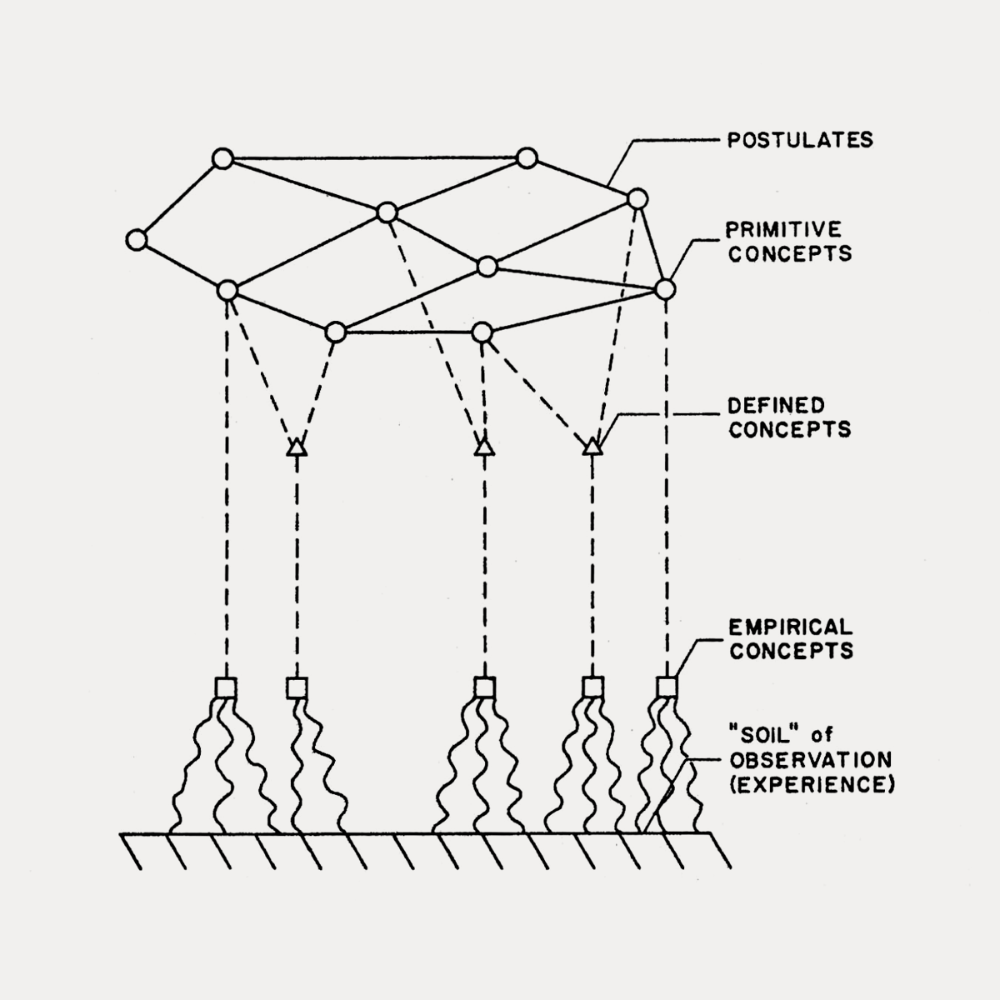

<!-- save as: <last-name-of-first-author>_<paper-title>.md -->

# Godfrey-Smith: Theory and Reality

## 1. Introduction

### This book is--
> ... about the nature of science--how it works, what it achieves, and what (fi anything) makes science different from other ways of investigating the world.

### Etymology of "science"
> The word "science" is derived from the Latin word "scientia". This translates roughly as knowledge, but it referred particularly to the results of logical demonstrations that reveal general and necessary truths.

### What the philosophy of science tries to find out
> 1. a general understanding of how humans gain knowledge of the world around them, and
> 2. an understanding of what makes the work descended from the Scientific Revolution different--if it really is different---from other kinds of investigation of the world.

### Problem with many a philosophy of science book
> ... my sympathies lie with those who insist that philosophy of science should have more contact with actual scientific work

### Descriptive vs. normative theories
> A descriptive theory is an attempt to describe what actualy goes on in some area, or what something is actually like, without making value judgments.
> A normative theory does make value judgments: it talks about what should go on, or what might be good or bad.

> When assessing general claims about science, it is a good principle to constantly ask: "Is this claim intended to be descriptive or normative, or both?"

### What "objective" means
> Sometimes objectivity is taken to mean the absence of bias: objectivity is impartiality or fairness. Bt the term is also often used to express claims about whether the existence of something is independent of our minds.

### What makes science special?
**Perspective 1: empiricism and science**
> Empiricism: the only source of genuine knowledge about the world is experience.

> In general, the empiricist tradition has tended to see the differences between science and everyday thinking as just differences of detail and degree.

... i.e., no fundamental difference

> But science is especially successful because it is organized, systematic, and particularly responsive to experience.

> ... although empiricism is true in broad terms, and all knowledge comes from experience, this tells us nothing about what differentiates science from other areas of human thought

**Perspective 2: mathematics and science**
> What makes science different from other kinds of investigation, and especially successful, is its attempt to understand the natural world using mathematical concepts and tools.

> ... mathematics used as a tool within an empiricist outlook is what makes science special.

**Perspective 3: social structure and science**
> What makes science different from other kinds of investigation, and especially successful, is its unique social structure.

> An empiricist might argue that this social organization made scientific communities uniquely responsive to experience.

### Scientific Revolution: historical context
> The Scientific Revolution occured roughly between 1550 and 1700 in Europe. ...
> In religion, the Catholic Church had been challenged by the rise of Protestantism. The Renaissance of the fifteenth and sixteenth centuries had included a partial opening of intellectual culture. Populations were growing (recovering from the Black Death), and there was increased activity in commerce and trade.

### Instrumentalism
Theory only needs to be good enough for predicting the future.
> ... holds that we should think of theories only as predictive tools rather than as attempts to describe the hidden structure of nature.

## Empiricism

### On pattern recognition
> ... classical empiricism saw the mind largely as a pattern-recognition device

### Rationalists vs. empiricists
> Rationalists such as Descartes and G. W. Leibniz believed that pure reasoning can be a route to knowledge that does not depend on experience. Mathematics seemed to be a compelling example of this kind of knowledge. 

> Empiricists like Locke and Hume insisted that experience is our way of finding out what the world is like.

Kant's best-part-of-both-world view:
> ... a sophisticated intermediate position was developed by the German philosopher Immanuel Kant. Kant argue that all our thinking involves a subtle interaction between sensory experience and preexisting mental structures that we use to make sense of experience. Concepts such as space, time, and causation cannot be derived from experience, because a person must already have these concepts in order to use experience to learn about the world.

### Characterization of empiricists
> ... it is fair to say that the empiricist tradition has tended to be (1) pro-science, (2) worldly rather than religious, and (3) politically moderate or liberal ...

### Logical positivism
> ... championed reason over the obsecure, the logical over the intuitive. The logical positivists were also internationalists, and liked the idea of a universal and precise language that everyone could use to communicate clearly.

### Earlier empiricism vs. logical positivism
> Earlier empiricist views were based on views about the ind and perception. Logical positivism, in contrast, was based in large part on theories about language--especially about what language can and can't express. Perhaps their central idea was the verifiability theory of meaning.

### Logical positivism's verifiability theory of meaning
> ... verifiability here refers to verifiability in principle, not in practice. ... conclusive verification or testing was not required. There just had to be the possibility of finding observational evidence that would count for or against the proposition in question.

> ... knowing the meaning of a sentence is knowing how to verify it ... if a sentence has no possible method of verification, it has no meaning.

> Some sentences are true or false simply in virtue of the meaning or the words within them, regardless of how the world happens to be; these are analytic. 
> A synthetic sentence is true or false in virtue of both the meaning of the words in the sentence and how the world actually is.

> For logical positivism, mathematical propositions do not describe the world; they merely record our decision to use symbols in a particular way.

### Logical positivism's acceptance of errors
> There is always the possibility of error, but that does not stop some claims in science from being supported by evidence. The logical positivists accepted and embraced the fact that error is always possible. ... did not think that science ever reaches absolute certainty.

### Summative characteristic of logical positivism
> Logical positivism was a revolutionary, uncompromising version of empiricism, based largely on a theory of language. The aim of science ... is to track and anticipate patterns in experience ... "what every scientist seeks, and seeks alone, are ... the rules which govern the connection of experiences, and by which alone they can be predicted."

### Summary on empiricism
> ... empiricism was organized around an ideal of intellectual flexibility as a mark of science and rationality. We see this ina famous metaphor used by Neurath. He said that in our attempts to learn about the world and improve our ideas, we are "like sailors who have to rebuild their ship on the open sea." The sailors replace pieces of their ship plank by plank, in a way that eventually results in major changes, but is constrained by the need to keep the ship afloat during the process.

### Logical empiricism
> ... scientific theories are aimed at describing unobservable real structures adn processes ...

*Empiricists' view of theories*

### How observation might change experiences
> ... when you act you often change your own experience. This is tru both in everyday cases ... and in more complicated cases, when we build a particle accelerator that can create observations that would never otherwise be possible.