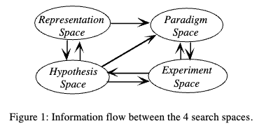

# Schunn & Klahr — A 4-space model of scientific discovery

```
Schunn, C.D. and Klahr, D., 1995. A 4-space model of scientific discovery. In Proceedings of the 17th annual conference of the cognitive science society (pp. 106-111). Mahwah, NJ: Lawrence Erlbaum Associates.
```

# One Sentence

---

This paper presents a model of scientific discovery that consists of 

- data representation (identifying features worth studying in the data),
- hypothesis formulation (proposing causal relationship between features and phenomena of interest),
- experimental paradigms (selecting a class of experiments for testing the hypothesis)
- experiment (instantiating a specific experimental design from the chosen paradigm)



# More Sentences

---

# Key Points

---

# Other Notes

---

### Three ways of identifying features in the data representation space

- Notice invariants: notice something that never changes and try to “perturb” it
- Analogy: analogize the data to something else, e.g., this protein works just like that other protein
- Brute-force search: exhaustively examine all known aspects given the data

### Piecemeal induction

> In the first stage of piecemeal induction, a hypothesis is generated (either from memory or from data). Then, a scoping process determines the generality or scope of the
> 

# Take-Away

---

- Unclear how to separate paradigm and experiment, since they often happen together as a experimental design process