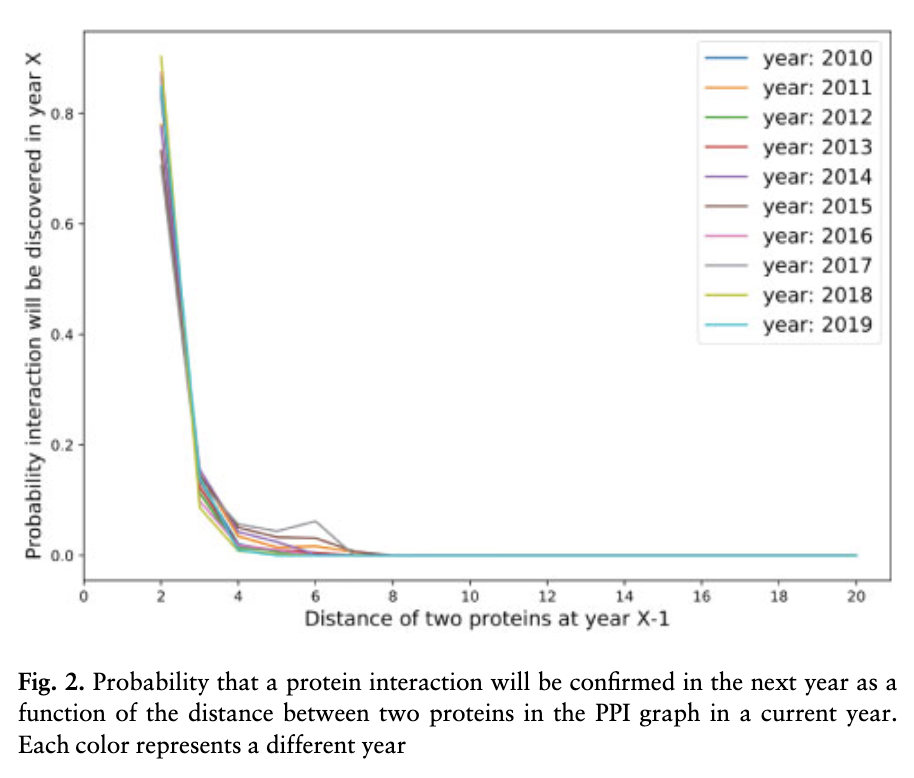

# Singer et al. — On biases of attention in scientific discovery

```

@article{singer_biases_2021,
	title = {On biases of attention in scientific discovery},
	volume = {36},
	issn = {1367-4803},
	url = {https://doi.org/10.1093/bioinformatics/btaa1036},
	doi = {10.1093/bioinformatics/btaa1036},
	abstract = {How do nuances of scientists’ attention influence what they discover? We pursue an understanding of the influences of patterns of attention on discovery with a case study about confirmations of protein–protein interactions over time. We find that modeling and accounting for attention can help us to recognize and interpret biases in large-scale and widely used databases of confirmed interactions and to better understand missing data and unknowns. Additionally, we present an analysis of how awareness of patterns of attention and use of debiasing techniques can foster earlier discoveries.The data is freely available at https://github.com/urielsinger/PPI-unbias.},
	number = {22-23},
	urldate = {2024-07-28},
	journal = {Bioinformatics},
	author = {Singer, Uriel and Radinsky, Kira and Horvitz, Eric},
	month = apr,
	year = {2021},
	pages = {5269--5274},
	file = {Snapshot:/Users/prof.biu/Zotero/storage/SD3A558W/6039114.html:text/html},
}

```

# One Sentence

---

This paper analyzes how scientists discovered protein-protein interactions (PPIs) over time and found attentional biases—that is, scientists tend to discover new interactions with proteins with a small degree of separation from proteins with the known interactions.

# More Sentences

---

> … patterns of exploration and confirmation have become embedded and implicit in the protein-protein interaction (PPI) database
> 

> … new discoveries about protein interactions in a consecutive year are highly skewed toward protein interactions with small distances in the PPI graph for the current year.
> 



# Key Points

---

### Sources of biases

> … discoveries about protein interactions are rooted in scientists’ attention to recent findings. Such biases may be rooted in several factors, including the sequencing of attention to specific sets of biochemical pathways of interest, and pursuit of understanding of these systems via PPI testing when one or more proteins are already known to be interacting with one another.
> 

### Formalization

The probability that scientists will discover a protein is a chain of two probabilities

> (1.A) the probability that the proteins will be found to interact, given the experiment is carried out and (1.B) the probability of an experiment being performed to check the interaction during the period.
> 

The (1.B) probability is a chain of the following two:

> (2.A) the probability that scientists are interested in performing a specific experiment to validate or invalidate a hypothesis about an interaction and (2.B) the probability that they have the required scientific tools, experimental resources and affordances.
> 

### How to simulate discovery with attentional biases

First, calculate the feature vector of an edge in the PPI graph

> … the feature vector of an edge linking two proteins is calculated as the absolute differences of the protein feature vector of each of the linked proteins.
> 

Then, set up the counterfactual scenario

> … a matching analysis is applied on edges with distance d>2 (’original edges’) to edges with distance d=2 (’matched edges’), by selecting the specific set of features and distance metric … to answer the question: ‘What if the *protein distance* was 2 instead of n?’
> 

### How to quantify/define bias of attention

The high-level idea is to predict PPI discovery based on 1) the original edge (where d>2) and 2) the matched edge (i.e., assuming the edge is at d=2).

If prediction performance based on the original edge is close to the matched edge, that means d doesn’t really matter, therefore no bias of attention.

# Other Notes

---

### The PPI data this paper analyzes

> … proteins in *H.sapiens*. While the human genome encodes ~30,000 proteins … defining a space of nearly a half billion potential interactions, only ~300,000 interactions for ~17,000 proteins have been confirmed to date.
> 

# Take-Away

---

What this paper did not cover is empirical evidence of how scientists’ work is actually influenced by biases. Instead, this paper derives its findings from predicting what scientists might have discovered (based on what they did discover).

### Supporting “leaps” in scientific endeavor

> … the potential value of adding to research portfolio the formulation and pursuit of hypotheses that make more distant leaps in conceptual spaces.
>