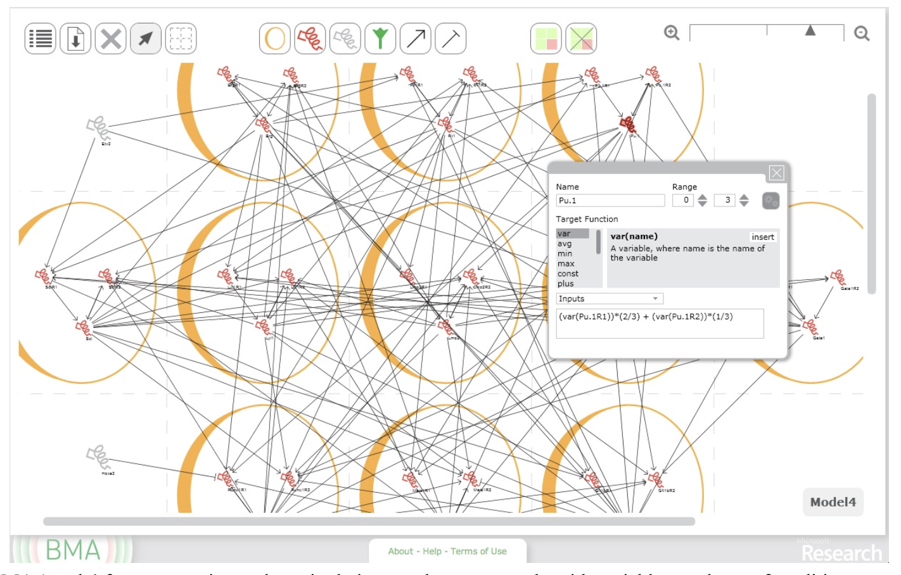

# Taylor et al. — At the interface of biology and computation

```

@inproceedings{taylor_at_2013,
	address = {New York, NY, USA},
	series = {{CHI} '13},
	title = {At the interface of biology and computation},
	isbn = {978-1-4503-1899-0},
	url = {https://dl.acm.org/doi/10.1145/2470654.2470725},
	doi = {10.1145/2470654.2470725},
	abstract = {Representing a new class of tool for biological modeling, Bio Model Analyzer (BMA) uses sophisticated computational techniques to determine stabilization in cellular networks. This paper presents designs aimed at easing the problems that can arise when such techniques - {\textbackslash}'14using distinct approaches to conceptualizing networks{\textbackslash}'14 - are applied in biology. The work also engages with more fundamental issues being discussed in the philosophy of science and science studies. It shows how scientific ways of knowing are constituted in routine interactions with tools like BMA, where the emphasis is on the practical business at hand, even when seemingly deep conceptual problems exist. For design, this perspective refigures the frictions raised when computation is used to model biology. Rather than obstacles, they can be seen as opportunities for opening up different ways of knowing.},
	urldate = {2024-10-21},
	booktitle = {Proceedings of the {SIGCHI} {Conference} on {Human} {Factors} in {Computing} {Systems}},
	publisher = {Association for Computing Machinery},
	author = {Taylor, Alex S. and Piterman, Nir and Ishtiaq, Samin and Fisher, Jasmin and Cook, Byron and Cockerton, Caitlin and Bourton, Sam and Benque, David},
	month = apr,
	year = {2013},
	pages = {493--502},
	file = {Full Text PDF:/Users/prof.biu/Zotero/storage/UX7NG6ZV/Taylor et al. - 2013 - At the interface of biology and computation.pdf:application/pdf},
}

```

# One Sentence

---

This paper discusses the authors’ experience working on the interface of Bio Model Analyzer (BMA)—a tool that supports biologists to simulate and understand the stabilization of cellular networks.

# More Sentences

---

> … we’ve shown that seeing tools like BMA as part of a set of practices for getting on with scientific work allows apparent problems arising from the use of computational techniques to be constructively refigured.
> 

# Key Points

---

### Two design approaches of SDST

> Bottom-up approaches … construct models directly from experimental evidence, building up representations from discrete biological functions.
> 

> Top-down techniques … may or may not have an immediate correspondence to biological processes. A high-level structure is determined by the computational technique applied, in a sense how the code or program is run to produce them.
> 

An example of top-down:

> BMA … runs … a symbolic model-checking algorithm to prove whether the model achieves *stabilization …* It checks, in other words, whether the modeled system will, from every possible starting point, always eventually reach a single ‘safe’ configuration or equilibrium.
> 

### BMA UI overview

> … a web-based front-end … the graphical construction and manipulation of biological networks … and, two, the execution of the proof and graphical presentation of the results.
> 



### SDST should go beyond visualization and serve as “enactments”

> They help to see tools using top-down structural modeling techniques such as BMA as new ways of interacting with and, in a manner of speaking, enacting biology, and thus ‘seeing’ the phenomena anew. If computational tools are thought not as lenses onto a static phenomenal world—a presupposed ground truth—but instead part of the assemblage of things that constitute the “intra-action” of the experiment, …
> 

### The design of SDST can start from a basic interface …

Start with some default view/visualization/representation of data, which would be problematic, thus opening up various ways of enabling experts to view and act on the data.

> … the frictions open up opportunities for representing multiple figurings of phenomena and consequently enabling biology to be enacted in divergent and new ways
> 

### The potential value of offering multiple views of the same data

> … offer multiple and in some cases divergent ways of working with and making sense of the model data at the cost of consistency.
… encourage a succession of views of the analysis that can be easily compared and contrasted, and that help users piece together a picture of the interventions they’ve made.
> 

> … “representations are not (more or less faithful) pictures of what is, but productive evocations, provocations, and generative material articulations or reconfigurations of what is and what is possible”
> 

# Other Notes

---

### Motivating HCI’s contribution to SDST

> … HCI has an important contribution to make in the uptake of computation in the sciences, and crucially how computation becomes entangled in the ways scientific knowledge is constituted.
> 

# Take-Away

---