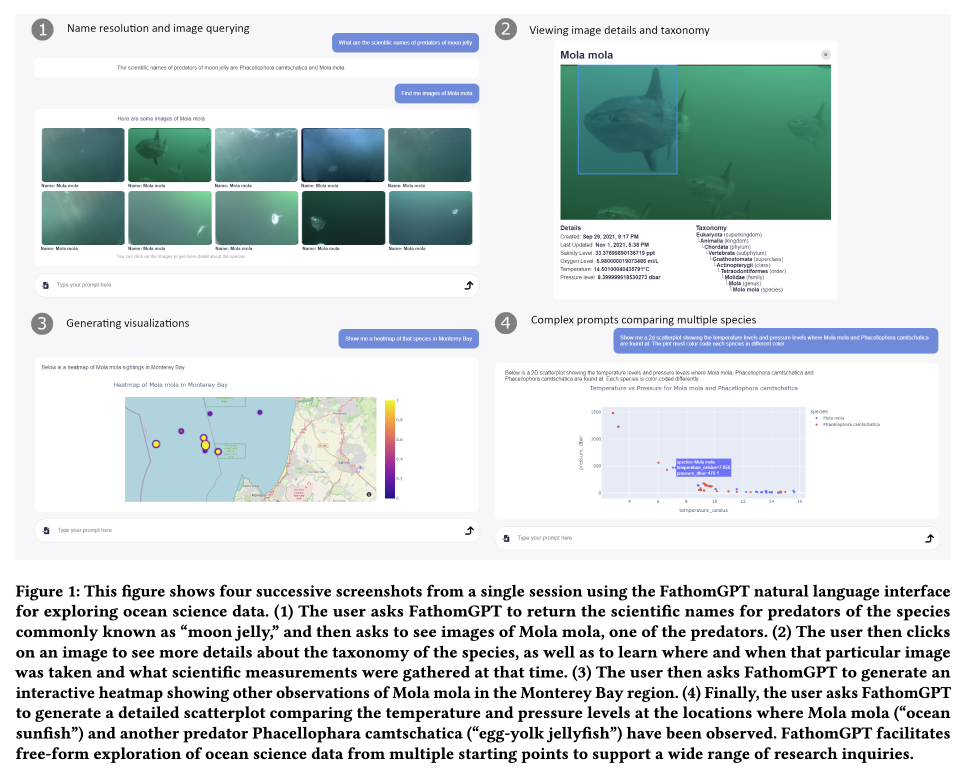

# Khanal et al. — A natural language interface for interactively exploring ocean science data

```
@inproceedings{10.1145/3654777.3676462,
author = {Khanal, Nabin and Yu, Chun Meng and Chiu, Jui-Cheng and Chaudhary, Anav and Zhang, Ziyue and Katija, Kakani and Forbes, Angus G.},
title = {FathomGPT: A natural language interface for interactively exploring ocean science data},
year = {2024},
isbn = {9798400706288},
publisher = {Association for Computing Machinery},
address = {New York, NY, USA},
url = {https://doi.org/10.1145/3654777.3676462},
doi = {10.1145/3654777.3676462},
abstract = {We introduce FathomGPT, an open source system for the interactive investigation of ocean science data via a natural language interface. FathomGPT was developed in close collaboration with marine scientists to enable researchers to explore and analyze the FathomNet image database. FathomGPT provides a custom information retrieval pipeline that leverages OpenAI’s large language models to enable: the creation of complex queries to retrieve images, taxonomic information, and scientific measurements; mapping common names and morphological features to scientific names; generating interactive charts on demand; and searching by image or specified patterns within an image. In designing FathomGPT, particular emphasis was placed on enhancing the user’s experience by facilitating free-form exploration and optimizing response times. We present an architectural overview and implementation details of FathomGPT, along with a series of ablation studies that demonstrate the effectiveness of our approach to name resolution, fine tuning, and prompt modification. We also present usage scenarios of interactive data exploration sessions and document feedback from ocean scientists and machine learning experts.},
booktitle = {Proceedings of the 37th Annual ACM Symposium on User Interface Software and Technology},
articleno = {95},
numpages = {15},
keywords = {Natural Language Interfaces, Ocean Science, Scientific Databases},
location = {Pittsburgh, PA, USA},
series = {UIST '24}
}
```

# One Sentence


This paper describes FathomGPT—a natural language interface for scientists to explore the FathomNet image database



# More Sentences


How LMs uniquely enable FathomGPT:

- Understanding query and questions, grounded in a database
- Generating visualizations of data as multiple views of the initial query/question
- …

> the creation of complex queries to retrieve images, taxonomic information, and scientifc measurements; mapping common names and morphological features to scientifc names; generating interactive charts on demand; and searching by image or specifed patterns within an image.
> 

# Key Points


# Other Notes


### Cite this to motivate SDST

> … [11] delineate core issues that prevent researchers and other users from incorporating scientific databases into their scientific workflows … a lack of accessible tools and interfaces.
> 

# Take-Away


### Bootstrapping evaluation with some events

> We recently introduced FathomGPT at a workshop for users of FathomNet that took place over two 4-hour sessions …
> 

### Pre-define criteria to ease evaluation

> We categorized the output from each prompt in terms of 5 different error categories in order to evaluate its quality …
> 

### The overall evaluation strategy

Collect a data set of real-world (not in a controlled setting) with 10+ users and then focus on data analysis.