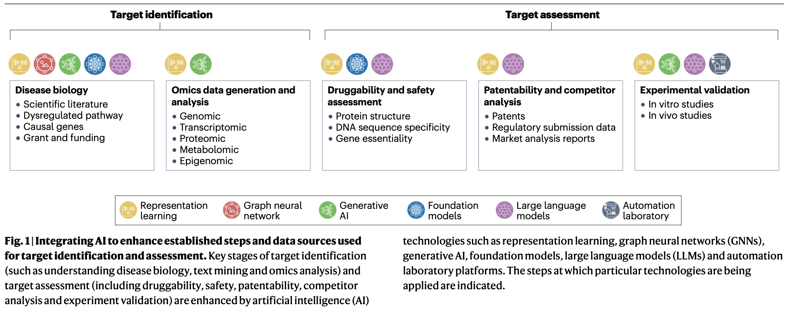

<!-- save as: <last-name-of-first-author>_<paper-title>.md -->

# Pun et al.: Target identification and assessment in the era of AI

## One Sentence
<!-- summarize the paper in one sentence, ideally with one figure as well -->

## More Sentences
<!-- additional sentences -->

## Key Points
<!-- the most important things in this paper -->

### Detailed number to show the challenge of target ID
> Of the approximately 20,000 protein-coding genes in humans, an estimated 4,500 are considered druggable. Yet all approved drugs to date exert their effect through only 716 distinct targets, representing a small fraction of the druggable target space and underscoring the substantial opportunity for future target discovery research.

### The classic novelty-plausibility trade-off
> The strategic selection of targets often involves a delicate trade-off between novelty and confidence in the target;s role in disease.

### Types of data AI can use for target ID
1. "Omics" data
> ... include genetic, transcriptomics, proteomics, metabolomics, epigenetics and microbiomics data, provide comprehensive biological information that enables a systemic view of the molecular aspects of disease.

2. Cellular imaging data

3. Biological knowledge graphs
> ... organize and represent the complex relationships and interactions among biological entities in a graph structure.

Examples:
- interaction networks, e.g., STRING;
- biological pathways, e.g., KEGG;
- heterogeneous knowledge graphs, e.g., PrimeKG.
    - heterogeneity == including multiple entity types, e.g., genes, pathways, and diseases.

## Other Notes
<!-- other things, not so important, but good to know -->

### What is (target) druggability
> ... the potential to identify a drug candidate capable of modulating the function of a target in the way (for example, inhibition or activation) that is hypothesized to result in the desired outcome (such as disease modification or symptom alleviation) in patients affected by a specific disease.

### Targets are more than just proteins ...
> A growing number of other therapeutic modalities beyond small molecules are now clinically validated ...

### Besides druggability, safety is another consideration in target ID
> ... relies on predictive (computational) toxicology and analysis of the target's associated biological pathways to anticipate potential adverse effects.

## Take-Away
<!-- critiques, ideas, actionable things, etc. -->

### What to focus on when reading deep ...
> ... discuss the obstacles hindering the effective use of AI in target identification and strategies to overcome them.

Think of each of the following row as a potential project idea (admittedly some rows entail more than one project). For example, HAPPIER addresses the fragmented tool and heterogenous data problem.

(I placed 🚩 next to challenges that HCI can possibly address---perhaps the one related to bias is the most overlooked?)

| Challenge / Obstacle | Why It Matters for Target ID | Strategy to Overcome | Symbiotic Computing Opportunity |
|----------------------|------------------------------|----------------------|----------------------------------|
| Limited data for rare diseases and underrepresented populations | Models generalize poorly and may miss disease-specific biology | Synthetic data generation, digital twins, targeted data collection, multimodal integration | Help scientists identify where evidence is sparse and guide targeted data acquisition |
| 🚩 Literature and knowledge graph bias | Well-studied genes dominate predictions while novel "dark genes" are overlooked | Debias graph representations, incorporate novelty-aware ranking, diversify evidence sources | Visualize confidence vs. novelty tradeoffs and surface overlooked hypotheses |
| Class imbalance (few known targets vs. many unknown genes) | Models tend to favor established target patterns and may suppress novel discoveries | Positive-unlabeled learning, semi-supervised learning, uncertainty-aware modeling | Support exploration of uncertain but promising candidates rather than only top-ranked targets |
| Black-box AI models and lack of interpretability | Scientists cannot easily evaluate or trust recommendations | Explainable AI, feature attribution, evidence retrieval, pathway-aware reasoning | Provide transparent evidence trails showing why a target was recommended |
| Difficulty integrating heterogeneous data | Disease mechanisms span omics, imaging, clinical, literature, and graph data | Multimodal foundation models, heterogeneous knowledge graphs, integrated data warehouses | Create unified evidence workspaces that organize and compare evidence across modalities |
| Weak connection between prediction and biological mechanism | High predictive accuracy does not necessarily imply mechanistic validity | Causal inference methods, perturbation data, mechanistic pathway modeling | Support hypothesis generation and causal reasoning rather than prediction alone |
| Inadequate evaluation metrics | Standard ML metrics ignore biological relevance and clinical feasibility | Disease-specific benchmarks (e.g., TargetBench), multidimensional evaluation | Allow users to evaluate targets along multiple dimensions rather than a single score |
| 🚩 Difficulty navigating massive hypothesis spaces | Scientists cannot manually inspect thousands of candidate targets and evidence sources | AI-assisted prioritization, clustering, representation learning | Treat discovery as hypothesis-space navigation, helping scientists explore, compare, and refine candidate mechanisms |
| 🚩 Fragmented discovery workflow | Target generation, assessment, validation, and learning occur in disconnected tools | AI-driven closed-loop experimental platforms | Create a human-AI discovery loop where hypotheses, experiments, results, and model updates continuously inform one another |