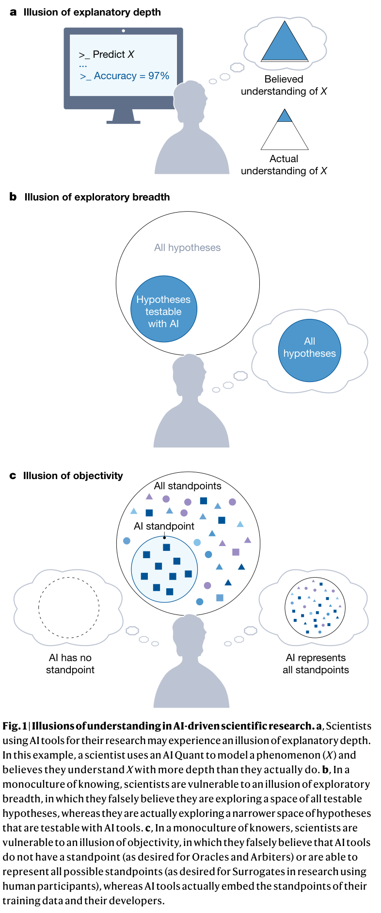

<!-- save as: <last-name-of-first-author>_<paper-title>.md -->

# Messeri et al.: Artificial intelligence and illusions of understanding in scientific research

## One Sentence

AI can make science more productive while making scientists understand less: treating it as a trusted knowledge-production partner can create illusions of understanding that hide narrowing methods, questions, and standpoints.

## More Sentences

The authors analyze four recurring *visions* of AI across the research pipeline—Oracle, Surrogate, Quant, and Arbiter—each promoted as overcoming limits of human time, attention, cognition, or objectivity. Their central concern is systemic rather than merely technical: even accurate tools can encourage scientific monocultures by privileging AI-compatible methods and the standpoints encoded in training data and tool design. The remedy is not to reject AI, but to preserve diverse ways of knowing and diverse human knowers while treating higher output as distinct from deeper understanding.

## Key Points

### The four roles AI plays in scientific discovery

These are aspirational sociotechnical *visions*, not claims about current capabilities:

- **Oracle (study design):** searches, evaluates, and summarizes a literature too large for humans to digest, and uses it to generate hypotheses.
- **Surrogate (data collection):** generates synthetic observations from complex systems—potentially simulating human participants or augmenting scarce biological and physical data.
- **Quant (data preparation and analysis):** curates, annotates, models, and extracts patterns from datasets too large or complex for unaided human analysis.
- **Arbiter (peer review and evaluation):** screens papers and proposals, writes or assists reviews, and predicts the merit or replicability of findings.

The roles are interdependent: Surrogates create data for Quants; their increased output creates more papers for Arbiters and more literature for Oracles.

### Three illusions of understanding

- **Explanatory depth:** a successful prediction or an AI-provided explanation is mistaken for the scientist's own causal understanding.
- **Exploratory breadth:** hypotheses that AI can test are mistaken for the full space of testable hypotheses.
- **Objectivity:** AI is imagined either to have no standpoint or to represent all standpoints, although its developers, training data, and design choices necessarily embed particular ones.

### How monocultures form

- A **monoculture of knowing** privileges quantitative, reductive, prediction-oriented questions because they are easy to pursue with AI; qualitative, contextual, causal, or otherwise hard-to-quantify questions receive less attention.
- A **monoculture of knowers** treats AI as a neutral, universal substitute for cognitively and demographically diverse people, masking the narrow standpoints built into tools.
- These monocultures can increase output while reducing error detection and innovation. This is a systemic risk even when each tool is accurate and each user is competent.

## Other Notes

- Scientists may trust AI because scientific work is difficult and high-volume, AI appears objective and “superhuman,” and reductive quantitative answers feel satisfying.
- Trust can be especially risky outside one's expertise: users are both less able to detect unreasonable results and more inclined to defer to the tool.
- Private, closed models add conflicts between scientific goals and corporate incentives, as well as problems of transparency and reproducibility.
- The authors recommend clearly stating why AI is being used, retaining cognitively and demographically diverse teams, teaching science and technology studies and philosophy alongside technical skills, and questioning institutional incentives to produce more research faster.

## Take-Away

### The illusion of exploratory breadth motivates HypoMap

By visually mapping the exploration-worthy hypothesis space, HypoMap attempts to counter the false impression that AI-generated hypotheses cover most of that space. A map alone does not solve the problem, however: its dimensions and boundaries can reproduce the same monoculture if they are derived only from existing literature or AI-compatible representations. The design should expose what is omitted, support multiple ways of organizing the space, and make uncertainty visible.

### Why these four roles? Are they complete

The paper derives the typology from recent cross-disciplinary publications about AI in science, aligning each role with a stage of the research pipeline and a perceived human limit. The authors explicitly say it is **not exhaustive**: they select visions relevant to the epistemic risks they analyze. As a pipeline taxonomy, it leaves experimentation and laboratory control, theory building, research execution, writing/dissemination, and coordination only partly covered. It is therefore best read as an analytical lens for four influential narratives—not as a complete taxonomy of scientific work or AI capabilities. The categories can also blur: one system may act as Oracle, Quant, and Arbiter in the same workflow.

### Critical assessment

The paper's strongest move is shifting attention from individual model errors to collective effects: better benchmark performance does not protect against a field-wide narrowing of questions and methods. Its weakness is that the monoculture argument is mainly conceptual and anticipatory; the paper offers little direct evidence about how often these AI-induced illusions occur in real scientific practice or which interventions work. The proposed safeguards—diverse teams, broader education, transparency, and reflection on incentives—are sensible but underspecified and difficult to evaluate.

## Source

Messeri, Lisa, and M. J. Crockett. “Artificial Intelligence and Illusions of Understanding in Scientific Research.” *Nature* 627 (2024): 49–58. https://doi.org/10.1038/s41586-024-07146-0
