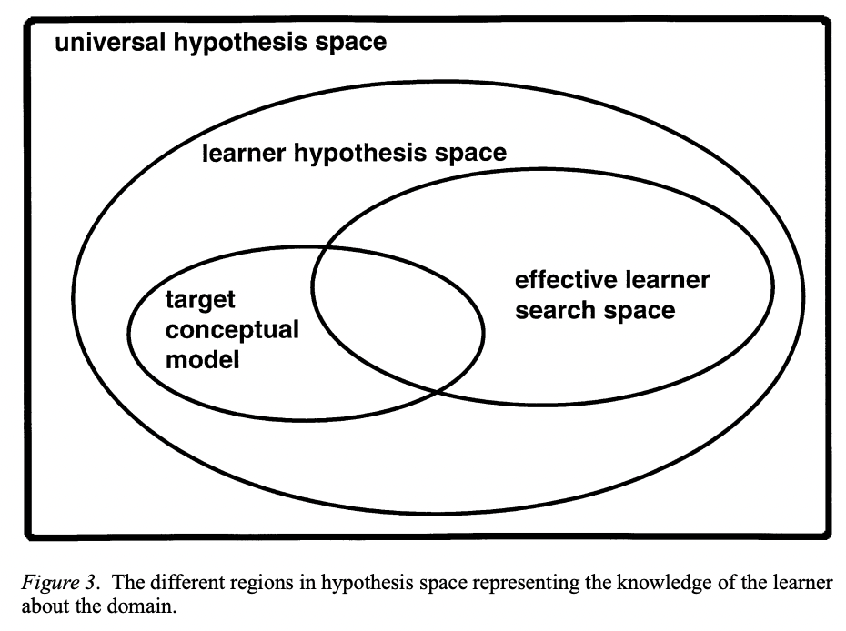
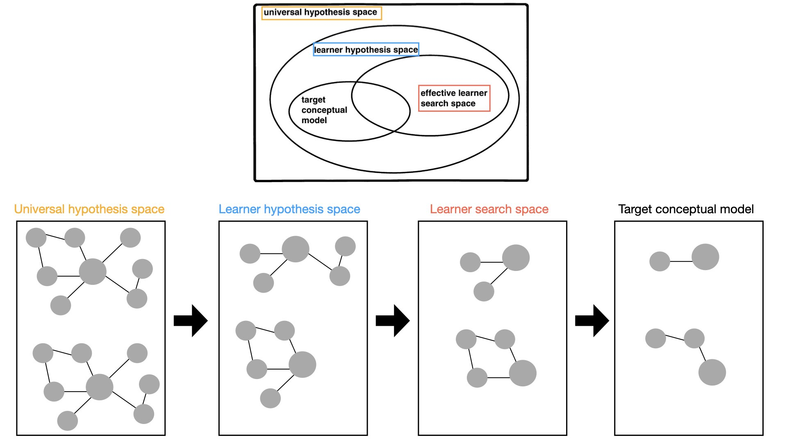

# Joolingen — An Extended Dual Search Space Model of Scientific Discovery Learning

```
`@article{van1997extended,
  title={An extended dual search space model of scientific discovery learning},
  author={Van Joolingen, Wouter R and De Jong, TON},
  journal={Instructional Science},
  volume={25},
  pages={307--346},
  year={1997},
  publisher={Springer}
}`,
	abstract = {This article describes a theory of scientific discovery learning which is an extension of Klahr and Dunbar’s model of Scientific Discovery as Dual Search (SDDS) model. We present a model capable of describing and understanding scientific discovery learning in complex domains in terms of the SDDS framework. The concepts of hypothesis space and experiment space, central to SDDS, are elaborated and used as a representation of the learner’s knowledge. Also, we introduce a taxonomy of search operations in hypothesis space which allows us to describe in detail the processes of discovery. Our ideas are tested against data of subjects who comment on the discovery processes of a simulated learner. It is found that the conditions for performance a search operation in hypothesis space include both sufficient knowledge of the search operation itself and reasons for choosing a specific search operation. Furthermore, a number of constraints on the search in hypothesis space is discussed: domain specific and generic prior knowledge, learning goals, and personality factors. We conclude with some recommendations for the design of discovery-based learning environments.},
	keywords = {discovery learning, scientific discovery, problem solving, simulation-based
learning},
	file = {https://link.springer.com/content/pdf/10.1023/A:1002993406499.pdf},
}

```

# One Sentence


- This paper discusses the decomposition of hypothesis space in scientific discovery.
    - Universal hypothesis space
    - Learner hypothesis space
    - Effective learner search space
    - Target conceptual model
    

    

# More Sentences


# Key Points


## The decomposition of hypothesis space

- Universal hypothesis space: all possible hypotheses about a certain domain, independent of their truth value, plausibility, learner’s judgment or whatever attribute can be found.
- Learner hypothesis: the hypothesis space that the learner knows of. This is still independent of the learner’s judgment. This is the space that the learner can search directly. To go outside this space, the learner must acquire knowledge about new relations or variables;
- Learner search space: the learner decides to be worthwhile for testing. This is a subspace of the learner hypothesis space, since learners may decide not to explore specific parts of their learner hypothesis space.
- Target conceptual model: True hypotheses after experiemnts. At the end of a successful discovery process, we expect the learner to have found a set of relations equivalent to the target conceptual model (after wet-lab).

## The possibility of ‘confirmation bias’

> Learners may lack knowledge of the search processes themselves, for instance not know the idea of generalization of hypotheses, or they may have insufficient knowledge of what kind of hypotheses to state or what kinds of experiments to perform. For instance a known problem is that of conformation bias where learners perform only experiments that are able to confirm a hypothesis.
> 

# Other Notes


# Take-Away


## Applying this theory into our task (identifying protein candidates for wet-lab)



- Universal hypothesis space: PPI interaction of proteins regarding AD ([4,568 proteins](https://platform.opentargets.org/disease/MONDO_0004975/classic-associations))
- Learner hypothesis: PPI interaction of proteins regarding AD that researchers knows of
- Learner search space: Candidates of proteins that satisfy their criteria for wet lab
    - e.g., possibility of drug affinity (docking with their ligand), genetic similarity, whether a protein had previously been used as the target protein for other AD drugs
- Target conceptual model: The results of wet-lab

→ If we can map this theory to our task, there would be possibility of confirmation bias

## Broadening learner hypothesis space and learner search space could prevent confirmation bias (as design goals).

- Broadening the learner's hypothesis space: it might help researchers consider the proteins that they had never done before.
    - *PPI graph based on the protein related to the disease that they are interested in.*
- Scoping / repositioning the learner's search space: it might enable scientists to quickly and efficiently find proteins that meet their criteria.
    - e.g., whether a protein has previously been used as a target protein for AD drugs, drug affinity (docking with the ligand), etc.

### How? - Three ways of identifying features in the data representation space

- Brute-force search: exhaustively examine all known aspects given the data
    - → Broadening the learner’s hypothesis space
    - STRING dataset: the biggest dataset based on previous work (researchers trust 100%)
- Analogy: analogize the data to something else, e.g., this protein works just like that other protein
    - → Broadening the learner’s search space
    - AI and Molecular similarity
        1. AI-based approach: DiffDock model
        2. Molecular similarity-based: Tanimoto coefficient (if the ligand of some protein is similar to the researchers’ ligand, the protein has high possibility of docking with the researchers’ ligand.

### Motivating mapping the hypothesis space
The theory of these spaces suggests the sheer layers of unknown, thus the need to map the hypothesis space.
