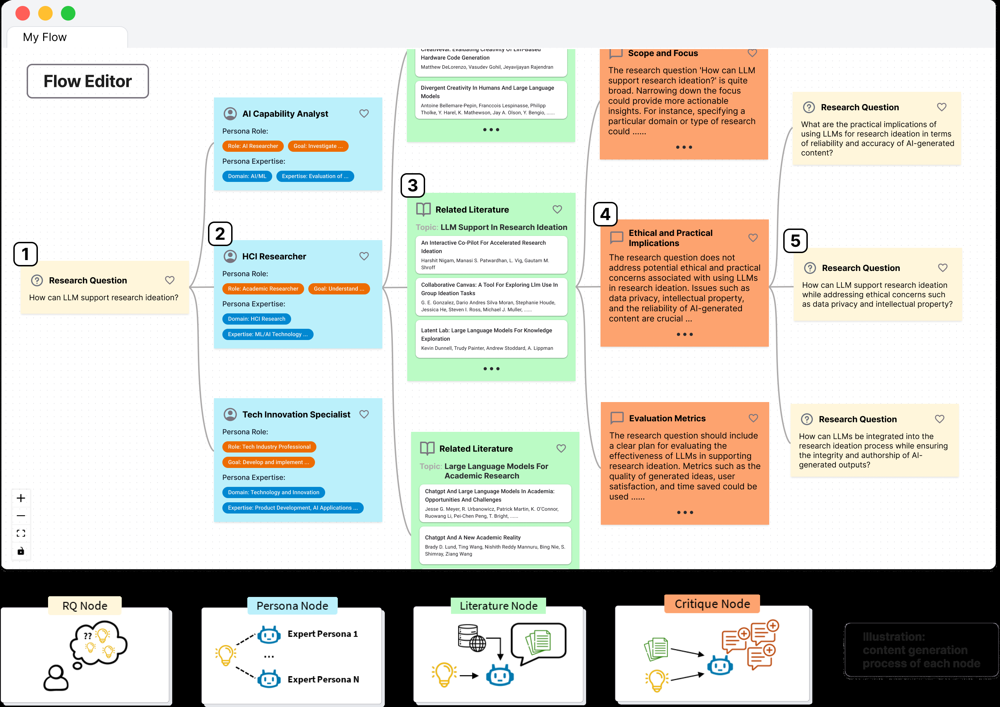

<!-- save as: <last-name-of-first-author>_<paper-title>.md -->

# Liu et al.: PersonaFlow: Designing LLM-Simulated Expert Perspectives for Enhanced Research Ideation

## One Sentence
<!-- summarize the paper in one sentence, ideally with one figure as well -->
This paper presents an LLM-enabled hypothesis generation workflow that allows researchers to post a research question, create multiple personas, each of which then reviews literature, critique researchers' ideas, and help formulate ideas into research questions.

*Figure 1. PersonaFlow's interface and node-generation workflow (from the [paper](https://arxiv.org/abs/2409.12538)).*

## More Sentences
<!-- additional sentences -->

## Key Points
<!-- the most important things in this paper -->

### Findings likely to be tre

> (using the proposed system) promoted users' critical thinking activities ...
> ... users' ability to customize expert profiles significantly improved their sense of agency

### Questionable findings---might be p-hacking (unreplicable)

> ... 1) increased the perceived relevance and creativity of ideated research directions

**Verdict: The results are suggestive, but they do not support the causal claim that multiple personas increased relevance and creativity.** The study had 21 participants use one persona first and multiple personas second, always in that order, with the second stage building on the first. Relevance and helpfulness ratings for critiques improved, but this could reflect additional time, outputs, literature, or familiarity with the interface rather than multiple personas specifically. The creativity result is weaker still: it is a modest correlation between the number of perspectives used and *self-rated* RQ creativity ($r=.37$, $p=.041$), not an independent assessment of creativity or a randomized condition effect. With many outcomes and no reported correction for multiple comparisons, the borderline $p$-values should be treated as exploratory rather than confirmatory. This is not evidence of p-hacking by itself, but the design gives considerable researcher degrees of freedom.

> ... (using the proposed system) without increasing their perceived cognitive load

**Verdict: The study does not establish that multiple personas leave cognitive load unchanged.** The paper measured cognitive load with one 5-point item (“The task is very mentally demanding”) and found no significant single- versus multi-persona difference. Failure to reject a difference is not evidence that the conditions are equivalent; supporting “without increasing” would require a pre-specified non-inferiority/equivalence test with adequate power and a validated multi-item load measure. The fixed order also works against a clean interpretation: later-stage complexity may be offset by practice with the system.

> ... (creating personas) mitigate their over-reliance on AI

**Verdict: The claim that creating or customizing personas mitigates over-reliance is unsupported speculation.** More persona-profile edits were associated with greater perceived control and recall, but not with lower self-reported reliance. The reported association with lower reliance was instead for editing **RQ nodes**. Because edits were self-selected, these regressions also cannot distinguish whether editing caused agency or whether more skeptical/engaged participants both edited more and felt more control. A study of over-reliance would need accuracy-sensitive tasks and behavioral measures such as detecting, rejecting, or correcting bad AI suggestions.

## Other Notes
<!-- other things, not so important, but good to know -->

## Take-Away
<!-- critiques, ideas, actionable things, etc. -->

### Unclear: defining persona

A persona is represented as a natural-language, structured profile rather than as only a single free-form prompt. Its editable fields include a name, functional role and goal, background/expertise traits (e.g., domain, experience, skills, methods, education, and knowledge), and user instructions. GPT-4o initially proposes three personas from (1) the user's RQ, (2) a summary of a selected literature node, or (3) a profile inferred from a relevant first author's papers. Users can then select, edit, combine, delete, or manually create personas.

The system therefore helps answer “which personas?” by proposing candidates and iteratively proposing new ones from discovered literature. It does **not**, however, establish that the proposed set covers the expertise a project actually needs. The authors did not evaluate persona accuracy or quality, and users often favored personas resembling their own background. That leaves a circularity: a researcher exploring an unfamiliar field may lack the knowledge needed to recognize a missing or misleading expert perspective. A stronger design would expose why each persona was suggested, map each one to literature-backed competencies, identify uncovered aspects of the RQ, and let users request contrasting or adversarial perspectives.

### Unclear: baseline

There is no external baseline such as ChatGPT or another ideation tool. The paper's only comparison is a fixed-order, within-participant contrast: all 21 participants first completed one iteration with a single PersonaFlow persona, then continued from that result using multiple personas. The authors omitted a chatbot baseline because formative participants found generic chatbots difficult to prompt and because another condition would lengthen already long sessions.

This is useful for observing interaction patterns, but it is not a strong baseline for attributing outcomes to multiple personas or to PersonaFlow. Condition is confounded with order, accumulated ideation time, number of model outputs, literature exposure, and practice. A stronger evaluation would counterbalance single- and multi-persona conditions and hold constant time, output count, model, retrieval access, and interface. It should also include a plain-LLM baseline and a “same information, no persona framing” ablation to isolate whether the benefit comes from persona simulation, multiple samples, literature retrieval, or the graph workflow.
