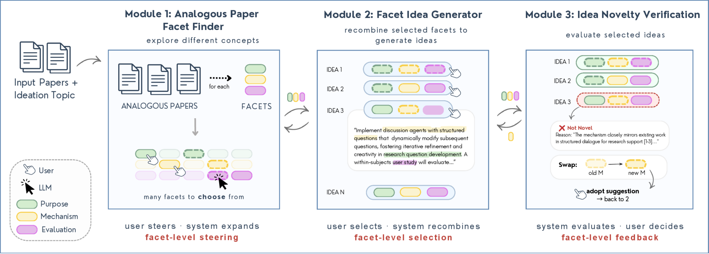

<!-- save as: <last-name-of-first-author>_<paper-title>.md -->

# Radensky et al.: Sideator: Human-LLM Compound System for Scientific Ideation through Facet Recombination and Novelty Evaluation

## One Sentence
<!-- summarize the paper in one sentence, ideally with one figure as well -->

## More Sentences
<!-- additional sentences -->

## Key Points
<!-- the most important things in this paper -->

### Main motivation of this work
> However, this line of work stopped at surfacing analogous papers as inspirations with no interface for *applying* the inspirations to synthesize recombinant ideas or for *evaluating* the generated ideas vis-à-vis existing literature to assess novelty. These important and cognitively taxing tasks were left to the scientists, with no support.

### The (only three?) facets
> purpose, mechanisms, and evaluations

Yes. Scideator's shared representation has exactly three facet types: **purpose** (the problem being addressed), **mechanism** (the proposed solution), and **evaluation** (how the system determines whether the mechanism addresses the purpose). All three are used to describe papers and ideas, generate ideas, assess novelty, and suggest revisions. However, analogous-paper retrieval and distance calculation use only purpose–mechanism pairs; evaluation is extracted after retrieval and does not determine conceptual distance.

## Other Notes
<!-- other things, not so important, but good to know -->

## Take-Away
<!-- critiques, ideas, actionable things, etc. -->

### How about plausibility
The paper seems to focus on novelty only when assessing an idea that consists of recombined facets, which seems also likely to yield implausible ideas?

Yes—this is a real limitation. Scideator does give **feasibility** some attention during generation: the LLM ranks candidate analogies against understandability, relevance, feasibility, specificity, and novelty, and its prompt defines feasibility as achievable by a moderately resourced lab with a mechanism suited to the purpose and an evaluation suited to both. But this is an LLM self-critique, not a retrieval-grounded plausibility checker analogous to the novelty module.

The evaluation does not establish that recombined ideas are more plausible. Participants rated the feasibility of their favorite Scideator and baseline ideas about the same (median paired difference 0.00), and some avoided distant facets because they could not see how the proposed mechanism could accomplish the purpose. Thus, facet recombination deliberately expands the search space but can also create purpose–mechanism–evaluation incompatibilities. A useful extension would separately test (1) mechanism-to-purpose causal fit, (2) evaluation validity, (3) required resources and data, and (4) conflicts with established domain knowledge—ideally using domain-specific evidence and expert review rather than only the generating LLM.

### Further readings

- [19] Karl Duncker and Lynne S. Lees. 1945. “On Problem-Solving.” *Psychological Monographs* 58(5), i. — The classic source for functional fixedness, relevant to the motivation for exposing scientists to unfamiliar facets.
- [51] A. Terry Purcell and John S. Gero. 1996. “Design and Other Types of Fixation.” *Design Studies* 17(4), 363–383. — A review and experimental account of how prior examples constrain design ideation.
- [7] Margaret A. Boden. 2004. *The Creative Mind: Myths and Mechanisms*. Routledge. — A foundational account of combinational, exploratory, and transformational creativity.
- [56] Dean Keith Simonton. 2021. “[Scientific Creativity: Discovery and Invention as Combinatorial](https://doi.org/10.3389/fpsyg.2021.721104).” *Frontiers in Psychology* 12. — Develops the view of scientific creativity as combinations of existing components.

### The original contributions of the three modules
- Analogous Paper Facet Finder seems already explored in prior work as reviewed in the early part of the intro?
- Faceted Idea Generator is just recombining facets and phrase them in natural language to describe the idea?
- Idea Novelty Checker? Original or that prior work has also used literature to assess novelty?

The primitives are mostly not new; the main contribution is how they are operationalized, connected through one representation, exposed for human steering, and evaluated.

- **Analogous Paper Facet Finder:** Purpose–mechanism representations and their use for finding scientific analogies predate Scideator (e.g., SOLVENT and later LLM-based facet extraction). Scideator's increment is distance-controlled generation and literature grounding of candidate purpose–mechanism pairs, followed by extraction of a third, evaluation facet. Its larger system-level novelty is that retrieved facets are actionable inputs to generation and evaluation rather than merely paper-search results.
- **Faceted Idea Generator:** Facet recombination and analogy-based ideation also predate this work, including systems in biology, engineering/design, and graphic design. The module does more than verbalize an arbitrary combination: it generates analogies between papers, scores them on explicit quality criteria, creates reciprocal purpose–mechanism combinations, adapts to the user's selected facets and distance groups, and checks candidates against a relevant-work summary. Still, its algorithmic core is prompt-orchestrated LLM generation; the claimed novelty is the human-LLM interaction and its integration into an early-stage scientific workflow, not a new generative model.
- **Idea Novelty Checker:** Prior systems had already retrieved related literature or assessed novelty (including automated scientific agents, agent-persona critique, and reviewer-support tools). Scideator's contribution is the facet-grounded retrieve-then-rerank pipeline, an explicit novel/not-novel judgment justified with specific papers, and a closed loop back to generation through targeted facet swaps. The paper also claims the first systematic evaluation of novelty assessment inside a human-AI ideation system, using expert labels plus separate retrieval and classifier ablations. This supports originality of the integrated method and evaluation—not the broad idea of literature-based novelty checking itself.

Source: [Radensky et al., *Scideator* (arXiv:2409.14634, v7)](https://arxiv.org/abs/2409.14634).
