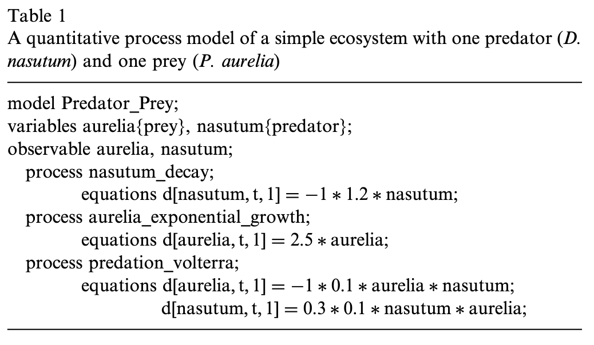

---
activities:
  - data-representation
  - hypothesis-generation
  - data-analysis
  - evidence-evaluation
contributions:
  - system
  - empirical-study
domains:
  - biology
scope: multi-activity
coding_status: coded
---

# Bridewell et al. — An interactive environment for the modeling and discovery of scientific knowledge

```

@article{bridewell_interactive_2006,
	title = {An interactive environment for the modeling and discovery of scientific knowledge},
	volume = {64},
	issn = {1071-5819},
	url = {https://www.sciencedirect.com/science/article/pii/S1071581906001030},
	doi = {10.1016/j.ijhcs.2006.06.006},
	abstract = {Existing tools for scientific modeling offer little support for improving models in response to data, whereas computational methods for scientific knowledge discovery provide few opportunities for user input. In this paper, we present a language for stating process models and background knowledge in terms familiar to scientists, along with an interactive environment for knowledge discovery that lets the user construct, edit, and visualize scientific models, use them to make predictions, and revise them to better fit available data. We report initial studies in three domains that illustrate the operation of this environment and the results of a user study carried out with domain scientists. Finally, we discuss related efforts on model formalisms and revision and suggest priorities for additional research.},
	number = {11},
	urldate = {2024-11-04},
	journal = {International Journal of Human-Computer Studies},
	author = {Bridewell, Will and Sánchez, Javier Nicolás and Langley, Pat and Billman, Dorrit},
	month = nov,
	year = {2006},
	keywords = {Interactive knowledge discovery, Model revision, Scientific modeling},
	pages = {1099--1114},
	file = {ScienceDirect Snapshot:/Users/prof.biu/Zotero/storage/3I6GLDP4/S1071581906001030.html:text/html},
}

```

# One Sentence


This paper presents PROMETHEUS—an interactive tool that allows scientists to simulatively and visually discovery  mathematical models to represent new processes by customizing a search process based on some existing generic process, their variables, and conditions.




# More Sentences


# Key Points


### This paper’s differentiation from prior work

> … current modeling environment are concerned primarily with the formulation and simulation of models, not with their discovery.
> 

### What is a process (in the system)

> … processes that explain how the values of variables change over time. A process consists of a name (e.g., predation_volterra) and one or more equations.
> 

### How scientists can provide domain-specific input

> Along with this general domain knowledge, the scientist provides PROMETHEUS with additional, task-specific information to direct its search for alternative models. This information includes a set of variables to include in the model, a data set containing values for the observable variables, and guidelines concerning the modification of the model.
> 

> … the scientist can select which generic processes should be considered for addition and which current processes can bne deleted or tuned by altering their parameters.
> 


### How is the discovery process implemented?

> … a two-stage search through the model space. 
In the first stage, the program creates candidate structures by  first generating all subsets of the component pool and then adding each one to the base model.
… For each structure, PROMETHEUS performs a gradient-descent search through the parameter space defined by the new processes.
> 

# Other Notes


### What are the generic processes as the “seeds” for discovery?

The are like the base class in OOP.

> … generic processes, … serve as building blocks when adding new processes to the model. Generic processes specify the form of a model’s instantiated processes and have an analogous representation.
> 

### Domain-experts might interpret the same visualization differently

> Subjects were accustomed to edges that indicate material flow between variables as opposed to causal influences.
> 

# Take-Away
