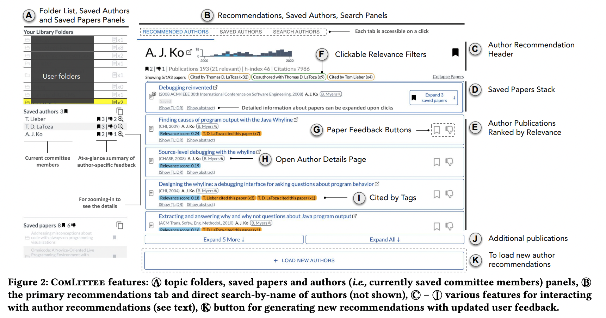

---
activities:
  - problem-formulation
  - literature-discovery
contributions:
  - system
  - empirical-study
domains:
  - general
scope: focused
coding_status: coded
---

# Kang et al. —  ComLittee: Literature Discovery with Personal Elected Author Committees

```
@inproceedings{kang2023comlittee,
intro={In order to help scholars understand and follow a research topic, significant research has been devoted to creating systems that help scholars discover relevant papers and authors. Recent approaches have shown the usefulness of highlighting relevant authors while scholars engage in paper discovery. However, these systems do not capture and utilize users’ evolving knowledge of authors. We reflect on the design space and introduce ComLittee, a literature discovery system that supports author-centric exploration. In contrast to paper-centric interaction in prior systems, ComLittee’s author-centric interaction supports curating research threads from individual authors, finding new authors and papers using combined signals from a paper recommender and the curated authors’ authorship graphs, and understanding them in the context of those signals. In a within-subjects experiment that compares to a paper-centric discovery system with author-highlighting, we demonstrate how ComLittee improves author and paper discovery.}
  title={ComLittee: Literature Discovery with Personal Elected Author Committees},
  author={Kang, Hyeonsu B and Soliman, Nouran and Latzke, Matt and Chang, Joseph Chee and Bragg, Jonathan},
  booktitle={Proceedings of the 2023 CHI Conference on Human Factors in Computing Systems},
  pages={1--20},
  year={2023}
}
```

# One Sentence

The authors introduce ComLittee which is a literature discovery system that supports author-centric exploration. 

# More Sentences

It supports curating research threads from individual authors, finding new authors and papers using combined signals from a paper recommender and the curated authors’ authorship graphs, and understanding them in the context of those signals.

ComLittee’s main idea is to use a user-curated, evolving set of authors as persistent relevance anchors for literature exploration, combining their topically relevant papers with coauthorship and citation graphs to recommend new authors and papers with interpretable provenance.

# Key Points



The latter includes effective support for contextual search, browsing, and flexible viewing of information artifacts based on relevant parameters and properties.

# Other Notes

# Take-Away

Author’s personal information (co-author) based
