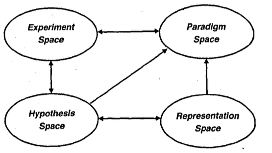

---
activities:
  - data-representation
  - hypothesis-generation
  - experiment-design
  - evidence-evaluation
contributions:
  - framework
  - review
domains:
  - general
scope: field-level
coding_status: coded
---

# Klahr & Simon - Studies of Scientific Discovery: Complementary Approaches and Convergent Finding

```
@article{klahr1999studies,
  title={The authors explain these four spaces with a problem-solving perspective: goal status (paradigm and experiment spaces) and initial status (representation and hypothesis spaces). This means that a well-established hypothesis space has a significant impact on the results.
.},
  author={Klahr, David and Simon, Herbert A},
  journal={Psychological Bulletin},
  volume={125},
  number={5},
  pages={524},
  year={1999},
  publisher={American Psychological Association},
	url = {http://www.ask-force.org/web/Discourse/Klahr-Simon-Studies-Scientific-Discoveries-1999.pdf},
	doi = {10.1207/s15516709cog1201_1},
	abstract = {This review integrates 4 major approaches to the study of science—historical accounts of scientific discoveries, psychological experiments with nonscientists working on tasks related to scientific discoveries, direct observation of ongoing scientific laboratories, and computational modeling of scientific discovery processes—by viewing them through the lens of the theory of human problem solving. The authors provide a brief justification for the study of scientific discovery, a summary of the major approaches, and criteria for comparing and contrasting them. Then, they apply these criteria to the different approaches and indicate their complementarities. Finally, they provide several examples of convergent principles of the process of scientific discovery.},
	language = {en},
	number = {1},
	urldate = {2024-06-28},
	journal = {Psychological Bulletin},
	author = {Klahr, David and Dunbar, Kevin},
	year = {1999},
}

```

# One Sentence


This paper presents major approaches to the study of science by viewing them through the lens of the theory of human problem-solving. 

# More Sentences


# Key Points


**Scientific discovery as problem-solving: from the initial state to the goal state.**

> A problem space consists of an initial state, a goal state, and a set of operators for transforming the initial state into the goal state by a series of intermediate steps.
> 

> The set of states, operators, goals, and constraints are called a problem space, and the problem-solving process can be characterized as a search for a path that links initial state to goal state (Operators).
> 

**Multiple search spaces from two states (initial and goal states)**



- Hypothesis and representation spaces
    - Search in the hypothesis space (goal state): generating a new hypothesis is a type of problem-solving in which the initial state consists of some knowledge about the domain, and the goal state is a hypothesis that can account for some or all of that knowledge in a more concise form.
    - Representation space (initial state): What people search for in this space is an effective and informative way to represent the phenomena they are observing.
- Experiment and Paradigm spaces
    - Search in the experiment space (goal state): In constructing experiments, scientists are faced with a problem-solving task which is similar to their search for hypotheses (goal state).
    - Paradigm space (initial state): Scientists determine the framework or type of the experiment, identifying which variables to change and which components to hold constant.
    

**Well-definedness of a problem depends on a scientist's knowledge.**

> …well-definedness and recognition depend on the knowledge that is available to the problem solver. For that reason, much of the training of scientists is aimed at increasing the degree of well-definedness of problems in their domain.
> 

**The process of definition is time-consuming.** 

> If we represent the problem space as a branching tree of $*m*$ moves with $*b*$ branches at each move, then there are $b^m$ moves in the full problem space.
> 

# Other Notes


# Take-Away


The role of AI might be to support the definition process. Since the definition process is tailored to specific domains or disciplines, scientists should spend tremendous time broadening the scope of their knowledge. 

- In drug discovery, AI can prioritize proteins with a high likelihood of being target proteins and then recommend them to scientists for further investigation.

It is linked to the Jooligen’s hypothesis space theory

- When scientists go outside the hypothesis space, which is the scope of their knowledge to build a hypothesis for an experiment, they must acquire knowledge about new relations or variables, spending lots of time broadening it.
- It can cause confirmation bias.
