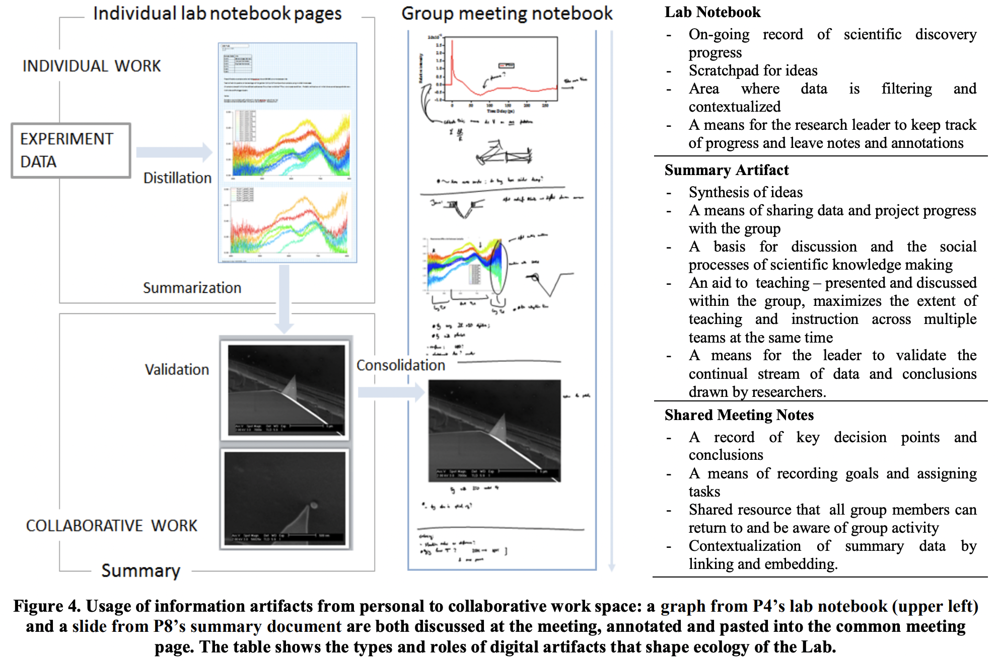

---
activities:
  - data-representation
  - collaboration
  - reproducibility
contributions:
  - framework
  - empirical-study
domains:
  - nanophotonics
scope: multi-activity
coding_status: coded
---

# Oleksik et al. —  Beyond Data Sharing: Artifact Ecology of a Collaborative Nanophotonics Research Centre

```
@inproceedings{oleksik2012beyond,
intro={Scientific communities have long been concerned with the design and implementation of effective infrastructures for data access and collaborative scientific work. Recent studies have shown an increase in collaborative data generation and reuse. However, further improvements require a deeper understanding of the social and technological circumstances under which they emerge. To that effect, we conduct an in-situ observation study of a Nanophotonics Research Centre. We consider the artifact ecology that evolved from the Centre's common experimentation and data platform, the scientific practices, and the intricate interactions with digital artifacts that arise from the researchers' activities. We uncover the use of progress summaries for collaborative data interpretation and knowledge sharing. By studying this reputable collaborative scientific environment, we (1) identified the factors that led to its functional and effective artifact ecology and (2) propose expansions of tools and services to improve it further. The latter include effective support for contextual search, browsing, and flexible viewing of information artifacts based on relevant parameters and properties.},
  title={Beyond data sharing: artifact ecology of a collaborative nanophotonics research centre},
  author={Oleksik, Gerard and Milic-Frayling, Natasa and Jones, Rachel},
  booktitle={Proceedings of the ACM 2012 conference on Computer Supported Cooperative Work},
  pages={1165--1174},
  year={2012}
}
```

# One Sentence


The authors propose observations of the entire artifact ecology that includes technical infrastructure, tools, individuals, and interactions, and identify the importance of building an environment where scientist can efficiently share their experiment dataset and reuse the datasets for increasing scientific discovery. 

# More Sentences


# Key Points


The paper (1) identified the factors that led to its functional and effective artifact ecology and (2) proposed expansions of tools and services to improve it further. 

The latter includes effective support for contextual search, browsing, and flexible viewing of information artifacts based on relevant parameters and properties.



# Other Notes


# Take-Away
