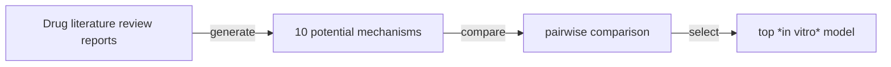
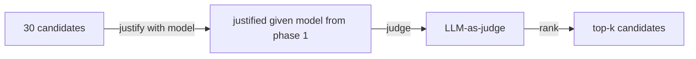

---
activities:
  - literature-discovery
  - hypothesis-generation
  - experiment-design
  - data-analysis
  - evidence-evaluation
  - workflow-orchestration
contributions:
  - system
  - empirical-study
domains:
  - biomedicine
  - drug-discovery
scope: end-to-end
coding_status: coded
---

<!-- save as: <last-name-of-first-author>_<paper-title>.md -->

# Ghareeb et al.: A multi-agent system for automating scientific discovery

## One Sentence
<!-- summarize the paper in one sentence, ideally with one figure as well -->

## More Sentences
<!-- additional sentences -->
> By integrating literature search agents with data analysis agents, Robin can generate hypotheses, propose experiments, interpret experimental results, and generate updated hypotheses, achieving a semi-autonomous approach to scientific discovery.

## Key Points
<!-- the most important things in this paper -->

### The specific task in drug discovery this project focused on, its challenge, and solution
Drug repurposing--
> The repurposing of existing drugs for new indications presents a promising application space for LLM systems. The history of drug repurposing often shows a pattern; while insights often existed in scientific literature, only after a significant lag did that knowledge crystallize into a new treatment. ...
> ... more repurposing opportunities could be identified through logical connection of existing biological insights in the literature.

### Robin's system workflow overview
> After giving Robin a disease of interest, Robin automatically identified relevant *in vitro* assays that model key disease mechanisms and proposed specific drug candidates to evaluate in these experimental models. We then conducted the experiments and provided the resulting data to Robin for autonomous analysis. Robin then interpreted the results of this analysis to generate a new round of therapeutic candidates.

### Therapeutic hypothesis generation workflow

Phase 1: Disease mechanisms

Phase 2: Therapeutic candidates

### Experimental analysis workflow
> ... 8 Finch analysis trajectories, each of which independently analyzed the experimental data. ... a meta-analysis was conducted to synthesize all outputs into a consensus-driven conclusion.

## Other Notes
<!-- other things, not so important, but good to know -->

## Take-Away
<!-- critiques, ideas, actionable things, etc. -->

### Motivating the focus on drug discovery as a representative problem in scientific discovery
> Drug development heavily relies on a confluence of biological, clinical, and pharmaceutical expertise, and is limited by the rate at which these experts can synthesize the scientific literature.

