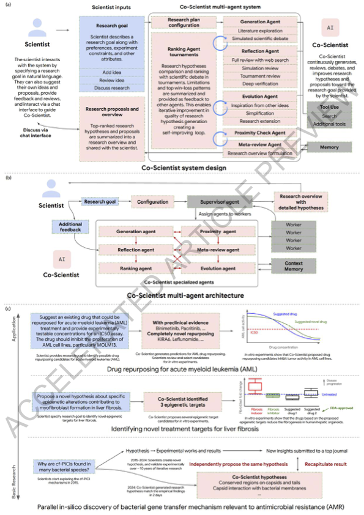

---
activities:
  - literature-discovery
  - hypothesis-generation
  - evidence-evaluation
  - collaboration
  - workflow-orchestration
contributions:
  - system
  - empirical-study
domains:
  - general
  - biomedicine
scope: multi-activity
coding_status: coded
---

<!-- save as: <last-name-of-first-author>_<paper-title>.md -->

# Gottweis et al.: Accelerating scientific discovery with Co-Scientist

## One Sentence
<!-- summarize the paper in one sentence, ideally with one figure as well -->

## More Sentences
<!-- additional sentences -->

> Key contributions include: (1) a multi-agent architecture with an asynchronous task execution framework for flexible compute scaling; (2) a tournament evolutionary process for self-improving hypotheses generation.

## Key Points
<!-- the most important things in this paper -->

### The agentic element
> ... the agentic nature of the system enables it to recursively self-critique its output and use tools such as web-search and specialized AI models to provide itself with feedback to refine its hypotheses and research proposals.

## Other Notes
<!-- other things, not so important, but good to know -->

### Another way to look at scientists' challenge
> Researchers are faced with a breadth and depth conundrum. The complexity of scientific topics requires increasingly deep and specific subject matter expertise, while leaps in insight may still arise from broad knowledge bridging across disciplines.

## Take-Away
<!-- critiques, ideas, actionable things, etc. -->

### Human involvement seems minimal and ad hoc
Also see the figure above ...
> ... "scientist-in-the-loop" ... Scientists can specify their research goals in simple natural language and inform the system of desirable attributes and constraints for the proposed solutions

> ... incorporate conversational feedback in natural language from scientists ...

### A very unique and convincing way of evaluation
> Researchers instructed the system to explore a topic their group had independently discovered, but not yet published.