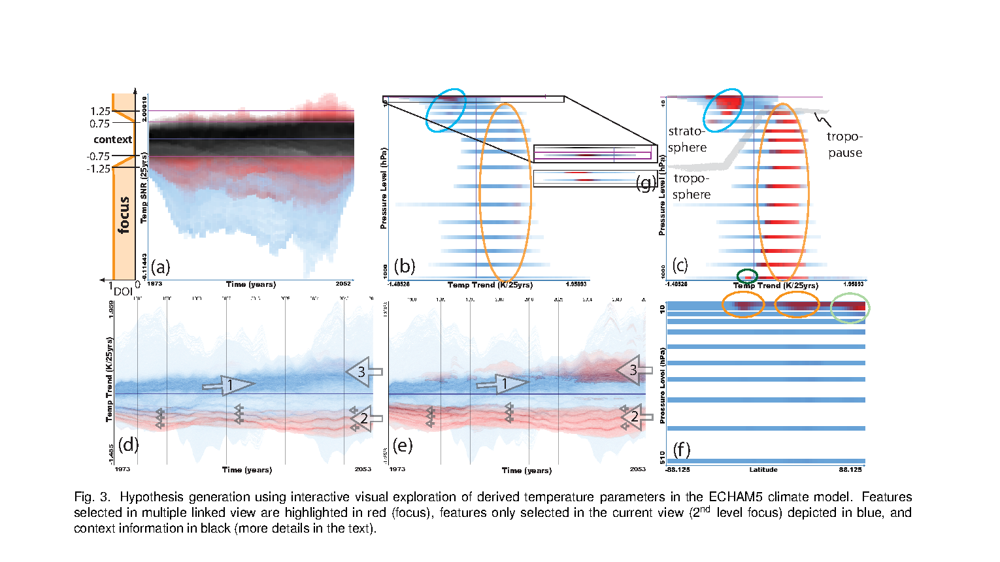
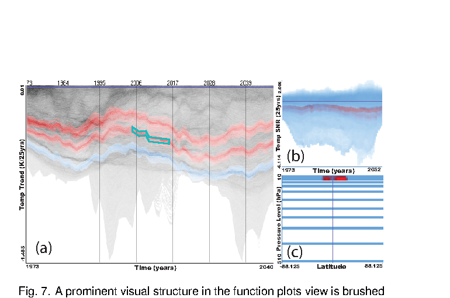

---
activities:
  - data-representation
  - hypothesis-generation
  - data-analysis
contributions:
  - system
  - empirical-study
domains:
  - climate-science
scope: multi-activity
coding_status: coded
---

<!-- save as: <last-name-of-first-author>_<paper-title>.md -->

# Kehrer et al.: Hypothesis Generation in Climnate Research with Interactive Visual Data Exploration

## One Sentence
<!-- summarize the paper in one sentence, ideally with one figure as well -->
> ... we demonstrate how interactive visual exploration is used to identify certain regions in space and time which are sensitive to climate change.

## More Sentences
<!-- additional sentences -->
The approach---
> The interactive exploration of the climate data in this application has been carried out in a framework employing a coordinated multiple views setup.

## Key Points
<!-- the most important things in this paper -->

### The long-standing challenge of hypothesis generation
... which is related to "asking the right questions".
> ... it is generally quite challenging to actually derive these specific application questions. Intuition of experts--based on experiences and knowledge gained from many years---lead to promising hypotheses as well as scientific trial-and-error approaches.

## Other Notes
<!-- other things, not so important, but good to know -->

## Take-Away
<!-- critiques, ideas, actionable things, etc. -->

### The main unclear thing
Is this paper just about the observation that interactive visual exploration (based on an existing technique---coordinated multiple views) helps hypothesis generation? Or is there any intentional, targeted design of novel techniques that lead to helping hypothesis generation? If it's the latter, what's the "secret sauce"?

It's both — but meaningfully the latter. The paper is framed as an application case study, but they did build novel techniques specifically for this work. The "secret sauce" has three concrete components, described under "New Extensions to the SimVis Framework" (Section 3):

1. Function graphs view — the main new technique. Instead of looking at one time series at a time, they render every voxel's time series simultaneously (hundreds of thousands of curves) using frequency binmaps: how many curves pass through each pixel is mapped to luminance. This makes global temporal patterns (e.g., a cooling trend in the lower stratosphere across all latitudes) immediately visible as visual structures in one dense image. This is what allows hypothesis generation without prior knowledge of where to look.

   

2. Similarity-based brushing on time series — the user sketches a target curve shape (as a polyline), and the system classifies all time series by gradient-based similarity to that sketch, assigning fuzzy DOI (degree-of-interest) values. This lets the user say "find me regions that behave like this" directly by drawing.

   

3. Four-level focus+context with DOI enhancement — extends standard focus+context to multiple hierarchical selection levels, plus a γ exponent (DOI_j = DOI_j^γ) the user can tune to pull out faint features that would otherwise be occluded by prominent ones. This is how they found the Tibetan Plateau cooling feature (Section 4.4) that a hard threshold would have missed entirely. (See Fig. 3 above, panels (b) vs. (c): average DOI shows only the dominant cooling; max DOI additionally reveals the tropopause and subtler warming.)

The pipeline architecture (Fig. 2) ties it together: they derive higher-order statistics (linear trend, SNR) within the vis tool so the feedback loop between derivation → visual exploration → statistics → back to exploration is tight and iterative. The key claim is that no prior knowledge of where to look in the data is needed — the function graphs view + similarity brushing let you discover where to point statistics at, rather than pre-selecting subsets as classical trend testing requires.

So the paper is not merely "coordinated multiple views helps." The function graphs view and similarity brushing are the genuinely novel contributions that make the hypothesis generation work.

