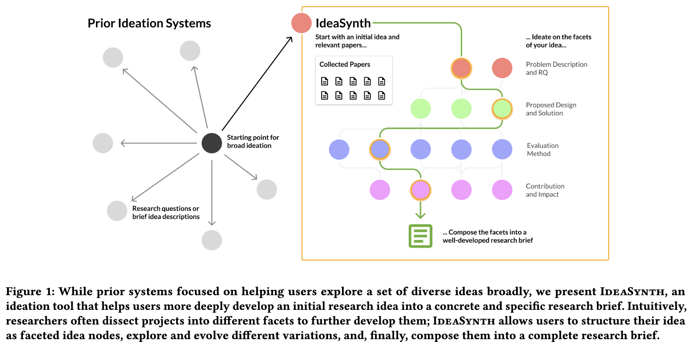

---
activities:
  - problem-formulation
  - literature-discovery
  - hypothesis-generation
  - evidence-evaluation
contributions:
  - system
  - empirical-study
domains:
  - general
scope: multi-activity
coding_status: coded
---

<!-- save as: <last-name-of-first-author>_<paper-title>.md -->

# Pu et al.: IdeaSynth: Iterative Research Idea Development Through Evolving and Composing Idea Facets with Literature-Grounded Feedback

## One Sentence
<!-- summarize the paper in one sentence, ideally with one figure as well -->
This paper presents IdeaSynth---a tool that helps researchers develop and explore multiple facets of an initial research idea.



## More Sentences
<!-- additional sentences -->

## Key Points
<!-- the most important things in this paper -->

### The challenge of iteratively developing a research idea
This "*further iteration and deeper development*" phase happens once a research identifies a promising idea after exploring a bunch:
> ... this process is effortful, because it often involves both understanding of literature to generate variations for different facets, and also to *compose* different idea facets together to form a coherent research idea.

### Specific pain points of iteratively developing a research idea
> First, researchers struggled with expanding initial ideas to concretely operationalize them into an executable project, which also hindered their ability to evaluate their ideas' novelty and feasibility.

> Second, researchers felt unsupported in organizing and evaluating multiple versions and iterations of their ideas.

> Third, researchers who have tried to use LLMs for research ideation often did not find the feedback helpful because it lacked the level of depth and specificity needed for refining and iterating on ideas.

## Other Notes
<!-- other things, not so important, but good to know -->

## Take-Away
<!-- critiques, ideas, actionable things, etc. -->
### The clean presentation
Other than the idea itself, the main take-away is actually the meticulously clean presentation, e.g.,
- how Figure 1 clearly shows how IdeaSynth differs from the majority of prior similar work

### The structure of the evaluation is also worth learning/borrowing:
> ... a controlled lab study and a field development study where participants used IdeaSynth to develop research ideas. 

Below is an extraction of a generalizable version (template) of the two studies.

```
Study 1: Controlled Comparative Study

Participants:
Recruit domain-relevant researchers who actively perform the target activity.

Design:
Use a within-subjects design when possible:
- Condition A: proposed tool
- Condition B: strong baseline

Baseline:
Make the baseline credible, not straw-man.
It should include the common tools/features researchers would otherwise use, such as:
- document editor / notebook / spreadsheet
- search or retrieval interface
- generic LLM chat or writing assistant
- same underlying model/data access when possible

Tasks:
Give participants comparable scientific tasks that are realistic but bounded (i.e., constrained enough that participants can complete it within the study session and researchers can compare outcomes across participants).
Avoid using their own ongoing projects if prior familiarity would create uncontrolled variance.

Procedure:
For each condition:
1. Brief tutorial
2. Timed task session
3. Concrete deliverable
4. Post-task survey

Measures:
Collect both subjective and behavioral data:
- perceived task success
- confidence in scientific understanding
- quality of produced artifact
- ability to explore alternatives
- ability to refine/operationalize ideas
- workload
- trust
- interaction logs
- time allocation across activity types

Analysis:
Use statistics for preselected key measures.
Use logs to compare behavioral patterns.
Use interviews/thematic analysis to explain why the differences occurred.

Output:
Show whether the tool changes the process, not just whether users liked it.
```

```
Study 2: Field Deployment Study

Participants:
Invite a smaller group of relevant researchers, ideally including some from Study 1.

Setting:
Let them install or access the tool in their own environment.

Usage Requirement:
Ask them to use it over multiple days on real work.
Set a light minimum, such as:
- use for at least 3 days
- use for at least 1 hour total
- use on an actual project or research question

Data Collection:
Collect:
- usage logs
- saved artifacts
- follow-up interviews
- optional diary entries or brief check-ins

Interview Focus:
Ask:
- What real task did you use it for?
- Where did it fit into your existing workflow?
- What did it help with?
- What did you ignore or work around?
- What would make it useful long-term?
- What did you not trust?
- When did you want more or less automation?

Analysis:
Use thematic analysis.
Look for:
- real use cases
- workflow fit
- stage-of-work differences
- trust and verification practices
- collaboration needs
- feature appropriation
- failure modes
```