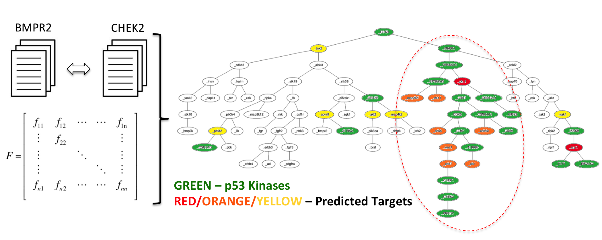

---
activities:
  - literature-discovery
  - data-representation
  - hypothesis-generation
  - evidence-evaluation
contributions:
  - method
  - empirical-study
domains:
  - biology
scope: multi-activity
coding_status: coded
---

<!-- save as: <last-name-of-first-author>_<paper-title>.md -->

# Spangler et al.: Automated Hypothesis Generation Based on Mining Scientific Literature

## One Sentence
<!-- summarize the paper in one sentence, ideally with one figure as well -->

KnIT converts the literature about scientific entities into a similarity network, then propagates known property labels through that network to rank novel, testable hypotheses; in its case study, it predicted protein kinases that phosphorylate p53.

*Figure 1. Kinases clustered by literature distance: known p53 kinases are green, while red, orange, and yellow nodes are predicted targets. Source: [Spangler et al. (2014)](https://doi.org/10.1145/2623330.2623667).*

## More Sentences
<!-- additional sentences -->

What the system (KnIT) does:
> ... mines the information contained in the scientific literature, represents it explicitly in a queriable network, and then further reasons upon these data to generate novel and experimentally testable hypotheses.

How KnIT works:
> ... combines entity detection with neighbor-text feature analysis and with graph-based diffusion of information to identify potential new properties of entities that are strongly implied by existing relationship

## Key Points
<!-- the most important things in this paper -->

### Overview of the workflow
- Exploration: data gathering---document retrieval and entity extraction;
- Interpretation: knowledge graph building---"a connected graph that represents the similarity relationship among entities";
- Analysis: surfacing hypotheses---"globally diffuses annotation information among entities to rank order the best entity candidates for further experimentation of novel annotation predictions."

## Other Notes
<!-- other things, not so important, but good to know -->

### Technical terms

- "entities of interest": "a particular set of human proteins called kinases"
- "connected graph": "represents the similarity relationship among entities"

- "connections between entities": Edges linking entities with similar literature-derived feature vectors, or "text signatures." In the diffusion network, each kinase is connected to its ten closest kinases by literature similarity.
- "graph-based diffusion of information": A semi-supervised method that propagates labels from known p53 kinases along the similarity network and assigns continuous scores to unlabeled kinases, producing a ranked list of candidates.
- "diffuses annotation information among entities": Spreads the known annotation "phosphorylates p53" across the whole network so that kinases near annotated kinases receive higher likelihood scores.
- "property of interest": The attribute KnIT is trying to predict for an entity; in this case, whether a kinase phosphorylates p53.

## Take-Away
<!-- critiques, ideas, actionable things, etc. -->
