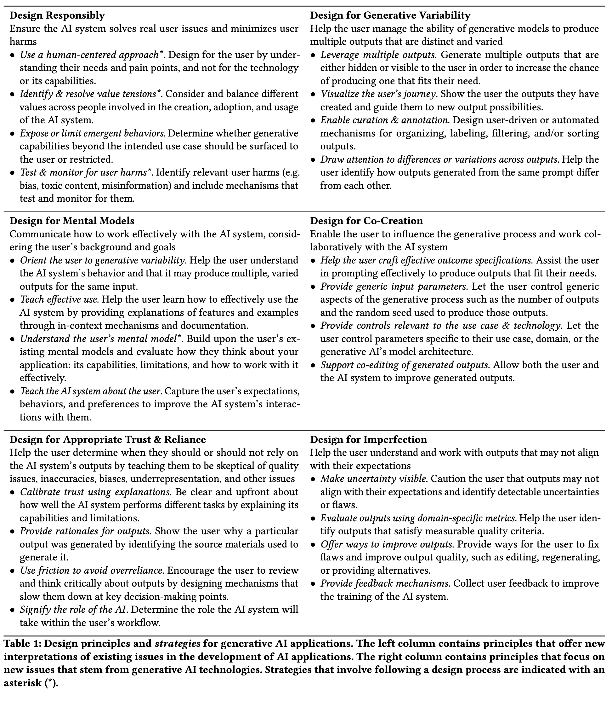
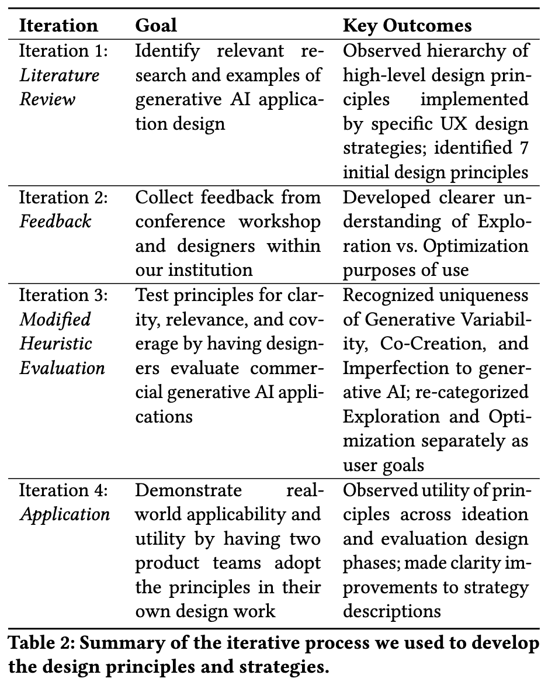

# Weisz et al. — Design Principles for Generative AI Applications

```
@inproceedings{10.1145/3613904.3642466,
author = {Weisz, Justin D. and He, Jessica and Muller, Michael and Hoefer, Gabriela and Miles, Rachel and Geyer, Werner},
title = {Design Principles for Generative AI Applications},
year = {2024},
isbn = {9798400703300},
publisher = {Association for Computing Machinery},
address = {New York, NY, USA},
url = {https://doi.org/10.1145/3613904.3642466},
doi = {10.1145/3613904.3642466},
abstract = {Generative AI applications present unique design challenges. As generative AI technologies are increasingly being incorporated into mainstream applications, there is an urgent need for guidance on how to design user experiences that foster effective and safe use. We present six principles for the design of generative AI applications that address unique characteristics of generative AI UX and offer new interpretations and extensions of known issues in the design of AI applications. Each principle is coupled with a set of design strategies for implementing that principle via UX capabilities or through the design process. The principles and strategies were developed through an iterative process involving literature review, feedback from design practitioners, validation against real-world generative AI applications, and incorporation into the design process of two generative AI applications. We anticipate the principles to usefully inform the design of generative AI applications by driving actionable design recommendations.},
booktitle = {Proceedings of the 2024 CHI Conference on Human Factors in Computing Systems},
articleno = {378},
numpages = {22},
keywords = {Generative AI, design principles, foundation models, human-centered AI},
location = {Honolulu, HI, USA},
series = {CHI '24}
}
```

# One Sentence


This paper went through several iterations to formulate a set of design principles that describe some high-level how-to’s in designing GenAI applications.

# More Sentences




# Key Points


# Other Notes


### The new AI paradigm Nielsen characterized

> … “intent-based outcome specification” … In this paraidgm, users specify what they want, often using natural language, but not *how it should be produced*.
> 

# Take-Away


### For the COHESION paper

- can cite Lewis and Wharton’s cognitive walkthrough (similar to how we expect designers to use the workbook)
- can refer to 2.2 for a review of existing HAI guidelines
- highlight the pragmatism of the workbook: “Design guidelines can be difficult to put into practice …., often because they describe goals rather than actions …”

### Generalizable methods

Any theory-level work needs to go through multiple mixed (theoretical/empirical) iterations



### Workshop as the format to engage with designers

Choosing product teams:

> We held two workshops with two different teams (Table 4) to evaluate the design principles and strategies in practice. Workshop 1 was held with an internal team comprised of four design practitioners working on the IBM [watsonx.ai](http://watsonx.ai/) Prompt Lab21, a prompt testing environment for large language models. Workshop 2 involved a separate internal team of ten design practitioners in the early, formative stages of designing an internal LLM-based conversational tool that provides UX research support. We selected these two teams as they provided a broader view on the actionability of the design principles in different phases of design: a later, evaluative stage (Workshop 1) and an earlier, ideation phase (Workshop 2).
> 

The specific process

> For each principle, participants were first asked to identify ways they were already “designing for” or considering the principle. Next, they identified relevant strategies that they had not yet considered and brainstormed ways to leverage them to improve their product. This brainstorming session produced new design ideas that team members shared and discussed with each other. At the end of the session, participants reflected on the actionability of the principles within their design process. The moderators and note-takers of
each workshop reviewed participants’ design ideas and recording transcripts to identify insights on the usefulness of the principles and recommendations for improvement.
>
