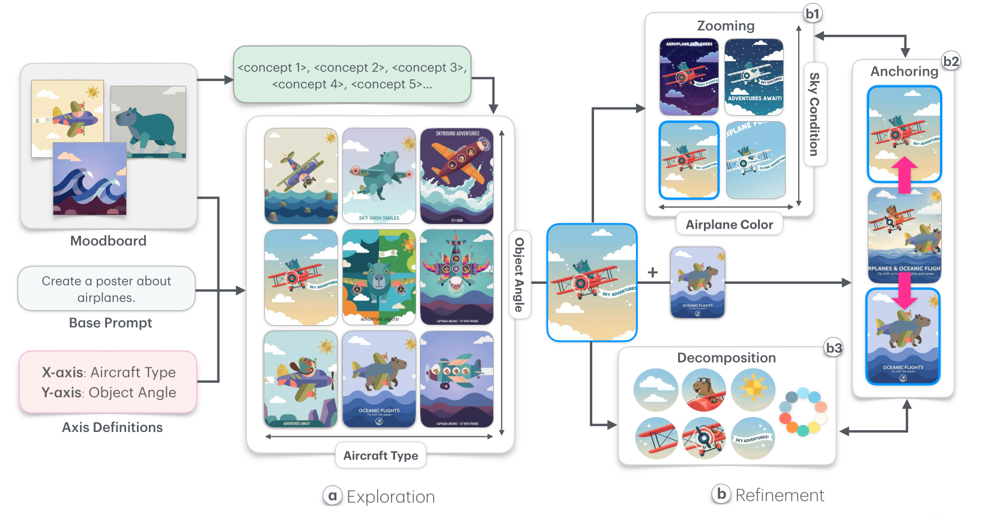

<!-- save as: <last-name-of-first-author>_<paper-title>.md -->

# You et al.: Surprise2Refine: Axis-Centered Exploration-To-Refinement for Agent-Assisted Creative Scaffolding

## One Sentence
<!-- summarize the paper in one sentence, ideally with one figure as well -->

The main idea is that design space provided in a tool should be adaptively scoped: at the divergent stage it can be broad while at the convergent stage it can zoom into a subspace

*Figure 1. The axis-centered workflow adapts the design space across creative stages. During exploration (a), users navigate diverse variations in an $n \times n$ grid organized by two conceptual axes. During refinement (b), zooming (b1), anchoring (b2), and decomposition (b3) reconstruct the space for increasingly focused, fine-grained adjustments. Source: [You et al. (2026)](https://arxiv.org/abs/2608.12605).*

## More Sentences
<!-- additional sentences -->

> ... differently scoped design spaces---i.e., sets of ideas and solutions considered for a task or problem---that expand during divergence and narrow during convergence to match changing information needs.

## Key Points
<!-- the most important things in this paper -->

<!-- ### Here is a point -->

## Other Notes
<!-- other things, not so important, but good to know -->

## Take-Away
<!-- critiques, ideas, actionable things, etc. -->

## Q&A

Q: For the three axis-centered interactions, I can guess that zooming is about zooming into a smaller subspace, but how about anchoring and decomposition? How do they work?

**A:**

- **Zooming** makes a selected design the reference point for a new grid, whose cells vary it in smaller steps along the two axes.
- **Anchoring** lets the designer pin chosen designs into grid cells. The agent extracts their visual traits, propagates those traits along the corresponding rows and columns, and generates the empty cells as interpolations; intersections blend multiple anchors.
- **Decomposition** breaks a design into reusable parts: textual attributes such as mood, composition, theme, and style; visual motif tokens; and a color-palette token. The designer can drag selected parts onto other designs to control what is recombined in later generations.

Q: "A backend agent ... encouraging diversity and 'surprises' ... progressively narrowing visual consistency" Briefly introduce how the agent achieves this---just by prompt engineering?

**A:** Mostly through structured multimodal prompting, but not through prompting alone. A vision-language model extracts moodboard concepts, chooses or populates two semantic axes, and expands each into a three-point scale. The system deterministically crosses the two scales to form nine distinct cell constraints, samples weighted moodboard references, and sends templated prompts to an image model. During refinement, explicit system logic also matters: zoom depth reduces unrelated references, anchors exert spatial influence across rows and columns, and user selections reinforce preferred references while unused ones decay. The paper reports this orchestration and state/weighting logic, not model fine-tuning.
