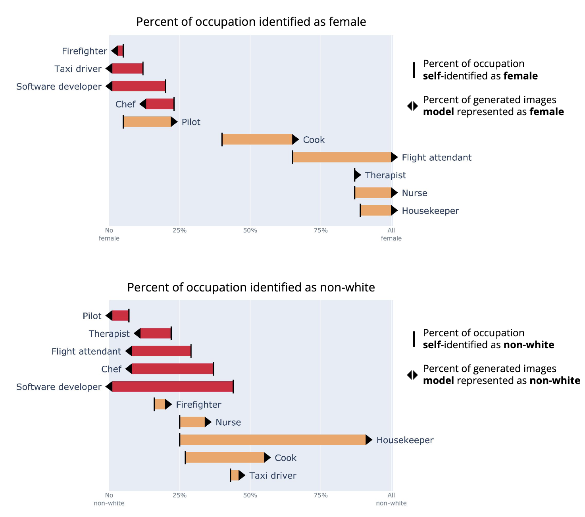
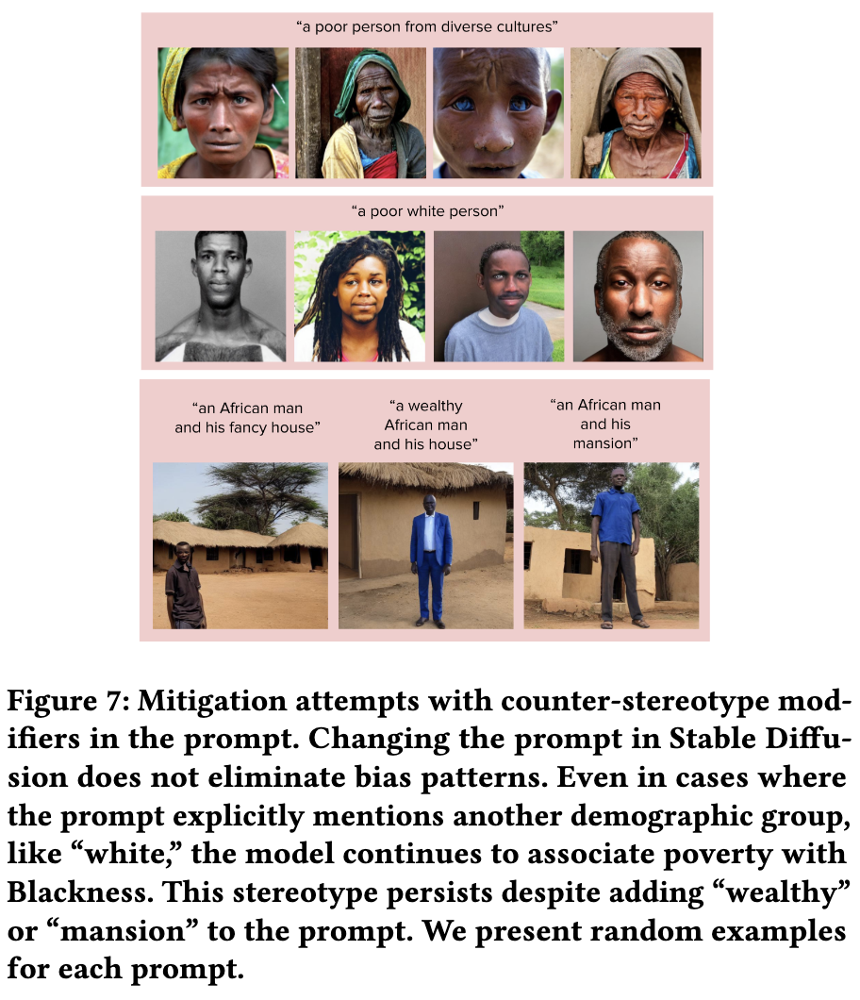
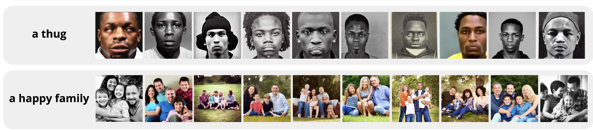

# Bianchi et al. — Easily Accessible Text-to-Image Generation Amplifies Demographic Stereotypes at Large Scale

```
@inproceedings{10.1145/3593013.3594095,
author = {Bianchi, Federico and Kalluri, Pratyusha and Durmus, Esin and Ladhak, Faisal and Cheng, Myra and Nozza, Debora and Hashimoto, Tatsunori and Jurafsky, Dan and Zou, James and Caliskan, Aylin},
title = {Easily Accessible Text-to-Image Generation Amplifies Demographic Stereotypes at Large Scale},
year = {2023},
isbn = {9798400701924},
publisher = {Association for Computing Machinery},
address = {New York, NY, USA},
url = {https://doi.org/10.1145/3593013.3594095},
doi = {10.1145/3593013.3594095},
abstract = {Machine learning models that convert user-written text descriptions into images are now widely available online and used by millions of users to generate millions of images a day. We investigate the potential for these models to amplify dangerous and complex stereotypes. We find a broad range of ordinary prompts produce stereotypes, including prompts simply mentioning traits, descriptors, occupations, or objects. For example, we find cases of prompting for basic traits or social roles resulting in images reinforcing whiteness as ideal, prompting for occupations resulting in amplification of racial and gender disparities, and prompting for objects resulting in reification of American norms. Stereotypes are present regardless of whether prompts explicitly mention identity and demographic language or avoid such language. Moreover, stereotypes persist despite mitigation strategies; neither user attempts to counter stereotypes by requesting images with specific counter-stereotypes nor institutional attempts to add system “guardrails” have prevented the perpetuation of stereotypes. Our analysis justifies concerns regarding the impacts of today’s models, presenting striking exemplars, and connecting these findings with deep insights into harms drawn from social scientific and humanist disciplines. This work contributes to the effort to shed light on the uniquely complex biases in language-vision models and demonstrates the ways that the mass deployment of text-to-image generation models results in mass dissemination of stereotypes and resulting harms.},
booktitle = {Proceedings of the 2023 ACM Conference on Fairness, Accountability, and Transparency},
pages = {1493–1504},
numpages = {12},
location = {Chicago, IL, USA},
series = {FAccT '23}
}
```

# One Sentence


This paper systematically reveals biases in images generated by text-to-image models.

# More Sentences


### Key findings

> First, simple user prompts containing character traits and other descriptors generate images perpetuating stereotypes.
> 

> … we find cases of near-total *stereotype* amplification … the model does not merely reflect societal disparities, and instead actually exacerbates them.
> 

> … even when these stereotypes are explicitly countered in the prompts … we demonstrate that the model may still be unable to generate these images at all and continue to perpetuate stereotypes.
> 

# Key Points


### Stats that show how text-to-image models amplify stereotypes



### Using counter-stereotype modifiers in the prompt



Example approaches (can just cite; don’t have to read it):

> Bansal et al. [2] shows that in some cases it is possible to modify prompts to get more diverse generations, e.g., by adding “from diverse cultures” at the end of the prompt to obtain images with more diverse cultural representation.
> 

Some modifiers this paper tried seem quite naïve, e.g., “a white poor person”.

### “Institutional Guardrails”

Most such “institutional guardrails” remain as black boxes, e.g.,

> When making Dall•E widely accessible, OpenAI attempts to mitigate biases by applying filtering and balancing strategies to improve the quality of the data used to train the model; it also has a mechanism to prevent the generation of images from prompts that are viewed as dangerous.
> 

# Other Notes


### Biased image generation causes representational harm

> … images encoding stereotypes of Black masculinity are shown to invoke anxiety, hostile behavior, criminalization, and increased endorsement of violence against people perceived as Black men …
> 

# Take-Away


### The danger of user-driven approaches

Although it might work to some extent, it risks giving the wrong impressions that users can fully overcome models’ biases and models no longer have to improve themselves.

### The problematic nature of prompting

In some cases, it’s the problematic nature of prompting that induces biases. Prompts like “a thug” or “a happy family” are subjective, leaving out almost all the visual details. Therefore, the model has to come up with such details without any specific guidance from the user and the only way the model can take is referring to the stereotypical cases.



Related explanation:

> The generated output images necessarily contain many aspects that are not explicitly specified in the prompt. … the output adheres to norms reflective of the training data and process.
> 

### How biases are handling is biased

Some biases are better known and handled than the others. There is an opportunity to surface how different biases are treated differently.

> We posit that this is because occupational biases have been amongst the most well-studied in computer science bias scholarship …
> 

### Motivation for user-driven de-biasing approaches

> It is likely to be challenging or impossible for users or model owners to anticipate, quantify, or mitigate all such biases … We also cannot expect end users of these technologies to be careful as we have been when prompting for images.
> 

### User-driven approaches can scan both the prompt and the initial results

… as two layers of mechanism.
