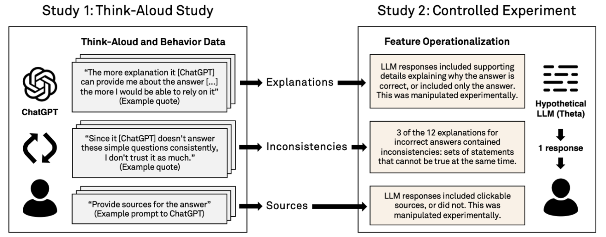

# Kim et al. — Fostering Appropriate Reliance on Large Language Models: The Role of Explanations, Sources, and Inconsistencies

```
Reference
```

# One Sentence

---

# More Sentences

---

### Main experiment

> … a 2x2x2 within-subjects design, varying three features of the LLM responses: accuracy of the LLM’s answer to the question (correct/incorrect), presence of an explanation (absent/present), and presence of clickable sources (absent/present).
> 

### Key finding

> We find that the presence of explanations increases reliance on both correct and incorrect responses. However, we observe less reliance on incorrect responses when sources are provided or when explanations exhibit inconsistencies.
> 

# Key Points

---

### What is LLM-provided explanation?

LLM responses often contain “both an answer to the question and some supporting details or justification for this answer”. This paper refers to such supporting details as an explanation.

> … the explanation describes why the answer is correct, not necessarily why the model output the answer that it did.
> 

### Two indicators of overreliance

1. **Justification quality** of a response (self-evaluated by participants), “i.e., whether it offers a good justification for its answer. Based on prior work in psychology, we expected this to be correlated with reliance and confidence …”
2. Asking **follow-up questions** as “a proxy for satisfaction: prior work in psychology has found that children are less likely to re-ask a question when they are satisfied with an initial response.”

# Other Notes

---

# Take-Away

---

### Motivation for studying overreliance on LLM

> … [overreliance] may be exacerbated by the introduction of LLMs, since LLM responses are often fluent and convincing even when wrong and public excitement around LLM is high.
> 

### The overall effect of explanation on reliance on AI

> … in many settings, the very presence of an explanation can increase trust and reliance, whether or not it is warranted …
> 

### A method we can learn and reuse

First use think-aloud to qualitatively hypothesize what factors might influence overreliance on LLM; then, extend the experiment to quantitatively verify such factors.

> We observe that participants interpret *inconsistencies* in explanations — that is, sets of statements that cannot be true at the same time — as a cue of unreliability. Participants also seek out *sources* to verify supporting details in LLM responses and are less likely to rely on incorrect answers when the sources provide helpful information.
> 


