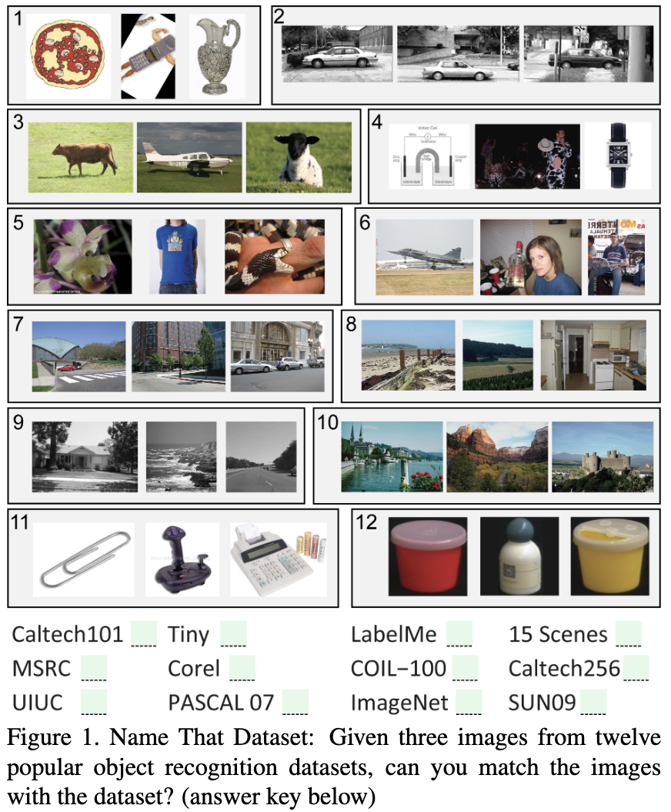
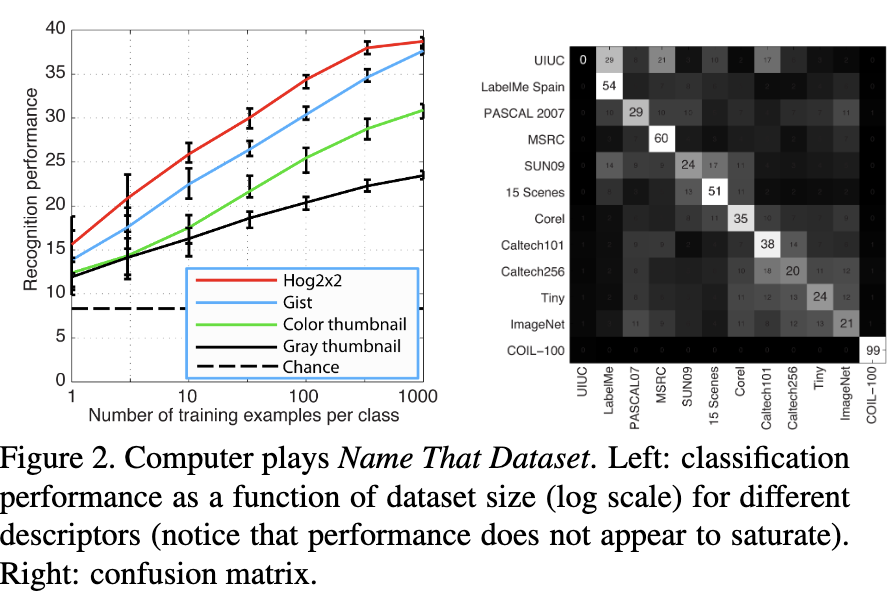
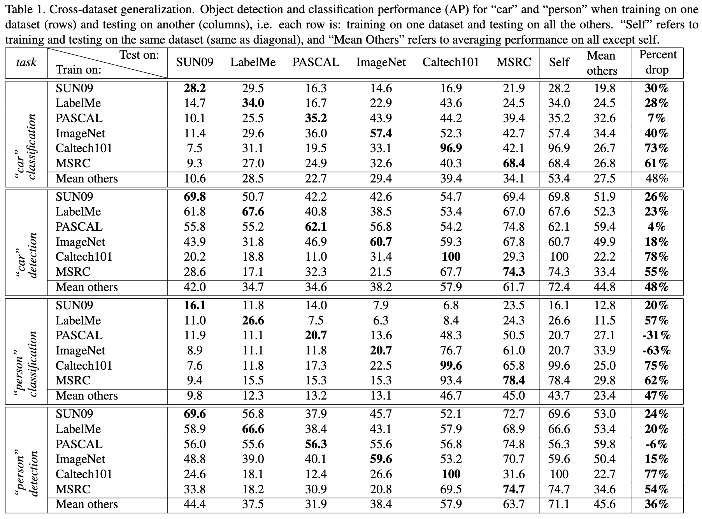
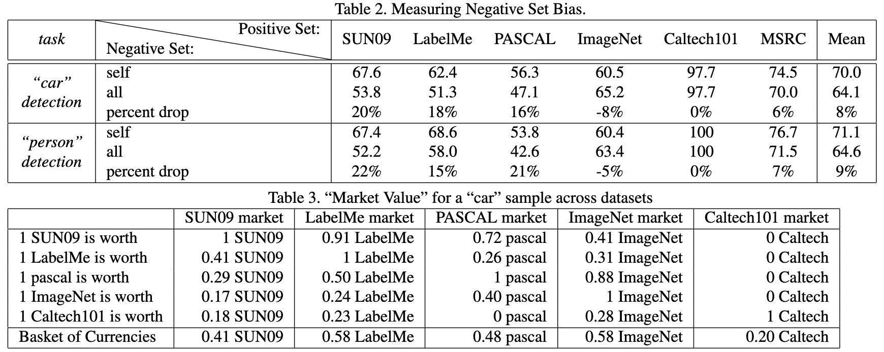

# Torralba & Efros — Unbiased look at dataset bias

```
@inproceedings{torralba2011unbiased,
  title={Unbiased look at dataset bias},
  author={Torralba, Antonio and Efros, Alexei A},
  booktitle={CVPR 2011},
  pages={1521--1528},
  year={2011},
  organization={IEEE}
}

```

# One Sentence

---

This paper performs a systemic analysis of how models trained from different datasets exhibit varied performances due to inter-dataset differences.

# More Sentences

---

# Key Points

---

### Are datasets intrinsically different? (Having built-in bias)





> … to train a classifier to play *Name That Dataset*. … the best classifier performs rather well at 39% (chance is 1/12 = 8%), and … there is no evidence of saturation as more training data is added.
> 

> … the datasets appear to have a strong build-in bias. … we applied the same analysis that we did for full images to object crops of cars from five datasets where care bounding boxes have been provided … Interestingly, the classifier was still quite good at telling the different datasets apart …
> 

### Cross-dataset model performance



### Biases in datasets

- **Selection bias** - “datasets often prefer particular kinds of images (e.g., street scenes, or nature scenes, or images retrieved via Internet keyword searches).”
    - “… datasets that are gathered automatically fare better than those collected manually.”
- **Capture bias** - “photographs tending to take pictures of objects in similar ways …”
    - “Professional photographs as well as photos collected using keyword search appear to suffer considerably from the capture bias, …. the object is almost always in the center of the image … almost all the mugs have a right-facing handle.”
- **Category/label bias** - “semantic categories are often poorly defined, and different labellers may assign differing labels to the same type of object …. (e.g., ‘grass’ vs. ‘lawn’ … ”
- **Negative set bias** - “… defines what the dataset considers to be ‘the rest of the world’. If that set is not representative, or unbalanced, that could produce classifiers that are overconfident and not very discriminative.”

### Negative set bias experiment

The method:

> First, for each dataset, we train a classifier on its own set of positive and negative instances. Then, during testing, the positives come from the dataset, but the negatives come from all datasets combined.
> 



Negative set and spurious correlation:

> … whether the negative data sample is *sufficient* to allow a classifier to tease apart the important bits of the visual experience.
For example, if we want to find all images of “boats” … , how can we make sure that the classifier focuses on the boat itself, and not on the water below, or shore in the distance (after all, all boats are depicted in water)?
> 

# Other Notes

---

### Classification vs. detection

> … a) classification—find all images containing the desired object; and b) detection—in all images, find all bounding boxes containing the desired object. Notice that the detection task is basically the same as classification if you think of bounding boxes as images—those that contains the object are positives, those that don’t are negatives. Importantly, for detection, the number of negatives is naturally much larger and more diverse.
> 

# Take-Away

---
