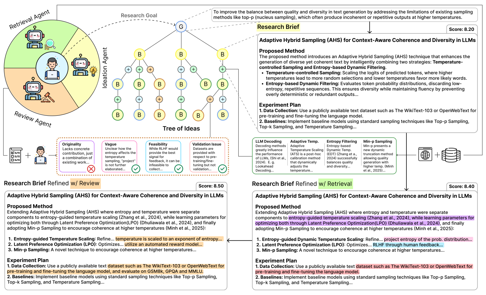

<!-- save as: <last-name-of-first-author>_<paper-title>.md -->

# Garikaparthi et al.: IRIS: Interactive Research Ideation System for Accelerating Scientific Discovery

## One Sentence
<!-- summarize the paper in one sentence, ideally with one figure as well -->

## More Sentences
<!-- additional sentences -->
> ... the system expects as input a research goal G consisting of a research problem and its motivation, and outputs a research brief B consisting of a Title, Proposed Methodology and Experiment Plan, while improving its quality; either in *semi-automatic* manner through directions from the researcher or *autonomously* exploiting Monte Carlo Tree Search (MCTS).

## Key Points
<!-- the most important things in this paper -->

### Current limitation of AI for scientific ideation

> Current solutions that leverage LLMs in scientific ideation primarily remain hinged on multi-agent frameworks on extending test-time compute ... and aim to validate the quality of the final ideas through human validation or LLM-as-a-judge evaluations ... However, these approaches often fail to integrate human supervision during generation in a truly complementary manner, neglecting the nuanced expectations and goals of the user.

### One specific argument for needing humans in the loop

> Recent developments of more capable Agentic LLMs have shown difficulties in transparently delegating sub-tasks, leading to "*reward hacking*" behaviors ... In the context of idea generation, we find signs of similar "*reward hacking*" where LLMs adopt fancy terminology e.g. "Prompt Learning and Optimization Nexus" for building a library of prompts, or often proposing the use of "graphs" without any clear motivation or description behind the design choice.

### Pitfalls of AI-generated hypotheses
Lack of iteration:
> "... generating hypotheses in a single pass ..., which overlooks the iterative nature of the ideation process

Coarse-grained criteria:
> Optimization through feedback on coarse-grained criteria like rigorousness, originality, generalizability etc. ... while often critiquing entire ideas rather than specific components

Unstructured and sub-optimal search:
> Unstructured and sub-optimal search of the idea space through either refinement of a generated base-idea (exploitation) ..., or through initial search and plan (exploration) without subsequent refinement of promising ideas.

## Other Notes
<!-- other things, not so important, but good to know -->

## Take-Away
<!-- critiques, ideas, actionable things, etc. -->