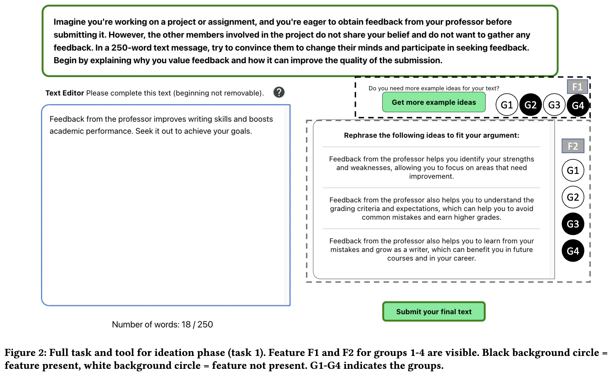

# Göldi et al. — Intelligent Support Engages Writers Through Relevant Cognitive Processes

```
@inproceedings{10.1145/3613904.3642549,
author = {G\"{o}ldi, Andreas and Wambsganss, Thiemo and Neshaei, Seyed Parsa and Rietsche, Roman},
title = {Intelligent Support Engages Writers Through Relevant Cognitive Processes},
year = {2024},
isbn = {9798400703300},
publisher = {Association for Computing Machinery},
address = {New York, NY, USA},
url = {https://doi.org/10.1145/3613904.3642549},
doi = {10.1145/3613904.3642549},
abstract = {Student peer review writing is prevalent and important in education for fostering critical thinking and learning motivation. However, it often entails challenges such as high effort and writer’s block. Leaving students unsupported may thus diminish the efficacy of the process. Large Language Models (LLMs) offer a potential remedy, but their utility hinges on user-centered design. Guided by design-determining constructs from the Cognitive Process Theory of Writing, we developed an intelligent writing support tool to alleviate these challenges, aiding 1) ideation and 2) evaluation. A randomized experiment (n=120) confirmed users were less inclined to utilize the tool’s intelligent features when offered pre-supplied ideas or evaluations, validating our approach. Moreover, students engaged not less but more with their writing if support was available, indicating an enhanced experience. Our research illuminates design choices for enhancing LLM-based tools’ usability and user experience, specifically optimizing intelligent writing support tools to facilitate student peer review.},
booktitle = {Proceedings of the CHI Conference on Human Factors in Computing Systems},
articleno = {1047},
numpages = {12},
keywords = {Artifact or System, Creativity Support, Education/Learning, Schools/Educational Setting},
location = {<conf-loc>, <city>Honolulu</city>, <state>HI</state>, <country>USA</country>, </conf-loc>},
series = {CHI '24}
}
```

# One Sentence

---

This paper studied how a user’s engagement with a writing support tool varied when provided with intelligent features in the ideation and evaluation phases.

# More Sentences

---

Results show that

- Users engaged less with the intelligent features when the static (non-intelligent) features are also present (e.g., showing some static ideas as well as the option to ask for more ideas from LLMs)
- For the ideation phase, “the presence of intelligent writing support increases time spent with the tool”; this is not the case for the evaluation phase

# Key Points

---

### The priors as part of the cognitive process theory of writing (CPTW)

> 1. the writer’s long-term memory, which includes information on the topic, audience, and reason to write; 2. the text produced so far; and 3. the rhetorical problem currently to be solved, i.e., what has to be achieved to address the reason to write.
> 

### The switching of the three processes in CPTW

> The writing process cognitively consists of dynamically switching between these three subprocesses. An additional subprocess, namely monitoring, conducts switching.
> 

### UI and experimental design

> … 2x2 between-group design … The two binary factors are the presence or absence of a) relevant example ideas/feedback suggestions for improvement and b) intelligent writing support in a button
> 

F1 below lets a user request intelligent support and F2 are the static version of the support



# Other Notes

---

The specific writing task here is writing peer reviews (common in online courses)

# Take-Away

---

### Delta from this work

This paper focuses on how intelligent support influences users’ engagement with the tool, measured by time spent and key-stroke level interaction counts; however, this work does not answer the question whether such support based on the cognitive process theory of writing can result in better AI assistance (or how to infer such cognitive states of a writer).

### Interpreting the subprocesses of planning

Planning should follow this order: goal setting → ideation (generating ideas) → organization (organizing ideas)
