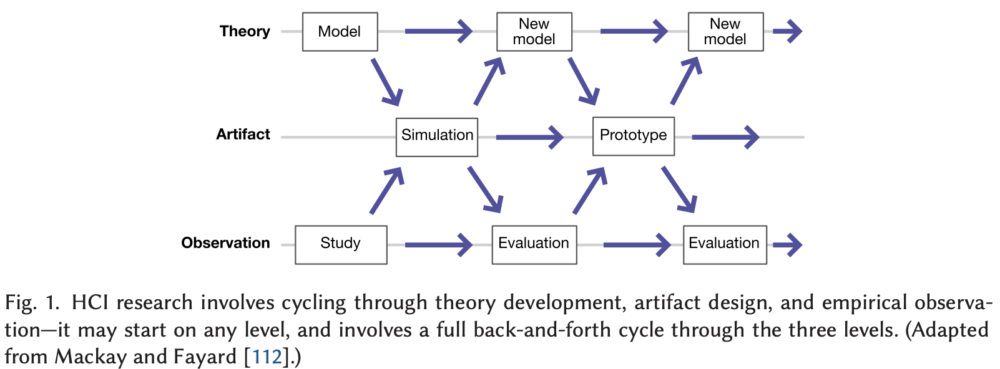
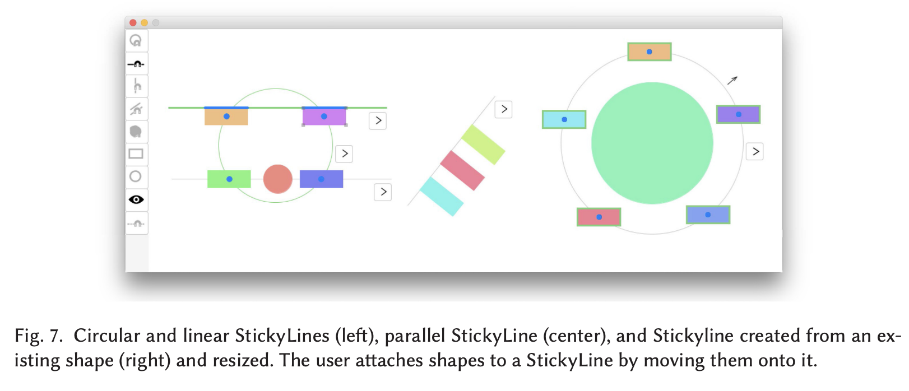

# Beaudouin-Lafon et al. — Generative Theories of Interaction

```
@article{10.1145/3468505,
author = {Beaudouin-Lafon, Michel and B\o{}dker, Susanne and Mackay, Wendy E.},
title = {Generative Theories of Interaction},
year = {2021},
issue_date = {December 2021},
publisher = {Association for Computing Machinery},
address = {New York, NY, USA},
volume = {28},
number = {6},
issn = {1073-0516},
url = {https://doi.org/10.1145/3468505},
doi = {10.1145/3468505},
abstract = {Although Human–Computer Interaction research has developed various theories and frameworks for analyzing new and existing interactive systems, few address the generation of novel technological solutions, and new technologies often lack theoretical foundations. We introduce Generative Theories of Interaction, which draw insights from empirical theories about human behavior in order to define specific concepts and actionable principles, which, in turn, serve as guidelines for analyzing, critiquing, and constructing new technological artifacts. After introducing and defining Generative Theories of Interaction, we present three detailed examples from our own work: Instrumental Interaction, Human–Computer Partnerships, and Communities \& Common Objects. Each example describes the underlying scientific theory and how we derived and applied HCI-relevant concepts and principles to the design of innovative interactive technologies. Summary tables offer sample questions that help analyze existing technology with respect to a specific theory, critique both positive and negative aspects, and inspire new ideas for constructing novel interactive systems.},
journal = {ACM Trans. Comput.-Hum. Interact.},
month = {nov},
articleno = {45},
numpages = {54},
keywords = {generative principles, generative theory, Theory}
}
```

# One Sentence


This paper demonstrates how to employ theories to generate specific designs of interactive systems.

> Each generative theory of interaction builds upon ideas from empirically based scientific theory, and introduces HCI-specific concepts and actionable principles that, when applied to specific research questions, help generate new insights about users and inspire novel design directions.
> 

# More Sentences


### Definition of a Generative Theory of Interaction

… which should achieve the following:

> (1) grounded in a theory of human activity and behavior with technology;
(2) amenable to analytical, critical, and constructive interpretation; and 
(3) actionable through the theory’s concepts and generative principles
> 

### Should be grounded in a theory

> … should not be based solely on intuition or anecdotal evidence, but grounded in descriptive, predictive, or prescriptive theories of human activity and behavior from the natural and social sciences, especially biology, experimental psychology, sociology, and anthropology.
> 

### Three ways a theory can be useful

1. Analytically—”provides a description of current use and practice”;
2. Critically—”assess both the positive and negative aspects of a system given different needs and contexts of use, thus providing avenues for improvement or re-design”;
3. Constructively—”inspires new ideas relative to the critque, expressed in terms of the generative theory’s concepts and principles”.

# Key Points


### A useful illustration of the HCI method



### The problem/motivation

> We lack *generative theories* that provide a direct link from empirically based theories in the natural and social sciences to *HCI-specific* constructs that suggest and inspire novel forms of HCI.
> 

### What types of theories are useful for HCI?

> (1) establishing relationships between two or more variables; (2) explaining particular social phenomena; and (3) describing the meaning or significance of phenomena in the social world.
> 

### How to generate generative theories

> - focus on a single underlying theory (or several closely related theories);
- choose concepts and principles for their consistency and complementarity;
- assess the analytical, critical, and constructive power of the concepts and principles;
- create specific questions to ensure that concepts and principles are actionable when exploring new designs;
- pay attention to where concepts and principles resist or break down and revise them accordingly; and
- engage with users throughout the process
> 

The authors also note that it’s not always the case to find a theory first; sometimes we start with empirical studies or prototyping and identify theories later based off of the earlier work.

# Other Notes


### What is theory?

Neuman [120, p.30]:

> … a system of interconnected ideas that condense and organize knowledge
> 

# Take-Away


Translating theories to specific designs of an artifact is hard—how to support this?

The paper seems to suggest translating a theory into a few heuristics or requirements, which can be used to both reflect on / critic existing techniques and to inspire new designs that address current limitations.

- For example, “reification”, which refers to an instrument that reifies an abstract command or concept, leads to the requirement that a command shouldn’t be manifested as a generic button but rather as a UI element specifically customized for making that command easy to recall and execute.
The following design of a UI element for aligning graphical objects is one such example:


