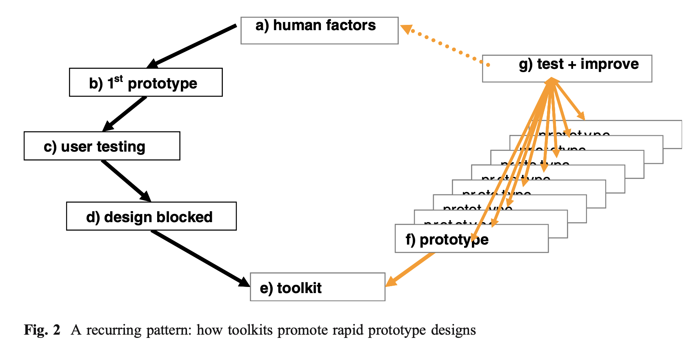
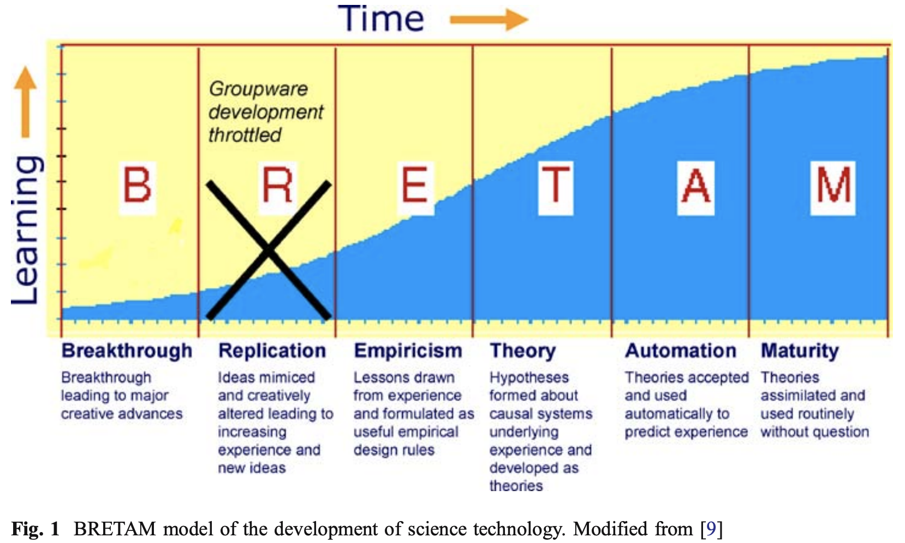

# Greenberg — Toolkits and interface creativity

```
@article{greenberg2007toolkits,
  title={Toolkits and interface creativity},
  author={Greenberg, Saul},
  journal={Multimedia Tools and Applications},
  volume={32},
  number={2},
  pages={139--159},
  year={2007},
  publisher={Springer}
}
```

# One Sentence

---

This essay advocates the development of toolkits as a key step in enabling people's creativity in building systems that otherwise would be too difficult to realize creative ideas.

# More Sentences

---

# Key Points

---

### A nice check list for what a toolkit should do

- Be embedded within a familiar platform and language in common use so that people can leverage their existing knowledge and skills.
- Remove low-level implementation burdens common to all groupware platforms (e.g., simplified access to communications, data sharing, concurrency control, session management).
- Minimize housekeeping and other non-essential tasks (e.g., hiding of details, or automating tasks that would otherwise have to be coded).
- Encapsulate successful design concepts known by the research community into programmable objects so they can be included with little implementation effort.
- Make simple things achievable in a few lines of code, and complex things possible.

### The 'research pattern' of toolkit development

A typical system starts with the goal of understanding some human factor related questions. There is an attempt to build the first prototype, which is often difficult and poorly implemented, has many usability problems, and blocking subsequent designs.

Then the team would switch to reconsider such technical obstacles and how a toolkit might enable non-expert users/programmers to overcome such obstacles.

A toolkit is then developed and often disseminated within the research team. If successful, the toolkit should enable more rapid development and iteration of the same kind of interfaces.



# Other Notes

---



# Take-Away

---
