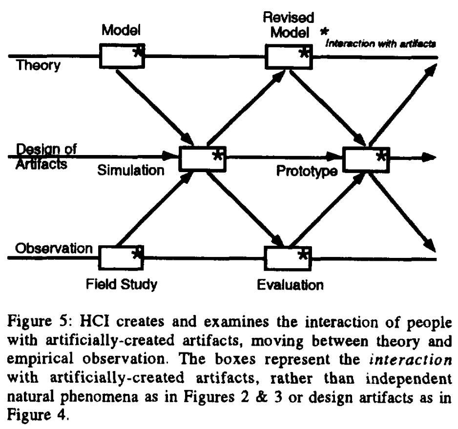
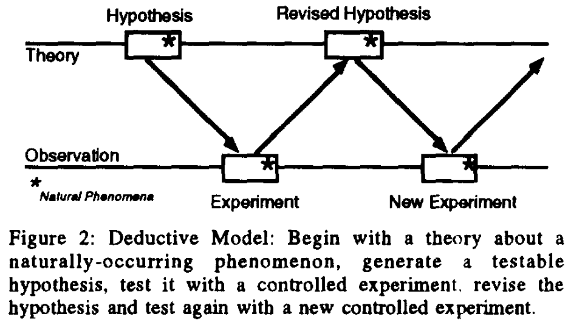
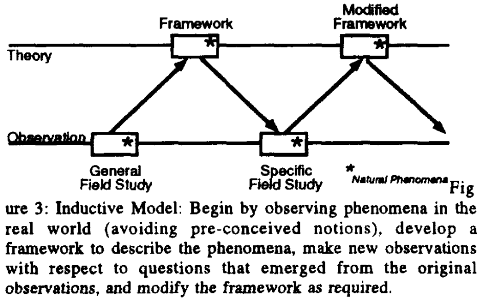

# Mackay & Fayard — HCI, natural science and design

```

@misc{noauthor_hci_nodate,
	title = {{HCI}, natural science and design {\textbar} {Proceedings} of the 2nd conference on {Designing} interactive systems: processes, practices, methods, and techniques},
	url = {https://dl.acm.org/doi/abs/10.1145/263552.263612},
	urldate = {2024-08-09},
	file = {HCI, natural science and design | Proceedings of the 2nd conference on Designing interactive systems\: processes, practices, methods, and techniques:/Users/xac/Zotero/storage/K8XJZBUY/263552.html:text/html},
}

```

# One Sentence


This paper presents a framework to characterize HCI’s research methodology—a combination of the deductive approach from theory to empirical study, the inductive approach from empirical study to theory, and the artifact creation approach in engineering, design, and fine arts.



# More Sentences


# Key Points


### Nice characterization of HCI vis-a-vis natural science and design

> Human-computer interaction is multidisciplinary, drawing paradigms and techniques from both the natural sciences and the design disciplines. HCI cannot be considered a pure natural science because it studies the interaction between people and artificially-created artifacts, rather than naturally-occurring phenomena, which violates several basic assumptions of natural science. Similarly, HCI cannot be considered a pure design discipline because it strives to independently verify design decisions and processes, and borrows many values from scientists.
> 

### HCI’s disciplinary identify struggle

> The major difficulty for HCI is that the object of study is not an independent natural phenomenon, as in all of the sciences. Nor is it solely the creation of new artifacts, as in the design and engineering disciplines.
> 

### Deductive vs. inductive models of research

> … share an important characteristic. Both assume the existence of two “worlds”: the theoretical and the empirical (or “real world”). For both, research consists of moving cyclically back and forth between theory and observation in an attempt to understand phenomena in the real world.
> 





# Other Notes


### The historical basis of null-hypothesis testing

> … pose the hypotheses differently, so that experiments try explicitly to find a counter-example to the hypothesis. The hypothesis can be accepted as conditionally true, until an objection can be found. This strategy is called “falsification” and forms the basis for most of today’s experimental designs that fit the Deductive Model. … experiments can never actually prove hypotheses: they can only increase our confidence in them.
> 

### Another reason to employ theory+artifact design+observation framework

Each individual method has their own limitation (more so when employed for HCI) so a combination of them will overcome each other’s. For example, a focused field study is good for understanding a specific domain or population but would struggle to generalize—developing a theory based on this study’s findings (or use some theory to inform the hypotheses of the study) can overcome this limitation.

# Take-Away

