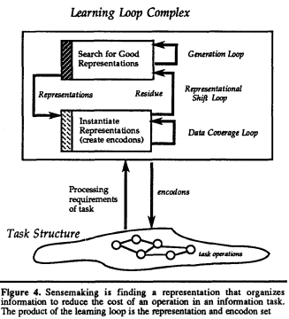

# Russell et al. — The cost structure of sensemaking

```
@inproceedings{russell_cost_1993,
	address = {Amsterdam, The Netherlands},
	series = {{CHI} '93},
	title = {The cost structure of sensemaking},
	isbn = {978-0-89791-575-5},
	url = {https://doi.org/10.1145/169059.169209},
	doi = {10.1145/169059.169209},
	abstract = {Making sense of a body of data is a common activity in any kind of analysis. Sensemaking is the process of searching for a representation and encoding data in that representation to answer task-specific questions. Different operations during sensemaking require different cognitive and external resources. Representations are chosen and changed to reduce the cost of operations in an information processing task. The power of these representational shifts is generally under-appreciated as is the relation between sensemaking and information retrieval. We analyze sensemaking tasks and develop a model of the cost structure of sensemaking. We discuss implications for the integrated design of user interfaces, representational tools, and information retrieval systems.},
	urldate = {2020-07-13},
	booktitle = {Proceedings of the {INTERACT} '93 and {CHI} '93 {Conference} on {Human} {Factors} in {Computing} {Systems}},
	publisher = {Association for Computing Machinery},
	author = {Russell, Daniel M. and Stefik, Mark J. and Pirolli, Peter and Card, Stuart K.},
	month = may,
	year = {1993},
	keywords = {cost structure, information access, learning loop, representation search, representation shift, sensemaking},
	pages = {269--276}
}
```

# One Sentence


This paper summarizes activities revolving around sensemaking—finding the representation of data to answer task-specific questions—and analyze its cost structure.

# More Sentences




- ***Residue*** is ill-fitting or missing data and unused representations.
- The ***representational shift*** loop is guided by the discovery of residue

### Peter Pirolli's description of the above diagram

> First, there is a search for a good representation (the generation loop). Then there is an attempt to encode information in the representation (the data coverage loop). The attempt at encoding information in the representation identifies items that do not fit (“residue”). This gives rise to an attempt to adjust the representation so that it has better coverage (the “representation shift loop”). The result is a more compact representation of the essence of the information relative to the intended task.
> 

# Key Points


### Sensemaking

> ***Sensemaking*** is the process of searching for a representation and encoding data in that representation to answer task-specific questions.
> 

From [Wikipedia](https://en.wikipedia.org/wiki/Sensemaking_(information_science)):

> Sensemaking is an active two-way process of fitting data into a frame (mental model) and fitting a frame around the data.
> 

### Peter Pirolli's framing of sensemaking

> Sensemaking, in essence, is a process of forming and working with representations, and those representations determine which computations are easy or difficult, and consequently (we will argue) which activities can be performed more or less intelligently. In sensemaking: representation is central; representation shapes computation; computation shapes intelligence.
> 

### An example of sensemaking

> In one of our case studies, the sensemaker looks up data about laptop computers in a collection of magazines and product sheets. His goal is to make a purchasing recommendation meeting given constraints. The data representation created by sensemakers carrying out this task invariably includes tables giving properties of competing laptops. Representation shifts are changes to the table structure as the sensemaker decides which properties are most relevant and retrievable and ultimately are able to help solve the problem of determining the best choice
> 

### The ubiquity of sensemaking

> Despite differences in domain, approaches or individual styles, making sense of a complex body of information always appears to follow a common pattern
> 

### The main cost of sensemaking is extracting data to fill in a represnetation

> Extraction requires finding the relevant documents containing the information, selecting the document parts containing the information, and then transforming the information into canonical form. The document parts may be particular paragraphs, table entries, or graphical elements from figures. In the cases we have examined, data extraction is often the most time consuming task in sensemaking.
> 

### The cost structure of sensemaking

FR: finding a representation schema to support the required operators in the target task,

IE: instantiating the encodons,

FD: finding data to create the encodons, including both finding the documents and selecting the information,

TT: the target task

# Other Notes


### Other familiar sensemaking scenarios

- Summarizing reviews to write a rebuttal or determine a revision plan
- Developing a tool with a workflow to (semi)automatically perform a task
- Describing a product page to a visually-impaired user to help them make a purchasing decision
- Affinity diagramming to consolidate user study data
- "collecting, organizing, and comprehending information about a medical condition, treatment options, and trade-offs in order to choose a treatment" [[ref](http://www.peterpirolli.com/Professional/Blog__Making_Sense/Entries/2010/8/16_What_is_sensemaking.html)]

### Related concept: information foraging

From [Wikipedia](https://en.wikipedia.org/wiki/Information_foraging):

> Information foraging is a theory that applies the ideas from optimal foraging theory to understand how human users search for information. The theory is based on the assumption that, when searching for information, humans use "built-in" foraging mechanisms that evolved to help our animal ancestors find food. Importantly, better understanding of human search behaviour can improve the usability of websites or any other user interface.
> 

# Take-Away


Didn't quite get the cost part of this paper or how to operationalize it.
