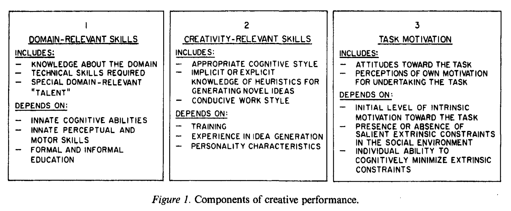

# Amabile — The social psychology of creativity: A componential conceptualization.

```
@article{amabile1983social,
  title={The social psychology of creativity: A componential conceptualization.},
  author={Amabile, Teresa M},
  journal={Journal of personality and social psychology},
  volume={45},
  number={2},
  pages={357},
  year={1983},
  publisher={American Psychological Association}
}
```

# One Sentence


# More Sentences


# Key Points


### This paper’s main thesis on creativity (summary)

> … creativity is best conceptualized not as a personality trait or a general ability but as a behavior resulting from particular constellations of personal characteristics, cognitive abilities, and social environments.
> 

### A consensual definition of creativity that supports the evaluation of it

> A product or response is creative to the extent that appropriate observers independently agree it is creative. Appropriate observers are those familiar with the domain in which the product was created or the response articulated.
> 

### This paper’s conceptual definition of creativity

> A product or response will be judged as creative to the extent that (a) it is both a novel and appropriate, useful, correct, or valuable response to the task at hand and (b) the task is heuristic rather than algorithmic.
> 

### Algorithmic vs. heuristic tasks

> … algorithmic tasks are those for which the path to the solution is clear and straightforward—tasks for which an algorithm exists. By contrast, heuristic tasks are those not having a clear and readily identifiable path to solution—tasks for which algorithms must be developed.
> 

### Components of creativity / overview



The level of generality:

> Creativity-relevant skills operate at the most general level; they may influence responses in any content domain. … Domain-relevant skills … operate at an intermediate level of specificity … includes all skills relevant to a general domain. … task motivation operates at the most specific level … specific to particular tasks within domains and may even vary over time for a particular task.
> 

### Components of creativity / domain-relevant skills

> Domain-relevant skills can be considered as the basis from which any performance must proceed. They include factual knowledge, technical skills, and special talents in the domain in question.
> 

### Components of creativity / creativity-relevant skills

- breaking perceptual set (try to perceive the same thing in different ways);
- breaking cognitive set, or exploring new cognitive pathways;
- keeping response options open as long as possible;
- suspending judgment;
- using “wide” categories
    - (“Individuals who categorize information in ‘wide’ as opposed to ‘narrow’ categories, who see relations between apparently diverse bits of information …)
- remembering accurately
    - (”Those who can code, retain, and recall large amounts of detailed information”)
- breaking out of performance ‘scripts’

What determine creativity-relevant skills:

> … creativity-relevant skills depend on personality characteristics … on training, through which they may be explicitly taught, or simply on experience with idea generation.
> 

# Other Notes


### The “old” view of creativity

> … empirical creativity research has long been dominated by a trait approach, an attempt to precisely identify the personality differences between creative and noncreative individuals.
> 

### A process-oriented view of creativity

> Koestler (1964) proposed that creativity involves a “bisociative process”—-the connecting of two previously unrelated “matrices of thought” to produce a new insight or invention.
> 

### A person-oriented view of creativity

> Guilford … “In this narrow sense, creativity refers to the abilities that are most characteristic of creative people”
> 

### A product-oriented view of creativity

> … creative product as the distinguishing signs of creativity. … The product criteria of novelty and appropriateness or value are common in most definitions of creativity …
> 

### The dichotomic view of creativity

> … the popular assumption that creativity is a dichotomous trait—that people and things are either creative or not creative—is implicit in much of the creativity literature.
> 

# Take-Away

