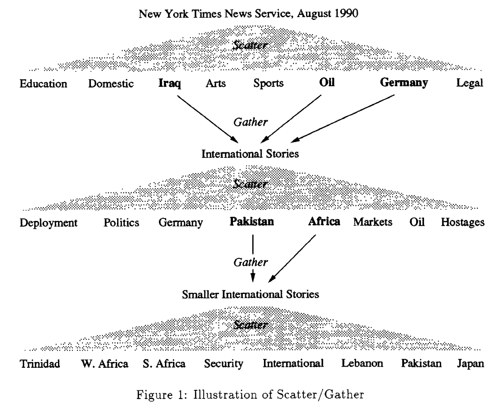

# Cutting et al. — Scatter/gather: A cluster-based approach to browsing large document collections

```
@inproceedings{cutting2017scatter,
  title={Scatter/gather: A cluster-based approach to browsing large document collections},
  author={Cutting, Douglass R and Karger, David R and Pedersen, Jan O and Tukey, John W},
  booktitle={ACM SIGIR Forum},
  volume={51},
  number={2},
  pages={148--159},
  year={2017},
  organization={ACM New York, NY, USA}
}
```

# One Sentence

---

This paper describes the scatter/gather technique: a corpus of documents is first scattered into several clusters (each with a description) and then a user gathers one or a few clusters and repeat the whole process.



# More Sentences

---

> Initially the system *scatters* the collection into a small number of document groups, or *clusters*, and presents short summaries of them to the user ... the user selects one or more of the groups for further study. The selected groups are *gathered* together to form a subcollection.
> 

# Key Points

---

### Why using this technique

> ... a *browsing* session with no well defined goal, satisfying a need to learn more about the document collection.
> 

# Other Notes

---

# Take-Away

---
