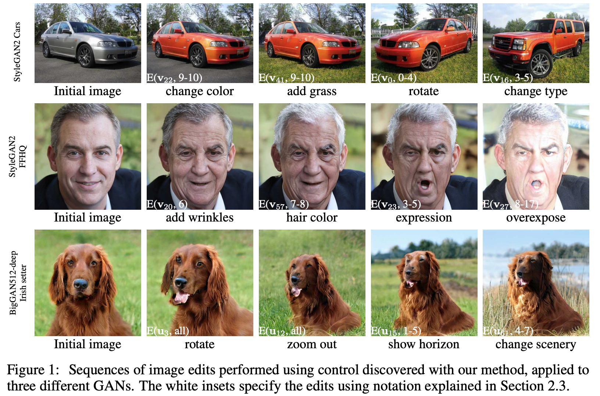

# Härkönen et al. — Ganspace: Discovering interpretable gan controls

```
@article{harkonen2020ganspace,
  title={Ganspace: Discovering interpretable gan controls},
  author={H{\"a}rk{\"o}nen, Erik and Hertzmann, Aaron and Lehtinen, Jaakko and Paris, Sylvain},
  journal={arXiv preprint arXiv:2004.02546},
  year={2020}
}
```

# One Sentence

---

This paper describes a PCA-based approach to decompose a GAN model into interpretable controls for users to specify desired attributes of the generated outcome.



# More Sentences

---

> ... a large number of interpretable controls can be defined by layer-wise perturbation along the principal directions.
> 

# Key Points

---

### Related Work

Nicely include a lot of the supervised approach (see paper for refs)

> Current attempts to add user control over the output focus on supervised learning of latent directions ... GAN training with labeled images ... this requires expensive manual supervision for each new control to be learned.
> 

### How PCA could work

> Our main observation is, simply, that the principal components of feature tensors on the early layers of GANs represent important factors of variation.
> 

# Other Notes

---

### Brief intro to BigGAN and StyleGAN

> In the BigGAN model, the intermediate layers also take the latent vector [z] as input

$\mathbf{y}_i = G_i(\mathbf{y}_{i-1}, \mathbf{z})$
> 

> In a StyleGAN model, the first layer takes a constant input y0 ... the output is controlled by a non-linear function [M] of z as input to intermediate layers:

$\mathbf{y}_i = G_i(\mathbf{y}_{i-1}, \mathbf{w})~~~\text{with}~~ \mathbf{w} = M(\mathbf{z})$
> 

For StyleGAN,

> ... the authors demonstrate that allowing each layer to have its own wi enables powerful "style mixing," the combination of features of various abstraction levels across generated images.
> 

### PCA on StyleGAN

Sample randomly N vectors of z and compute the corresponding w's ...

> We then compute PCA of these $\mathbf{w}_{1:N}$ values. This gives a basis $V$ for $\mathcal{W}$. Given a new image defined by $\mathbf{w}$, we can edit it by varying PCA coordinates $\mathbf{x}$ before feeding to the synthesis network:
$\mathbf{w}' = \mathbf{w} + \mathbf{V}\mathbf{x}$
> 

# Take-Away

---

Spotlight's advantage:

- Allowing users to discover directions, thus promoting a sense of agency beyond interpretation.
- Not one-size-fits-all—each user might discover/define slightly different directions?

Maybe we can run their UI to compare with Spotlight?

- [https://github.com/harskish/ganspace](https://github.com/harskish/ganspace)
