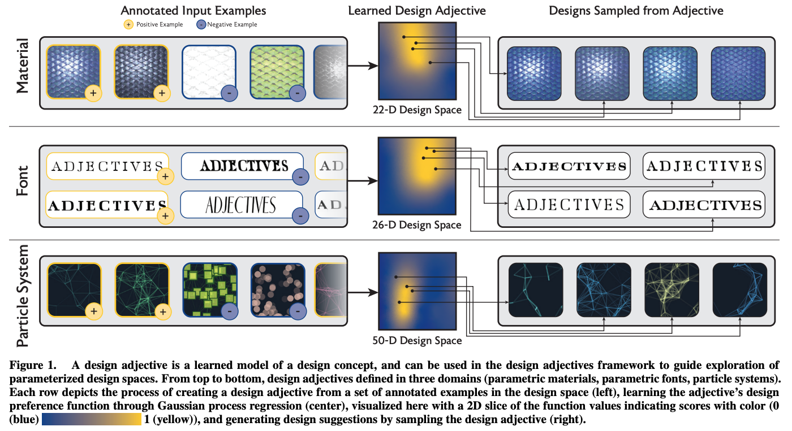
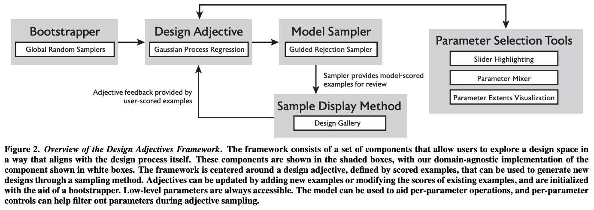

# Shimizu et al. — Design Adjectives: A Framework for Interactive Model-Guided Exploration of Parameterized Design Spaces

```
@inproceedings{shimizu2020design,
  title={Design Adjectives: A Framework for Interactive Model-Guided Exploration of Parameterized Design Spaces},
  author={Shimizu, Evan and Fisher, Matthew and Paris, Sylvain and McCann, James and Fatahalian, Kayvon},
  booktitle={Proceedings of the 33rd Annual ACM Symposium on User Interface Software and Technology},
  pages={261--278},
  year={2020}
}
```

# One Sentence


This paper introduces Design Adjectives—a method for specifying a user's design intent (e.g., to create "shiny blue scales") via iteratively specifying positive and negative examples and optionally tuning low-level parameters.



# More Sentences


> a *design adjective*: a learned model of a user's design intent
> 

> The goal of the design adjectives framework is to facilitate user interaction with a design space in a manner that mirrors these steps: defining an initial model of user intent (the learned *design adjective*), refining that model by reacting to examples produced by an interactive sampling process, and fine-tuning using low-level parameter controls.
> 



# Key Points


### On "design gallery" type of work

> ... to be effective in high dimensional spaces they must predict what designs are most useful to present to the user throughout the iterative design process.
> 

### Interaction Scenario

(See **DESIGN ADJECTIVES OVERVIEW** section)

The design process is divided into 

1. preliminary design, where a user sample random examples and specify which they like/dislike;
2. refinement, where the model learns the user's preference, returns variations and let the user refine whether these variations meet their intents;
3. detailed design, where the user "uses the individual parameter controls. The adjective ... highlights which parameters had the most impact on" the definition of the design intents (e.g., "shiny blue scales").

### Input to the design adjective

> ... is assumed to be standard example-score pairings, with examples created in the design space that the user is working in. The output of the adjective is a function that assigns a real-valued preference score to all points in the design space.
> 

# Other Notes


> Methods of modeling an objective function given a small amount of input data have been studied in machine learning. This class of problems is referred to as few-shot, or zero-shot, learning.
> 

# Take-Away


### Difference from Spotlight

1. Spotlight users might not have a specific objective in mind;
2. GAN models do not have well-defined (design) parameters.
