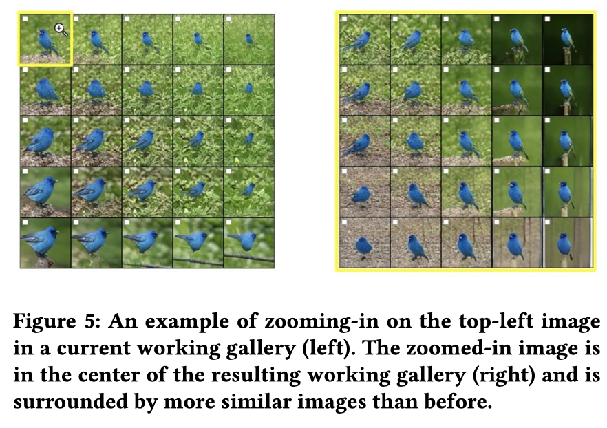
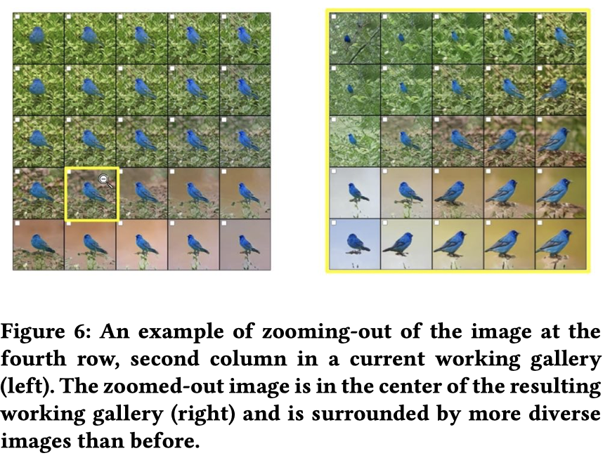
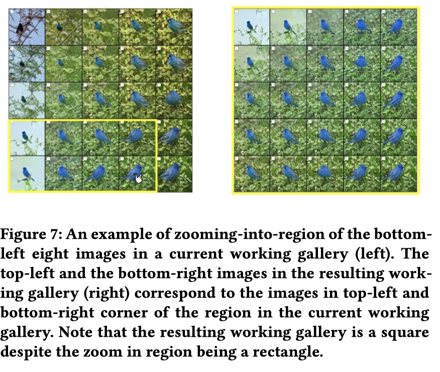
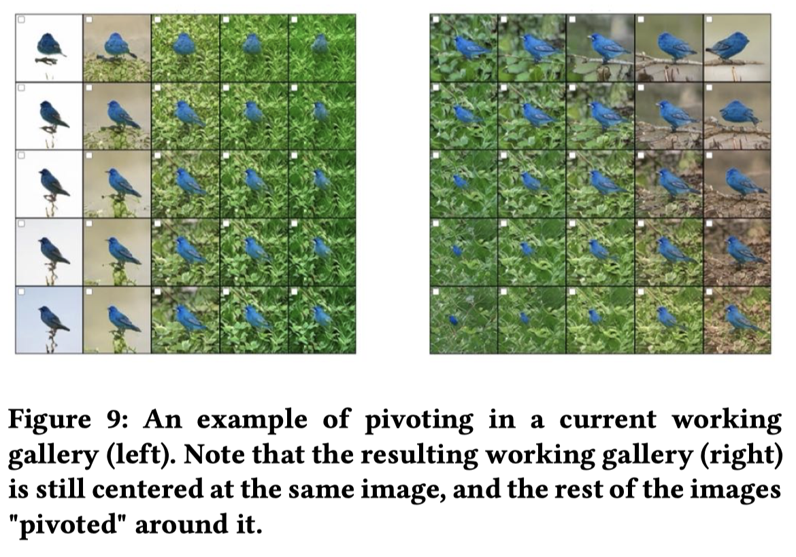

# Zhang & Banovic — Method for Exploring Generative Adversarial Networks (GANs) via Automatically Generated Image Galleries

# One Sentence

This paper presents a method for retrieving examples of generated images based on a series of user input, thus enabling users to find quality results.

# More Sentences

# Key Points

### Motivation and challenges

> However, it remains challenging to explore and objectively assess the quality of all possible images generated using a GAN. Currently, model creators evaluate their GANs via tedious visual examination of generated images sampled from narrow prior probability distributions on model parameters.
> 

### Prior work

> Techniques for interactive GAN image generation [3, 10, 13, 18, 30, 35] enable manual creation of specific images, but not sampling of diverse, high-quality images from a GAN
> 

[21]: 

> ... (finding) a gallery of similar high-quality images ... not a diverse gallery ...
> 

[22]: 

> ... finding a single "best" quality GAN-generated image
> 

[30]

> Although approaches for direct manipulation of model parameters [30] exist, such interactions currently require tedious manipulation of sliders that map directly to model parameters.
> 

### Fundamental issue: the trade-offs of varying z

> 1) if z deviates from the mean too greatly, the generated image will tend to have poor quality, and 2) if all elements of z are too close to the mean, then the resulting images will all look similar and the sample will not be diverse.
> 

# Take-Away

### What does it mean to discover direction?

1. explorability, i.e., the ability to explore — go away from the current spot to find examples that differ in as many ways as possible
2. saliency, i.e., the ability to find examples highly representative of a direction

### Advantages of Spotlight

1. Goes beyond naïve linear interpolation to make sure new images introduced as a result of user input are coherent (presenting changes that are reasonable to a user's expectation and proportional to the user input);
2. Region-specific, i.e., users can start with specific regions they are interested in exploring;
3. Using language models to produce semantic features for discovering semantic directions;

### The same argument can be made for Spotlight w.r.t prior work

> ..., but the existing techniques [3, 10, 35] focus on manually generating specific images from a GAN and not a large sample of images that could provide insights into the capabilities and limitations of current GAN models.
> 

### Paper idea

A design space of GAN exploration techniques
