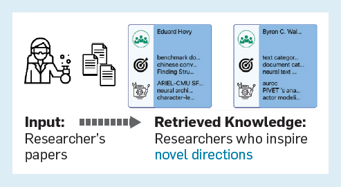

# Hope et al. — A Computational Inflection for Scientific Discovery

```

@article{hope_computational_2023,
	title = {A {Computational} {Inflection} for {Scientific} {Discovery}},
	volume = {66},
	issn = {0001-0782},
	url = {https://doi.org/10.1145/3576896},
	doi = {10.1145/3576896},
	abstract = {Enabling researchers to leverage systems to overcome the limits of human cognitive capacity.},
	number = {8},
	urldate = {2024-07-11},
	journal = {Commun. ACM},
	author = {Hope, Tom and Downey, Doug and Weld, Daniel S. and Etzioni, Oren and Horvitz, Eric},
	month = jul,
	year = {2023},
	pages = {62--73},
}

```

# One Sentence

---

This paper reviews authors’ series of work of task-guided retrieval of rich information (academic publications, online forum discussions, etc.) to assist scientists’ work by helping them overcome their cognitive limitations.

# More Sentences

---

The two desiderata considerd by this series of work:

> … countering humans’ bounded capacity by retrieving and synthesizing information targeted to enhance performance on tasks.
> 

> … such systems should be rooted in *conceptual models of the inner cognitive world of a researcher.*
> 

# Key Points

---

### How human minds are the bottle neck of scientific discovery

> While scientific knowledge, discourse, and the larger scientific ecosystem are expanding with rapidity, our human minds have remained static, with severe limitations in the capacity to find assimilate, and manipulate information.
> 

> The way we search through and reflect on information across the vast space—the areas we select to explore and how we explore them—is hindered by cognitive biases and lacks principled and scalable tools for guiding our attention.
> 

### The cognitive aspect of how scientists perform their work

> The way researchers decide to interact with information in the outer world and the way they process and use this information is governed by a complex array of cognitive processes, personal knowledge and preferences, biases, and limitations, which are only partially understood.
> 

> For example, scientists can be limited by confirmation bias, aversion to information from novel domains, homophily, and fixation on specific directions and perspectives without consideration of alternative views.
> 

### An example of scientists’ bias in their work

> … to identify protein-protein interactions (PPIs) … a significant “bias of locality,” where explorations of PPIs are launced more frequently from those that were most recently studied, rather than following more general prioritization of exploration.
> 

### How the proposed information retrieval differs from traditional approaches

Traditional information retrieval:

> … “relevance first,” focusing on results that answer user queries as accurately as possible. … pinpointed literature search in familiar areas.
> 

Task guided scientific knowledge retrieval—for example:

> For researchers engaged in *experimentation or analysis*, we envision systems that help users identify experiments and analyses in the literature to guide design choices and decisions.
> 

### Example systems of task-guided knowledge retrieval

Example #1:

> Bridger, which connects researchers to peers who inspire novel directions for research … [researchers’] inner knowledge is represented as mentions of problems and methods extracted automatically from a researcher’s papers and weighted by term frequency.
> 



Example #2:

> … a search method that enables researchers to search through a database of technological inventions and find mechanisms that can be transferred from distant domains to solve a given problem.
> 

Example #3:

> Given as input a problem description written by the user (as a proxy summary of the user’s inner world of knowledge and purpose), we have pursued mechanisms that can retrieve diverse problem perspectives that are related to the focal problem, with the goal of inspiring new ideas for problem abstraction and reformulation.
> 

Example #4:

> … a search engine that allows users to retrieve outer knowledge in the form of difficulties, uncertainties, and hypotheses in the literature.
> 

# Other Notes

---

# Take-Away

---
