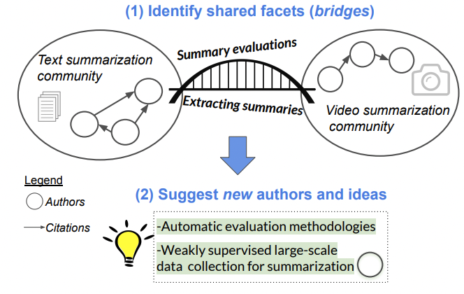

# Portenoy et al. —  Bursting scientific filter bubbles: Boosting innovation via novel author discovery

```
@inproceedings{portenoy2022bursting,
intro={Isolated silos of scientific research and the growing challenge of information overload limit awareness across the literature and hinder innovation. Algorithmic curation and recommendation, which often prioritize relevance, can further reinforce these informational “filter bubbles.” In response, we describe Bridger, a system for facilitating the discovery of scholars and their work. We construct a faceted representation of authors with information gleaned from their papers and inferred author personas and use it to develop an approach that locates commonalities and contrasts between scientists to balance relevance and novelty. In studies with computer science researchers, this approach helps users discover authors considered useful for generating novel research directions. We also demonstrate an approach for displaying information about authors, boosting the ability to understand the work of new, unfamiliar scholars. Our analysis reveals that Bridger connects authors who have different citation profiles and publish in different venues, raising the prospect of bridging diverse scientific communities.},
  title={Bursting scientific filter bubbles: Boosting innovation via novel author discovery},
  author={Portenoy, Jason and Radensky, Marissa and West, Jevin D and Horvitz, Eric and Weld, Daniel S and Hope, Tom},
  booktitle={Proceedings of the 2022 CHI Conference on Human Factors in Computing Systems},
  pages={1--13},
  year={2022}
}

```

# One Sentence


The authors suggested Bridger, which is an AI-based interface to provide a faceted representation of authors with information gleaned from their papers and inferred author personas, using it to develop an approach that locates commonalities and contrasts between scientists to balance relevance and novelty. 

# More Sentences


This tool helps users discover authors considered useful for generating novel research directions.

# Key Points


Bridger's approach to burst scientific filter bubbles and promote a more interconnected scholarly community is a pivotal development in how academic literature and collaborations can be fostered.



# Other Notes


# Take-Away


Author’s preference based