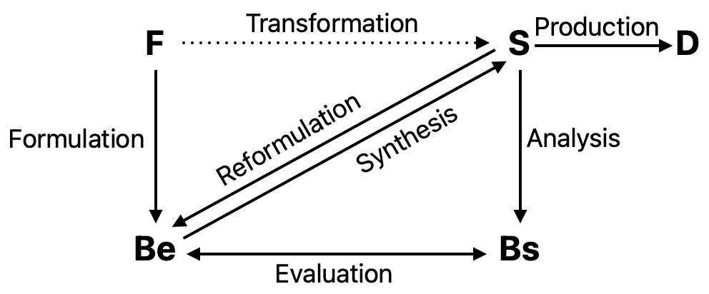

# Gero — Computational Models of Innovative and Creative Design Processes

```
@article{gero_computational_2000,
	title = {Computational {Models} of {Innovative} and {Creative} {Design} {Processes}},
	volume = {64},
	issn = {0040-1625},
	url = {https://www.sciencedirect.com/science/article/pii/S0040162599001055},
	doi = {https://doi.org/10.1016/S0040-1625(99)00105-5},
	abstract = {Computational support for designing began in the early 1960s, and has had a considerable influence. Only recently has there been the possibility of providing computational support for innovative and creative designing. This paper presents a number of computational models of creative designing; including combination, transformation, analogy, emergence, and first principles as a representative set. It describes them within a uniform framework and indicates the potential of having such models on technological change in a society where designers are the change agents of the physical world.},
	number = {2},
	journal = {Technological Forecasting and Social Change},
	author = {Gero, John S.},
	year = {2000},
	pages = {183--196},
}
```

# One Sentence


This article describes a general process of design as the interplay amongst function, structure, and behavior, followed by an abstraction of key activities that occur in creative and innovative design, including combination, transformation, analogy, emergence, and first principles.

# More Sentences


# Key Points


### Why design

> Designing exists because the world around us does not suit us, and the goal of designers is to change the world through the creation of artifacts. They do this by positing functions to be achieved and producing descriptions of artifacts capable of generating those functions.
> 

> … designing is the opposite of the traditional scientific explanation.
> 

### The Function-Behavior-Structure framework

- **Structure**. The outcome of design is an artifact, referred to as a structure (of some building-block elements);
    - A piece of furniture is a structure of its constituent materials;
- **Behavior**. How the artifact (structure) works;
    - A rocking chair can seat a person and generate back-and-forth rocking motion;
- **Function**. “… the relationship between the goal of a human user and the behavior of a system”
    - Goal: to sooth the person seated in a chair
    - Behavior that meets this goal: producing rocking motion

### What is design

> … a goal-oriented, constrained, decision-making, exploration and learning activity that operates within a situation that depends on the designer’s perception of the situation and results in the description of a future engineering system.
> 

### Two types of creative/innovative design

Although the paper distinguishes creative design and innovative design; such a word-level distinction isn’t really necessary in my opinion.

Regardless of naming, these two different designs are made of:

- **New values of existing variables**—“when the context that constrains the available ranges of the values for the variables is jettisoned so that unexpected values become possible.”
    - An unusually large angle between a chair’s seat and backrest makes a lounge chair
- **New variables**;
    - Connecting a chair’s legs to a non-static part leads to chairs with wheels or rocking chairs;

### A model of the design process



The key concepts in the design process:

- F: Function
- S: Structure
- Be: Expected behaviors
- Bs: Behavior of a structure
- D: Design specification

There are different design activities that connect the above concepts.

### Activities that enable creative design (introducing new variables)

- **Combination**
    - F_new = F_existing1 + F_existing2;
    - S_new = S_existing1 + S_existing2;
    - B_new = B_existing1 + B_existing2;
- **Transformation**
    - S_new = transform_operator(S_existing);
- **Analogy**
    - S_new = analogical_operator(S_existing)
- **Emergence**: “… extensional properties of a structure are recognized beyond its intentional ones”
    - S_new = emergence_transformer(S_existing)
- **First principles**: “… knowledge used abductively to relate function to behavior and behavior to structure …”
    - S = abductive_knowlege_based_transformer(B)

# Other Notes


### How design generates knowledge (twice)

> As a consequence of designing, knowledge is produced … The knowledge of its use and the resulting values it introduces and changes constitute a second form of knowledge.
> 

# Take-Away

