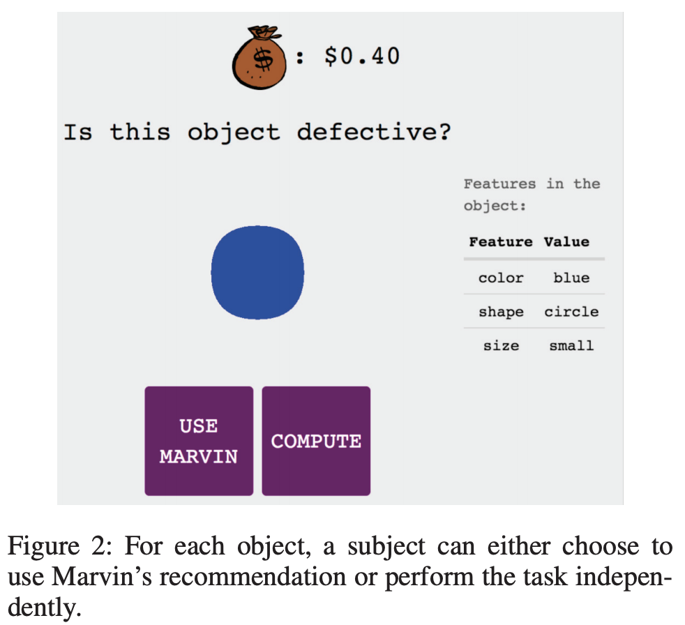
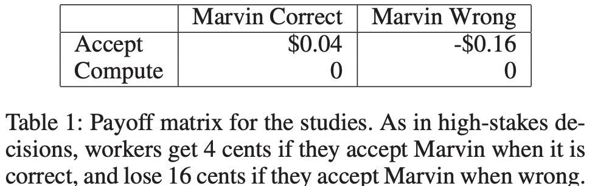

# Bansal et al. — Beyond accuracy: The role of mental models in human-AI team performance

```
@inproceedings{bansal2019beyond,
  title={Beyond accuracy: The role of mental models in human-AI team performance},
  author={Bansal, Gagan and Nushi, Besmira and Kamar, Ece and Lasecki, Walter S and Weld, Daniel S and Horvitz, Eric},
  booktitle={Proceedings of the AAAI Conference on Human Computation and Crowdsourcing},
  volume={7},
  number={1},
  pages={2--11},
  year={2019}
}
```

# One Sentence


This paper characterizes and experimentally shows how parsimony, stochasticity, and task dimensionality contribute to a user's mental model of AI's error boundary, i.e., detecting whether AI makes a mistake in the inference of a given instance.

# More Sentences


# Key Points


### What is the mental model of AI's error boundary?

> ... the human's mental model of the AI capabilities, specifically the AI system's *error boundary* (*i.e.,* knowing "When does the AI err?")
> 

### The type of human-AI collaborative scenario

> We refer to situations where an AI system provides a *recommendation* but the human makes the final *decision* as *AI*-*advised human decision making*
> 

### Formalization of AI's error boundary

The error boundary of model h is a function f that describes for each input x whether model output h(x) is the correct action for the input.

$$
f: (x, h(x)) \rightarrow \{T, F\}
$$

### Characteristics of AI error boundaries

- **Parsimony**: ... inversely related to its representational complexity. For AI error boundaries formulated in mathematical logic using disjunctive normal form, complexity depends on the number of conjuncts and literals in *f*.
- **Stochasticity**: *f* is non-stochastic if it separates all mistakes from correct predictions.
An error boundary might be stochastic for three reasons:
    - generalization (over simplifying things)
    - representation (mismatching what the boundary actually is)
    - inherent stochasticity (error itself exhibits high uncertainty/randomness)
- **Task dimensionality**: the number of features defining each instance.

# Other Notes


### Task setup





# Take-Away

