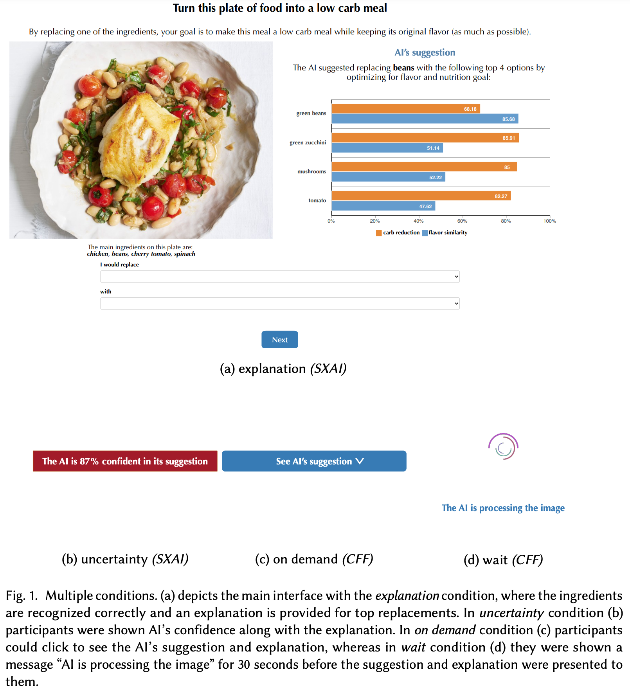
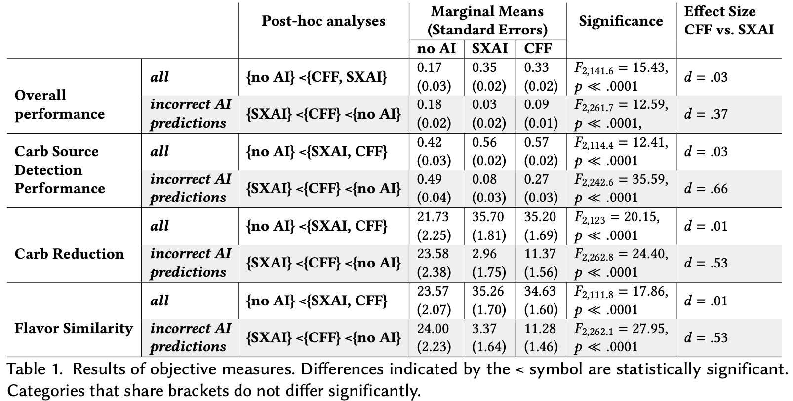
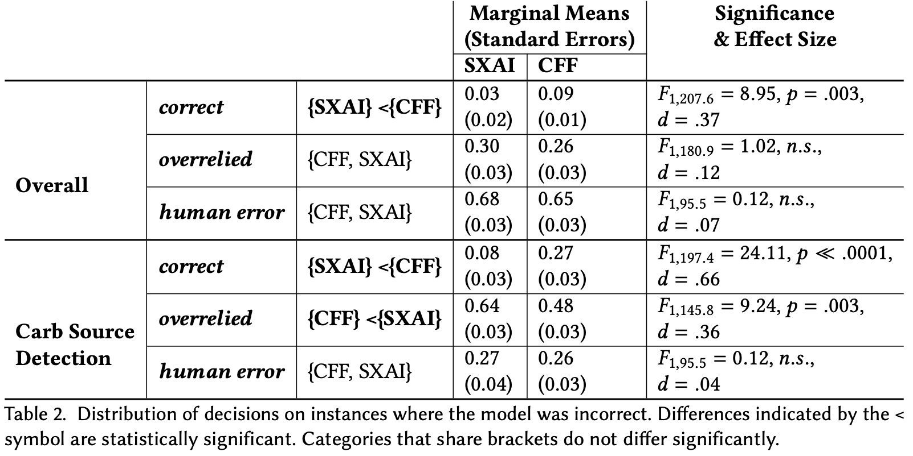

# Buçinca et al. — To trust or to think: cognitive forcing functions can reduce overreliance on AI in AI-assisted decision-making

```
@article{buccinca2021trust,
  title={To trust or to think: cognitive forcing functions can reduce overreliance on AI in AI-assisted decision-making},
  author={Bu{\c{c}}inca, Zana and Malaya, Maja Barbara and Gajos, Krzysztof Z},
  journal={Proceedings of the ACM on Human-Computer Interaction},
  volume={5},
  number={CSCW1},
  pages={1--21},
  year={2021},
  publisher={ACM New York, NY, USA}
}
```

# One Sentence

This paper studied how the use of cognitive forcing functions might reduce humans' overreliance on AI, i.e., going with AI's prediction even when it is wrong.








# More Sentences


> ... to reduce human overreliance on the AI and improve performance, we need to not only develop effective explanation techniques, but also ways to increase people's cognitive motivation for engaging analytically with the explanations.
> 

Main contributions:

> First, we introduced *cognitive forcing functions* as interaction design interventions for human+AI decision-making and demonstrated their potential to reduce overreliance on the AI ...
Second, ... our approach, while effective on average, appears to benefit individuals with high NFC more than those with low NFC.
> 

# Key Points


### Other findings of AI over-reliance

> ..., some studies demonstrate that explanations are interpreted as a general signal of competence—rather than being evaluated individually for their content—and just by their presence can increase the trust in and overreliance on the AI.
> 

### Cognitive forcing function

> ... —-interventions that are applied at the decision-making time to disrupt heuristic reasoning and thus cause the person to engage in analytical thinking
> 

### Previous strategies to overcome AI reliance

> • *Asking the person to make a decision before seeing the AI's recommendation.* ...
• *Slowing down the process*. ...
• *Letting the person choose whether and when to see the AI recommendation.*
> 

### The task (where humans might overrely on AI)

> Participants were shown meal images and were asked to replace the ingredient highest in carbohydrates on the plate, with an ingredient that was low in carbohydrates, but similar in flavor.
> 

### Study results

> When the top AI predictions were incorrect, however, *cognitive forcing functions* improved the objective metrics (i.e., overall performance, carb source detection performance, carb reduction and flavor similarity) significantly more compared to *simple explainable AI*. 
Yet, performance of participants that complete the task with no AI assistance ... was significantly higher than that of participants' in either *cognitive forcing functions* or *simple explainable AI* categories when they saw incorrect model prediction.
> 

# Other Notes


### Intervention-generated inequalities

> ... technological interventions can lead to intervention-generated inequalities (IGIs). IGIs arise when the benefits of an intervention disproportionately accrue to a group that is already privileged in a particular context.
> 

# Take-Away


> ... cognitive forcing functions reduced, but not yet eliminated, overreliance on the AI.
> 

> There was no significant difference in (overall) performance between *simple explainable AI* approaches and  *cognitive forcing functions*
> 

> When the AI model was making incorrect predictions, people performed best in conditions that they preferred and trusted the least, and that they rated as the most difficult.
>
