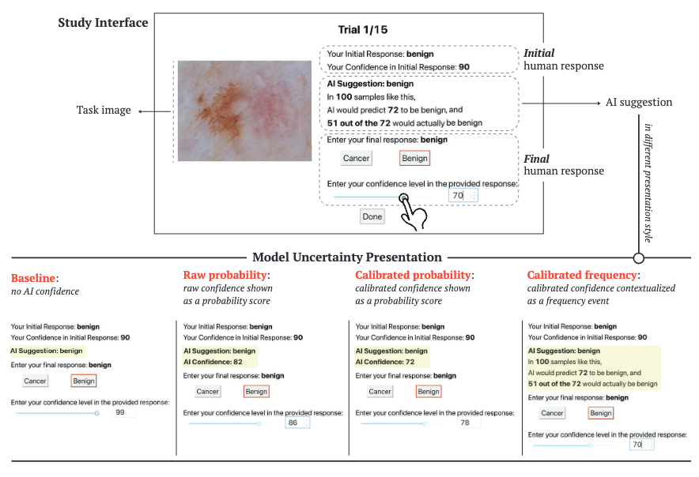
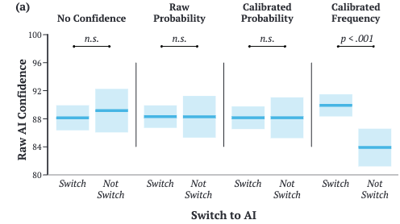
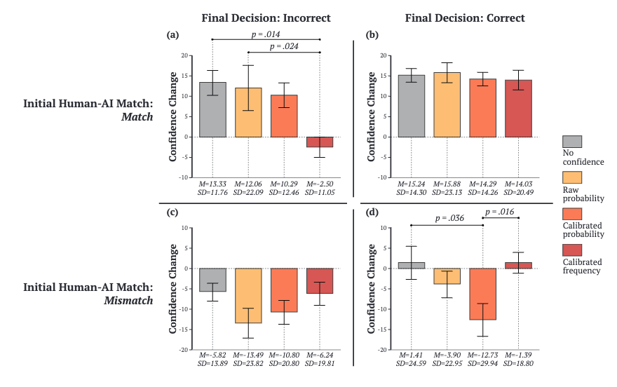

# Cao et al. — Designing for Appropriate Reliance: The Roles of AI Uncertainty Presentation, Initial User Decision, and User Demographics in AI-Assisted Decision-Making

```

@misc{cao_designing_2024,
	title = {Designing for {Appropriate} {Reliance}: {The} {Roles} of {AI} {Uncertainty} {Presentation}, {Initial} {User} {Decision}, and {User} {Demographics} in {AI}-{Assisted} {Decision}-{Making}},
	shorttitle = {Designing for {Appropriate} {Reliance}},
	url = {http://arxiv.org/abs/2401.05612},
	doi = {10.1145/3637318}},
	abstract = {Appropriate reliance is critical to achieving synergistic human-AI collaboration. For instance, when users over-rely on AI assistance, their human-AI team performance is bounded by the model's capability. This work studies how the presentation of model uncertainty may steer users' decision-making toward fostering appropriate reliance. Our results demonstrate that showing the calibrated model uncertainty alone is inadequate. Rather, calibrating model uncertainty and presenting it in a frequency format allow users to adjust their reliance accordingly and help reduce the effect of confirmation bias on their decisions. Furthermore, the critical nature of our skin cancer screening task skews participants' judgment, causing their reliance to vary depending on their initial decision. Additionally, step-wise multiple regression analyses revealed how user demographics such as age and familiarity with probability and statistics influence human-AI collaborative decision-making. We discuss the potential for model uncertainty presentation, initial user decision, and user demographics to be incorporated in designing personalized AI aids for appropriate reliance.},
	urldate = {2024-04-08},
	author = {Cao, Shiye and Liu, Anqi and Huang, Chien-Ming},
	month = jan,
	year = {2024},
	note = {arXiv:2401.05612 [cs]},
	keywords = {Computer Science - Human-Computer Interaction},
	annote = {Comment: Accepted to CSCW2024},
}

```

# One Sentence

---

This paper conducted online experiments, based on a skin cancer detection task by lay users, to study how reliance on AI is affected by AI uncertainty presentation, users’ initial response (whether matching AI’s or not), and users’ demographics.

# More Sentences

---

# Key Points

---

### The proposed technique: calibrated frequency



Why frequency?

> To help make statistics easier to interpret and more intuitive for human readers, previous research recommends framing statistics in frequency form rather than probability form [18, 30]. In fact, prior work showed that the use of frequency representations of statistics could mitigate or even invert certain cognitive biases, including over-confidence bias, conjunction fallacy, and base-rate neglect [27].
> 

### Calibrated frequency helps users appropriately adjust their reliance on AI

The following shows that, with Calibrated Frequency, users switch to agree with AI when AI has a higher raw confidence.



### How users’ confidence changes when provided calibrated frequency



> Our results showed that confidence changes tended to be more moderate in cases with calibrated frequency presentations than in other model uncertainty presentations. 

Moreover, the calibrated frequency presentation helped participants calibrate their confidence to be closer to matching the correctness of their decisions when 
(1) the AI suggestion matches the user’s initial user response and the final response is incorrect (see Figure 3 branch h) and 
(2) the AI suggestion mismatched the user’s initial response and the final response is correct
> 

### Factors that influence reliance on AI

> Six variables significantly influenced whether or not the user switched (at the 𝑝 < .05 level): participants were significantly more likely to switch to agree with AI suggestion when 
(1) the model confidence was higher (𝜒2 (1, 374) = 14.83, 𝑝 < .001);
(2) they had the calibrated probability presentation (Model uncertainty presentation: 𝜒2 (2, 374) = 6.19, 𝑝 = .103); 
(3) their initial response was benign (𝜒2 (1, 374) = 8.16, 𝑝 = .004); 
(4) their initial confidence was lower (𝜒2 (1, 374) = 39.24, 𝑝 < .001); 
(5) they were older (𝜒2 (1, 374) = 7.36, 𝑝 = .007); and 
(6) their familiarity with probability and statistics was higher (𝜒2 (1, 374) = 7.52, 𝑝 = .006).
> 

# Other Notes

---

### On the effects of revealing model confidence on reliance

> … previous work in human-AI interaction has found mixed results on the effectiveness of presenting the model confidence in modulating users’ reliance behavior.
> 

> One possible reason for the mixed findings is that humans struggle with interpreting and acting on numbers. Cognitive biases have been shown to cause difficulty in probability inference for individuals across expertise levels [ 29 , 35 ].
> 

### Indicators of reliance on AI

> … the “switch” metric is commonly used. Switch captures the number of times or frequency at which an individual switched their response such that their final response matched the AI suggestion, given that the user’s initial response did not match the AI suggestion …
> 

> Other metrics of reliance, such as weight of advice [ 56, 70 ], how fast an AI suggestion is
accepted by the user [ 22 ], user’s self-reported level of reliance on AI [ 14 , 15 ], and the relative length of user’s gaze duration on the AI suggestion [ 14], …
> 

### Explanation has no effect of mitigating overreliance on AI

> However, presenting explanations of the AI decisions did not appear to reduce inappropriate reliance in its users [ 2, 49 , 54 , 70 ]. On the contrary, some studies found that explanations may increase user reliance on incorrect AI recommendations [2, 10, 54, 107]
> 

# Take-Away

---

### How to analyze factors that influence reliance on AI

1. They observe where reliance behaviors vary a lot across users and only focus on those cases
2. They used “a stepwise multiple regression approach … to understand how a range of factors shapes the task outcomes”

### More factors to consider that influence reliance on AI

- Age
- Familiarity with statistics or other technical knowledge involved in presenting AI predictions
    - in LLM, this might be the ability to read text?
