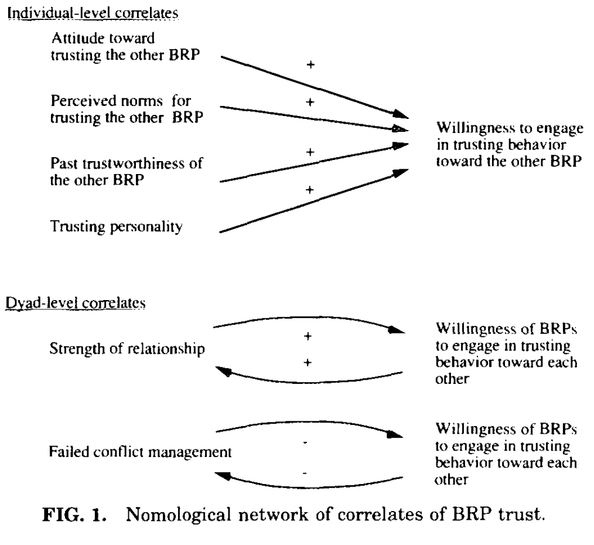

# Currall & Judge — Measuring trust between organizational boundary role persons

```
@article{currall1995measuring,
  title={Measuring trust between organizational boundary role persons},
  author={Currall, Steven C and Judge, Timothy A},
  journal={Organizational behavior and Human Decision processes},
  volume={64},
  number={2},
  pages={151--170},
  year={1995},
  publisher={Elsevier}
}
```

# One Sentence

---

> Defining trust as an individual’s behavioral reliance on another person under a condition of risk, we developed and tested the construct validity of a questionnaire measure that assessed trust between the individuals who provide the linking mechanism across organizational boundaries, namely, boundary role persons (BRPs).
> 

# More Sentences

---

# Key Points

---

### The proposed questionnaires measure antecedents of trust

> ... our aim was to develop a survey instrument that measured the most proximal antecedent of trusting behavior.
> 

> ... “behavioral estimation” items ... which assessed a BRP’s estimation of the likelihood with which he or she will actually engage in trusting behavior toward the counterpart BRP.
> 



# Other Notes

---

### Scope

- The scope of this paper is on trust in inter-organizational collaboration;

### Construct validity

> Construct validity examines the “correspondence between a construct (conceptual definition of a variable) and the operational procedure to measure or manipulate that construct.
> 

# Take-Away

---
