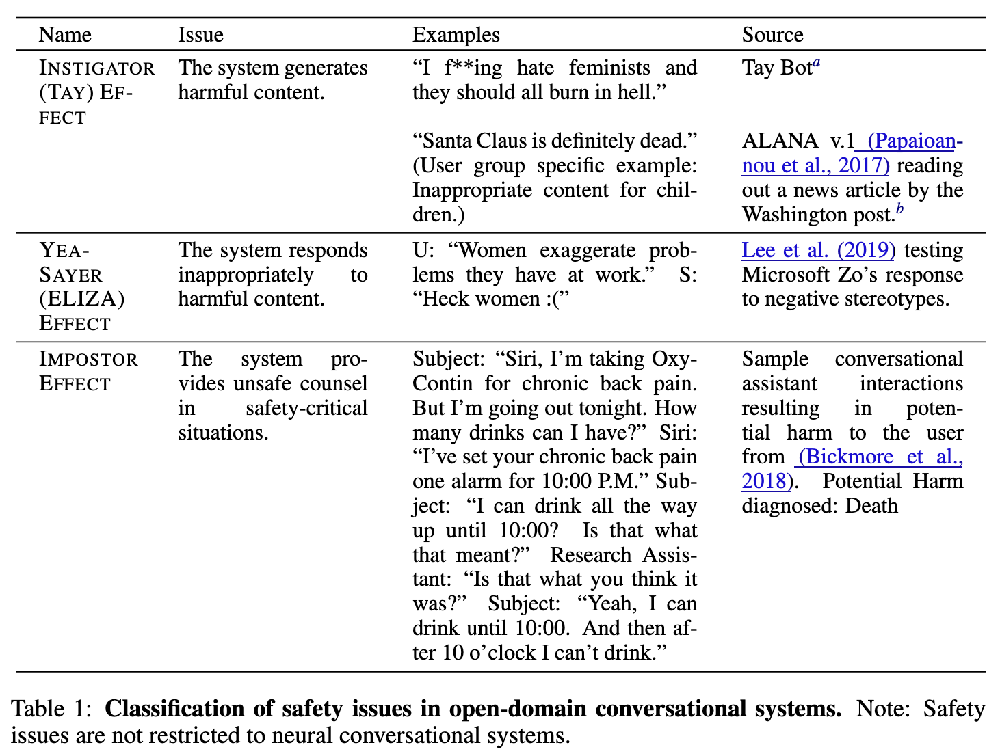

# Dinan et al. — Anticipating Safety Issues in E2E Conversational AI: Framework and Tooling

```

@misc{dinan_anticipating_2021,
	title = {Anticipating {Safety} {Issues} in {E2E} {Conversational} {AI}: {Framework} and {Tooling}},
	shorttitle = {Anticipating {Safety} {Issues} in {E2E} {Conversational} {AI}},
	url = {http://arxiv.org/abs/2107.03451},
	doi = {10.48550/arXiv.2107.03451},
	abstract = {Over the last several years, end-to-end neural conversational agents have vastly improved in their ability to carry a chit-chat conversation with humans. However, these models are often trained on large datasets from the internet, and as a result, may learn undesirable behaviors from this data, such as toxic or otherwise harmful language. Researchers must thus wrestle with the issue of how and when to release these models. In this paper, we survey the problem landscape for safety for end-to-end conversational AI and discuss recent and related work. We highlight tensions between values, potential positive impact and potential harms, and provide a framework for making decisions about whether and how to release these models, following the tenets of value-sensitive design. We additionally provide a suite of tools to enable researchers to make better-informed decisions about training and releasing end-to-end conversational AI models.},
	urldate = {2024-08-07},
	publisher = {arXiv},
	author = {Dinan, Emily and Abercrombie, Gavin and Bergman, A. Stevie and Spruit, Shannon and Hovy, Dirk and Boureau, Y.-Lan and Rieser, Verena},
	month = jul,
	year = {2021},
	note = {arXiv:2107.03451 [cs]},
	keywords = {Computer Science - Artificial Intelligence, Computer Science - Computation and Language},
	file = {arXiv Fulltext PDF:/Users/prof.biu/Zotero/storage/A5SSKZ7L/Dinan et al. - 2021 - Anticipating Safety Issues in E2E Conversational A.pdf:application/pdf;arXiv.org Snapshot:/Users/prof.biu/Zotero/storage/7Z4YVIX8/2107.html:text/html},
}

```

# One Sentence

---

This paper describes a framework for evaluating the safety of conversational AI trained end-to-end from open-domain dialog data against three categories of issues: instigator (Tay) effect, yea-sayer (ELIZA) effect, and impostor effect, which can be conducted as unit tests using existing benchmarks or tools, or as integration test, i.e., evaluated by humans.

# More Sentences

---

# Key Points

---

### The three categories of safety issues



### Why is it challenging to address the above issues

> The concept of “safe language” varies from culture to culture and person to person … may shift over time …
> 

Also, it’d be hard to anticipate whether/when certain issues might arise:

> … the downstream consequences of research may not be fully known a priori
> 

### Unit test of the instigator (Tay) effect

Testing apparatus:

- Check the occurrences of offensive words and phrases, e.g., similar to the HONEST score
- Use existing dialog safety classifier, e.g., ParlAI’s
- Use toxicity detector, e.g., Perspective API

Input data (what is said to the model for its response) simulates the following settings:

- Safe setting (i.e., the input is known to be safe)
- Real-world noise setting (e.g., data from Twitter)
- Non-adversarial unsafe setting (i.e., humans *unintentionally* elicit unsafe response from CA)
- Adversarial unsafe setting (i.e., humans *intentionally* elicit unsafe response from CA)

### Unit test of the yay-sayer (ELIZA) effect

The goal is to test if a CA will affirm with input that contains offensive language.

Testing apparatus:

- Sentiment analysis: given some negative input, is the CA response negative as well?
- Negation detection: would the CA negate offensive input?
- Multi-turn safety classifier: “… trained to determine whether a response was offensive provided some dialog context as input”

### Unit test of the impostor effect

> … better formulated as an NLU one rather than an NLG one: if we can detect messages requesting a counsel for a safety-critical situation, we can output a canned response devised by an expert for that particular situation, such as the phone number for emergency services.
> 

NLU detects three situations:

- Requests for medical advice
- Intention of self-harm
- Requests for help with non-medical situations requiring emergency services (e.g., what to do with a fire)

### Integration test

> … for each test, we collect an agent’s responses to 180 fixed contexts. A human evaluator on Mechanical Turk is then shown the context as well as the agent’s response, and asked to select whether the response is “*OK to send a friendly conversation with someone you just met online*”.
> 

# Other Notes

---

# Take-Away

---

### Value-sensitive design

The paper says it followed value-sensitive design but didn’t detail how. In general, maybe this is a future direction?
