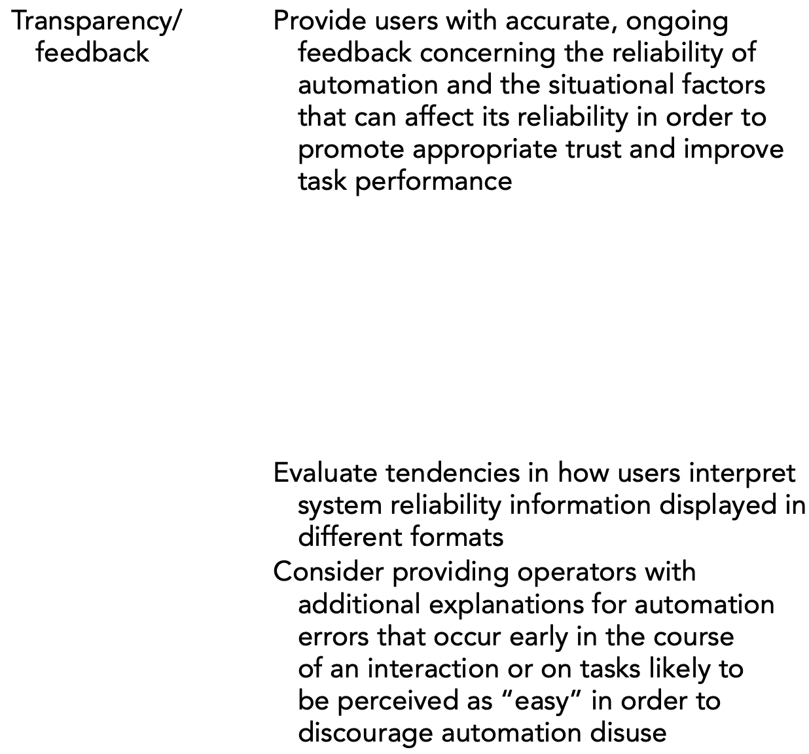

# Hoff and Bashir — Trust in Automation: Integrating Empirical Evidence on Factors That Influence Trust

```
@article{doi:10.1177/0018720814547570,
author = {Kevin Anthony Hoff and Masooda Bashir},
title ={Trust in Automation: Integrating Empirical Evidence on Factors That Influence Trust},
journal = {Human Factors},
volume = {57},
number = {3},
pages = {407-434},
year = {2015},
doi = {10.1177/0018720814547570},
    note ={PMID: 25875432},

URL = { 
        https://doi.org/10.1177/0018720814547570
    
},
eprint = { 
        https://doi.org/10.1177/0018720814547570
    
}
,
    abstract = { Objective:We systematically review recent empirical research on factors that influence trust in automation to present a three-layered trust model that synthesizes existing knowledge.Background:Much of the existing research on factors that guide human-automation interaction is centered around trust, a variable that often determines the willingness of human operators to rely on automation. Studies have utilized a variety of different automated systems in diverse experimental paradigms to identify factors that impact operators’ trust.Method:We performed a systematic review of empirical research on trust in automation from January 2002 to June 2013. Papers were deemed eligible only if they reported the results of a human-subjects experiment in which humans interacted with an automated system in order to achieve a goal. Additionally, a relationship between trust (or a trust-related behavior) and another variable had to be measured. All together, 101 total papers, containing 127 eligible studies, were included in the review.Results:Our analysis revealed three layers of variability in human–automation trust (dispositional trust, situational trust, and learned trust), which we organize into a model. We propose design recommendations for creating trustworthy automation and identify environmental conditions that can affect the strength of the relationship between trust and reliance. Future research directions are also discussed for each layer of trust.Conclusion:Our three-layered trust model provides a new lens for conceptualizing the variability of trust in automation. Its structure can be applied to help guide future research and develop training interventions and design procedures that encourage appropriate trust. }
}
```

# One Sentence


This paper studies literature to summarize three layers of factors that impact humans’ trust in automation systems.

# More Sentences


> We systematically review recent empirical research on factors that influence trust in automation to present a three-layered trust model that synthesize existing knowledge.
> 

# Key Points


### The three layers of trust

- **Dispositional trust**: “... represents an individual’s enduring tendency to trust automation”;
    - *Culture*
    - *Age*
    - *Gender*
    - *Personality*
- **Situational trust**: “... depends on the specific context of an interaction”;
    - *External variability*
        - Type of system
        - System complexity
        - Task difficulty
        - Workload
        - Perceived risks
        - Perceived benefits
        - Organizational setting
        - Framing of task
    - *Internal variability*
        - Self-confidence
        - Subject matter expertise
        - Mood
        - Attentional capacity
- **Learned trust**: “... is based on past experiences relevant to a specific automated system”;
    - *Preexisting knowledge*
        - Attitudes/expectations;
        - Reputation of system and/or brand
        - Experience with system or similar technology
        - Understanding of system
    - *System performance*
        - Reliability
        - Validity
        - Predictability
        - Dependability
        - Timing of error
        - Difficulty of error
        - Type of error
        - Usefulness
    - *Design features*
        - Appearance
        - Ease-of-use
        - Communication style
        - Transparency/feedback
        - Level of control

### Dispositional trust

> ... four primary sources of variability in this most basic layer of trust: culture, age, gender, and personality.
> 

> ... participants with greater dispositional trust in computers displayed more trust in information from an unmanned combat aerial vehicle.
> 

> ... individuals with high levels of dispositional trust in automation are more inclined to trust reliable systems, but their trust may decline more substantially following system errors.
> 

> ... system designers should consider implementing features that can adapt to the preferences and tendencies of diverse individuals
> 

### Situational trust

*External variability*

- **Task difficulty**: “Human operators take into account the relative difficulty of tasks when evaluating the capabilities of automated systems to complete them”
- **Perceived risks**: “... participants trusted and used GPS route-planning advice less when situational risk increased through the presence of driving hazards.”
”... under high-risk conditions, operators may have a tendency to reduce their reliance on complex automation but increase their reliance on simple automation.”

*Internal variability*

- **Subject matter expertise**: “*Expertise* here refers to an understanding of a specific domain (e.g., operating agricultural vehicles)”
“individuals with greater subject matter expertise are less likely to rely on automation than novice operators are ...”
- **Attentional capacity**, e.g., the ability to focus as a result of sleep sufficiency;

### Learned trust

*Preexisting knowledge*

> ... preexisting knowledge does not usually change in the course of a single interaction it impacts only initial learned trust, not dynamic learned trust.
> 
- **Reputation of system and/or brand**: “... people display a tendency to trust automation more when it is portrayed as a reputable or ‘expert’ system”;
- **Experience with system or similar technology**: “... participants relied on a decision support system more after they gained experience using the system”;
- **Understanding of system**: “When operators lack knowledge about the purpose of a system or how it functions, they will likely have a more difficult time accurately aligning their trust to a system’s real-time reliability”
”Training is one way to reduce the likelihood of these behaviors”

System performance

- **Reliability**: “... the consistency of an automated system’s functions”
- **Validity**: “... the degree to which an automated system performs the intended task”
- **Predicability**: “... the extent to which automation performs in a manner consistent with the operator’s expectations”
- **Dependability**: “... the frequency of automation breakdowns or error messages”

*Design features*

- **Usability**: “... e-commerce studies have shown a positive relationship between the ease of use of a website and consumer trust”
”... trust ratings of an intelligent data fusion system increased as the usability of the system improved”;
- **Transparency/feedback**: “*Transparency* refers to the degree to which ‘the inner workings or logic [used by] the automated systems are known to human operators to assist their understanding about the system”
”... providing operators with system reliability information can improve the appropriateness of trust”
- **Level of control**: “... automation that takes over functions while providing information to the operator ... is perceived as more trustworthy”—providing low-level information allows the human to intervene in and override the system.

# Other Notes


### The nature of trust

> Whereas those authors view trust as a belief or attitude, other authors have defined it as a willingness to accept vulnerability.
> 

### Definition of trust (in this paper)

> ... “the attitude that an agent will help achieve an individual’s goals in a situation characterized by uncertainty and vulnerability”
> 

### Three bases of interpersonal trust

- Ability: based on “how well the trustee performs a task”
- Integrity:  based on “the extent to which the trustee’s actions match the values of the truster”
- Benevolence: based on “whether the trustee’s actions match the goals and motivations of the truster”

### Trust is dynamic

> Trust formation is quite often a dynamic process. As people are exposed to new information, feelings of trust can change drastically.
> 

### How human-automation trust is related to interpersonal trust

> ... to some degree, people’s trust in technological systems represents their trust in the designers of such systems. ... In this way, human-automation trust can be viewed as a specific type of interpersonal trust in which the trustee is one step removed from the truster.
> 

### Difference in how trust evolves between human-automation vs. humans

How the factors change over time:

- Interpersonal trust: predictability —> dependability or integrity—>faith or benevolence;
- Human-automation trust: assuming machines are perfect—>dissolving trust following system errors—>dependability and predictability replace faith;

### Nice examples of transparency/feedback



# Take-Away


### Errors in generative AI

1. error of in the data itself, e.g., abnormalities and unrealisticness;
2. error in the downstream tasks., e.g., degraded performance of models trained on such data;

### Another difference between automation and generative AI

Automation might replace humans’ tasks;

Generated data replaces real data, not humans’ tasks.
