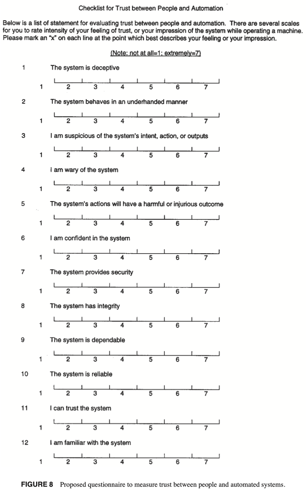
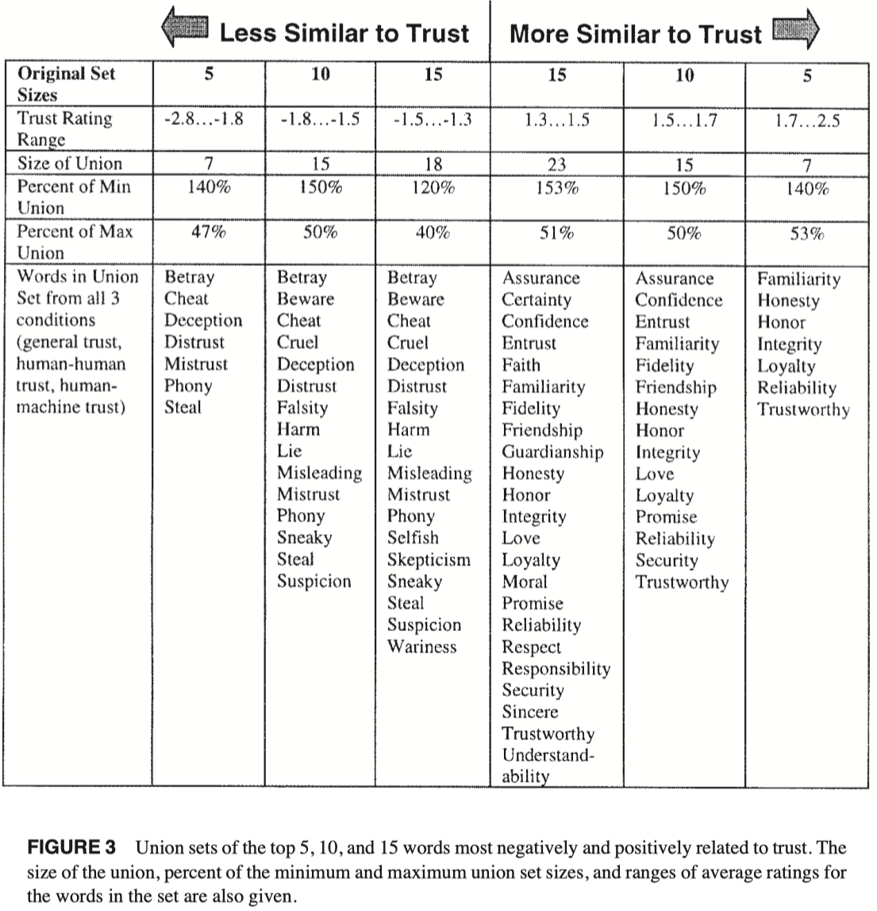
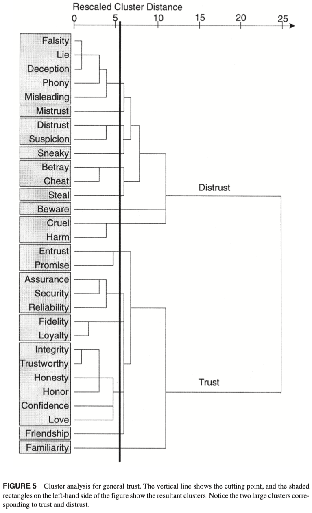

# Jian et al. — Foundations for an empirically determined scale of trust in automated systems

```
@article{jian2000foundations,
  title={Foundations for an empirically determined scale of trust in automated systems},
  author={Jian, Jiun-Yin and Bisantz, Ann M and Drury, Colin G},
  journal={International journal of cognitive ergonomics},
  volume={4},
  number={1},
  pages={53--71},
  year={2000},
  publisher={Taylor \& Francis}
}
```

# One Sentence

---

This paper conducts empirically studies to elicit, select, and compare words correlated with trust and distrust in three categories (general trust, human-human trust, and human-machine trust), based on which the paper groups similar words and develops a questionnaire (each question corresponding to a group of words) to measure trust in automated systems.



# More Sentences

---

> ... a three-phased experimental study was conducted of the concept of trust by an individual in another individual or system.
> 

> In the first phase, a word elicitation study, we collected various words related to concepts of trust and distrust.
In the second phase, a questionnaire study, we investigated how closely each of these words was related to trust or distrust ...
The third phase was a paired comparison study, in which participants rated the similarity of pairs of words.
> 

# Key Points

---

### Phase 1 word elicitation study procedure

> Participants were asked to provide written descriptions of their understandings of both trust and distrust with respect to ...
Next, participants were also asked to rate whether a set of ... words were related to trust using a nominal scale, with *positively* *related to trust*, *not related to trust*, *negatively related to trust*, and *don’t know* as scale points.
> 

Phase 1 produces:

- a set of words related to trust

### Phase 2 questionnaire study procedure

> ... participants were asked to rate the extent to which words from Set 1 were related to trust or distrust, from the perspective of ... using a 7-point scale, ranging from *positively related to trust* ... to *negatively related to trust* ...
> 

Phase 2 produces:

- a set of words with scores of how closely each word positively/negatively related to trust



### Phase 3 comparison study procedure

> The goal ... was to ... develop a multidimensional scale to measure trust.
> 

> Participants were asked to compare and rate the similarity of 30 words positively and negatively related to trust ... on a 7-point scale, ranging from 1 (*totally different*) to 7 (*almost the same*).
> 

Phase 3 produces:

- grouping of words (from Phase 2) where each group’s words are similar to each other

### Question/scale development

Two classification analyses based on the groups of words (from Phase 3):

- **Factor analysis**: “... using Minitab. Factor extraction using the principal components and varimax rotation resulted in # significant factors ...”
- **Cluster analysis**: “... used to group words according to their similarity to each other” “From the factor analysis reported earlier, ... ‘groups’ of words were found for each type of trust. We used these results to inform our choice of ‘cuts’ in the cluster analysis trees, attempting to obtain a similar number of groupings.”



# Other Notes

---

# Take-Away

---
