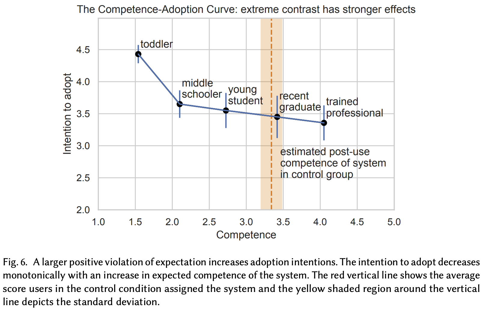

# Khadpe et al. — Conceptual Metaphors Impact Perceptions of Human-AI Collaboration

```
@article{10.1145/3415234,
author = {Khadpe, Pranav and Krishna, Ranjay and Fei-Fei, Li and Hancock, Jeffrey T. and Bernstein, Michael S.},
title = {Conceptual Metaphors Impact Perceptions of Human-AI Collaboration},
year = {2020},
issue_date = {October 2020},
publisher = {Association for Computing Machinery},
address = {New York, NY, USA},
volume = {4},
number = {CSCW2},
url = {https://doi.org/10.1145/3415234},
doi = {10.1145/3415234},
abstract = {With the emergence of conversational artificial intelligence (AI) agents, it is important to understand the mechanisms that influence users' experiences of these agents. In this paper, we study one of the most common tools in the designer's toolkit: conceptual metaphors. Metaphors can present an agent as akin to a wry teenager, a toddler, or an experienced butler. How might a choice of metaphor influence our experience of the AI agent? Sampling a set of metaphors along the dimensions of warmth and competence---defined by psychological theories as the primary axes of variation for human social perception---we perform a study $(N=260)$ where we manipulate the metaphor, but not the behavior, of a Wizard-of-Oz conversational agent. Following the experience, participants are surveyed about their intention to use the agent, their desire to cooperate with the agent, and the agent's usability. Contrary to the current tendency of designers to use high competence metaphors to describe AI products, we find that metaphors that signal low competence lead to better evaluations of the agent than metaphors that signal high competence. This effect persists despite both high and low competence agents featuring identical, human-level performance and the wizards being blind to condition. A second study confirms that intention to adopt decreases rapidly as competence projected by the metaphor increases. In a third study, we assess effects of metaphor choices on potential users' desire to try out the system and find that users are drawn to systems that project higher competence and warmth. These results suggest that projecting competence may help attract new users, but those users may discard the agent unless it can quickly correct with a lower competence metaphor. We close with a retrospective analysis that finds similar patterns between metaphors and user attitudes towards past conversational agents such as Xiaoice, Replika, Woebot, Mitsuku, and Tay.},
journal = {Proc. ACM Hum.-Comput. Interact.},
month = {oct},
articleno = {163},
numpages = {26},
keywords = {expectation shaping, perception of human-ai collaboration, conceptual metaphors, adoption of ai systems}
}
```

# One Sentence

---

This paper studies the relationship between conceptual metaphor of an AI conversational assistant and users’ reaction to the AI, such as perceived usability and warmth and willingness to adopt and cooperate.

# More Sentences

---

### Study 1

> In our first study, we examine the effects of metaphors attached to the conversational system on user pre-use expectations and post-use evaluations.
> 

Findings:

1. “Users are more tolerant of gaps in knowledge of systems with low competence but are less forgiving of high competence systems making mistakes”;
2. “The intention of adopt and desire to cooperate decreases as the competence of the AI system metaphor increases”;
3. “…. users are more likely to co-operate and interact longer with agents portraying high warmth, but …. (no) significant impact of warmth on users’ intention to adopt”

### Study 2

Relationship with Study 1

> Study 1 established that setting low expectations and violating them positively increased the likelihood of users adopting the system. In Study 2, we zoom in and try to understand how user evaluations change as the magnitude of that gap changes.
> 

Findings:



### Study 3

> … test the effect of metaphor on pre-use intention to adopt, and pre-use desire to cooperate with an AI system …
> 

Findings:

> … people are more likely to try out a new service if it is described with a high competence metaphor.
> 

# Key Points

---

### Stereotype Content Model

> We draw on the Stereotype Content Model (SCM) from psychology …, which demonstrates that the two dimensions of *warmth* and *competence* are the principal axes of human social perception.
> 

> … Judgments on warmth and competence are made within 100 milliseconds … and a change in these traits alone can wholly change impressions …
> 

### Why using metaphors on AI systems

> Just as we expect an administrative assistant to know our calendar but not to know the recipe for the best stoat sandwiches, an AI agent that communicates a metaphor as an “administrative assistant”projects the same skills and boundaries.
> 

### Key findings

See above.

### Implications for design

> From Study 3, it becomes clear that associating a high warmth metaphor is always beneficial— however, the choice of competence level projected by the metaphor becomes a more nuanced decision. One possible approach might be to choose a higher-competence metaphor but to lower competence expectations right after interaction begins (e.g., “Great question! One thing I should mention: I’m still learning how to best respond to questions like yours, so please have patience if I get something wrong.”) Another approach might be to age the metaphor over time: to present a high competence metaphor such as a professional, but when a user first encounters it, the agent introduces itself via a lower-competence version such as a
> 

# Other Notes

---

### The type of AI studied in this work

> … goal-oriented conversational agents (or task-focused bots) … such as those for booking flights, hotel rooms, or navigating customer service requests …
> 

### Contrast Theory

> … users’ evaluations are defined by the difference between their experiences and expectations.
> 

### Example questions for pre-/post- usability and warmth

Usability:

> 1) *“Using the AI system was (will be) a frustrating experience.” …*
> 

Warmth:

> *“This AI system was (will be) good-natured” …*
> 

# Take-Away

---

Study 3 in some sense tries to “challenge” Study 1 and 2’s findings (or the implications). It makes the work more “robust” by adding such a “challenging” follow-up study.
