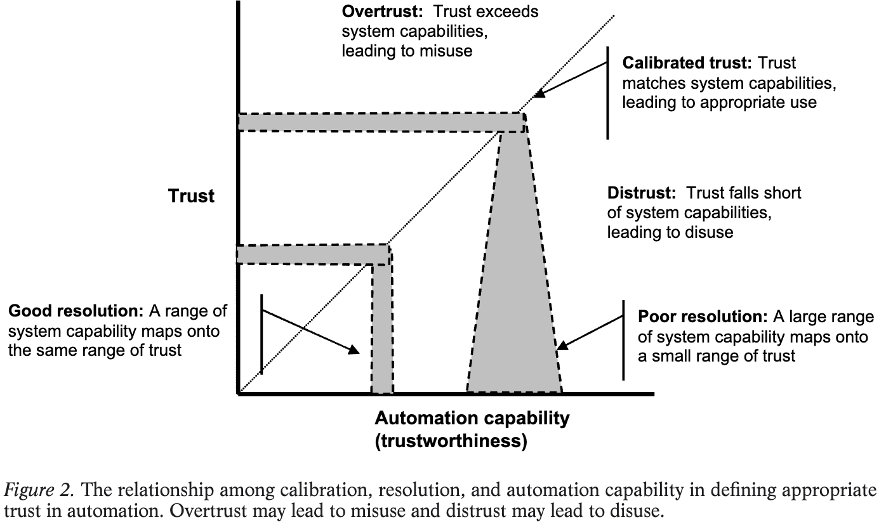
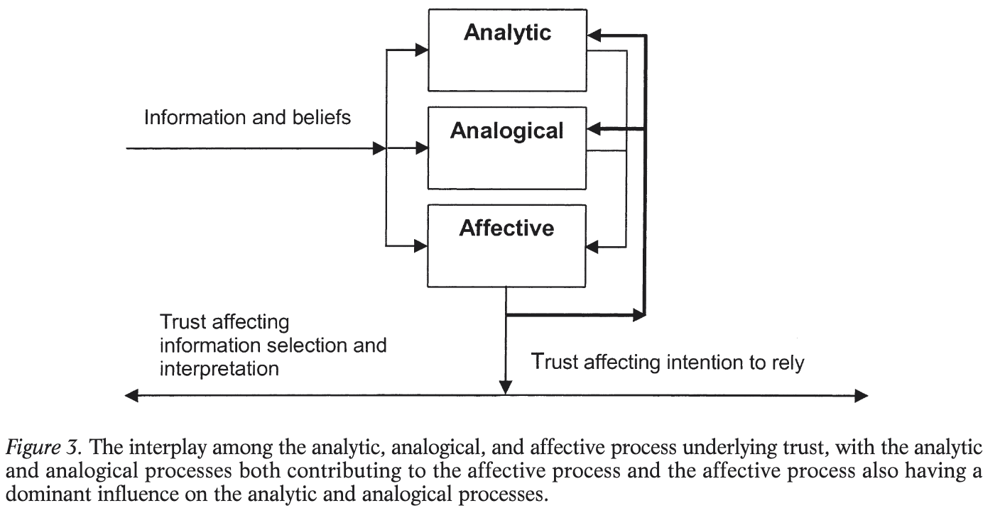

# Lee & See — Trust in Automation: Designing for appropriate reliance

```
@article{lee2004trust,
  title={Trust in automation: Designing for appropriate reliance},
  author={Lee, John D and See, Katrina A},
  journal={Human factors},
  volume={46},
  number={1},
  pages={50--80},
  year={2004},
  publisher={SAGE Publications Sage UK: London, England}
}
```

# One Sentence


This paper discusses the definitions, differences, and deciding factors of trust and reliance, drawing on numerous prior work to construct several frameworks to juxtapose trust, reliance, and other associated factors in the decision making process.

# More Sentences


# Key Points


### Trust depends on four dimensions

1. *Foundation*—the assumption of stability in the natural and social order;
2. *Performance*—the expectation of consistent, stable, and desirable performance or behavior
3. *Process*—the understanding of the underlying qualities and characteristics that guide behavior (in machines, algorithms, control processes, etc.)
4. *Purpose*—the underlying motives or intents (with machines—designer’s intention in creating the system)

### Relationship between trust and reliance

> … trust guides reliance when complexity and unanticipated situations make a complete understanding of the automation impractical
> 

### What does automation mean?

> *Automation* is technology that actively selects data, transforms information, makes decisions, or controls processes
> 

Didn’t quite include LLM.

### Misuse and disuse of automation

Perhaps the early version of reliance: misuse == overreliance and disuse == underreliance

> *Misuse* refers to the failures that occur when people inadvertently violate critical assumptions and rely on automation inappropriately
> 

> … *disuse* signifies failures that occur when people reject the capabilities of automation.
> 

### Reliance is not necessarily discrete

> Although this paper describes reliance on automation as a discrete process of engaging or disengaging, automation can be a very complex combination of many modes, and reliance is often a more graded process.
> 

This insight “foresees” how reliance on LLM might be a “graded process”.

### Trust and reliance have a strong social, affective component

> Software that displays personality characteristics similar to those of the user tends to be more readily accepted.
> 

### Definition of trust

> … the attitude that an agent will help achieve an individual’s goals in a situation characterized by uncertainty and vulnerability.
> 

### Trust and reliance within the belief-attitude-intention-behavior framework

Ajzen and Fishbein’s framework suggests that

1. Beliefs → attitudes → intentions → behaviors
2. Trust is an attitude and reliance is a behavior

### Machine-related factors that influence trust (Lee and Moray, 1992)

(Below are direct quotes)

1. *Performance* refers to the current and historical operation of the automation and includes characteristics such as reliability, predictability, and ability.
    1. … competency or expertise as demonstrated by its ability to achieve the operator’s goals
    2. “*what* the automation does”
2. *Process* is the degree to which the automation’s algorithms are appropriate for the situation and able to achieve the operator’s goals
    1. “*how* the automation operates”
3. *Purpose* refers to the degree to which the automation is being used within the realm of the designer’s intent
    1. “*why* the automation was developed”

### A nice visualization of trust vs. trustworthiness …

… and related concepts of overtrust, calibrated trust, and distrust



### Trust is a result of analytic, analogical, and affective processes

Here analogical means analogizing the present situation to a previously-known case or category

> Ultimately trust is an affective response, but it is also influenced by analytic and analogical processes.
> 



### The effects of display: content and format

> Because direct observation of the automation is often impractical or impossible, perception of the automation-related information is usually mediated by a display.
> 

> … the appropriateness of trust—that is, the match between the trust and the capabilities of the automation—depends on the content and format of the display.
> 

### The two dimensions of display

(I do not find them very clear or useful)

1. *Abstraction*: which level of abstract is the information being displayed: performance (what the automation does and how well it is doing), process (how it does what it does), and purpose (why is this automation in place)
2. *Detail*: which specific system component does the trust focus on?

### Pre-LLM evidence that the way AI is presented plays a role

> In many cases, trust and credibility depend on surface features of the interface that have no obvious link to the true capabilities of the system.
> 

On anthropomorphism:

> Cassell and Bickmore (2000) suggested that creating a computer that is a conversational partner will induce people to trust the system by providing the same social cues that people use in face-to-face conversation.
> 

### Design implications on making automation trustable

(For HFAI book) Each of the following points could be expanded to discuss more (e.g., discuss “how” and cite evidence that it works with more recent literature)

- Design for appropriate trust, not greater trust
- Show the past performance of the automation.
- Show the process and algorithms of the automation by revealing intermediate results in a way that is comprehensible to the operators
- Simplify the algorithms and operation of the automation to make it more understandable
- Show the purpose of the automation, design basis, and range of applications in a way that relates to the users’ goals
- Train operators regarding its expected reliability, the mechanisms governing its behavior, and its intended use.
- Carefully evaluate any anthropomorphizing of the automation, such as using speech to create a synthetic conversational partner, to ensure appropriate trust.

# Other Notes


# Take-Away

