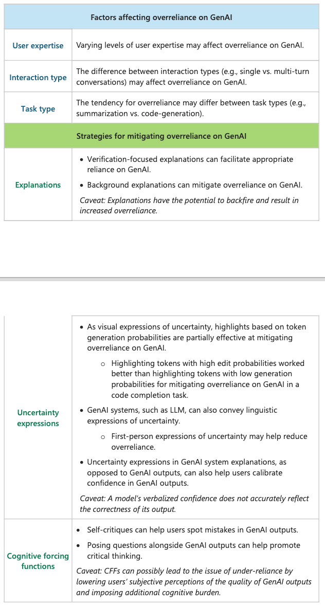
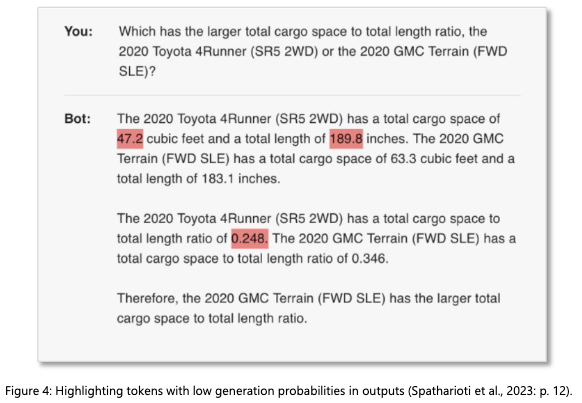
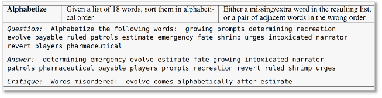

# Passi et al. — Appropriate reliance on GenAI: Research synthesis

```

@techreport{passi_appropriate_2024,
	title = {Appropriate reliance on {Generative} {AI}: {Research} synthesis},
	url = {https://www.microsoft.com/en-us/research/publication/appropriate-reliance-on-generative-ai-research-synthesis/},
	abstract = {Appropriate reliance on AI happens when users accept correct AI outputs and reject incorrect ones. New complexities arise for fostering appropriate reliance on generative AI (GenAI) systems. GenAI systems pose several risks, despite often rivaling, and sometimes surpassing, human performance on many tasks. Inappropriate reliance – either under-reliance or overreliance – on GenAI can have negative consequences such as poor human+GenAI team performance and even product abandonment. Based on a review of 50 papers from multiple research areas, this report provides an overview of the factors that affect overreliance on GenAI, the effectiveness of different mitigation strategies for overreliance on GenAI, and potential design strategies to facilitate appropriate reliance on GenAI. See also our 2022 research synthesis on Overreliance on AI Cite as: Samir Passi, Shipi Dhanorkar, \& Mihaela Vorvoreanu. 2024. Appropriate Reliance on Generative AI: Research Synthesis. Microsoft Technical Report MSR-TR-2024-7. Microsoft Corporation.},
	number = {MSR-TR-2024-7},
	institution = {Microsoft},
	author = {Passi, Samir and Dhanorkar, Shipi and Vorvoreanu, Mihaela},
	month = mar,
	year = {2024},
}

```

# One Sentence

---

This paper reviews recent research on appropriate reliance on generative AI, including why it matters, how to define it, factors, mitigation strategies, and design recommendations.

# More Sentences

---



# Key Points

---

### The old assumption that breaks with GenAI

> a. The presence of ground truth (i.e., a priori knowledge about the correctness of AI outputs).
b. An all-or-nothing outlook towards AI outputs (i.e., an AI output is either fully right or fully wrong).
> 

We should also add that the way a user treat GenAI outputs is no longer a binary accept-or-reject; instead, there is a degree of reliance.

### Outcome- vs. strategy-graded approaches

There are two ways to define what is appropriate reliance:

- Outcome-graded: appropriate reliance is to “accept right AI outputs and reject wrong ones”;
- Strategy-graded: appropriate reliance is to “accept AI output when AI is expected to outperform users in a task and reject AI outputs when AI is expected to underperform users in a task”

Strategy-graded approach considers appropriate reliance at a more global level (if AI is in general much better than the user, it’s appropriate to rely on it even if there are individual cases where AI is still wrong) whereas outcome-graded approach might consider local, individual cases as inappropriate reliance.

### Interaction style (single- vs. multi-turn conversation) is a factor

> … multi-turn conversations can reduce overreliance by helping users better evaluate the correctness of LLM outputs (Bowman et al. 2022)
> 

This could be a mitigation technique, e.g., nudging users to ask follow-up question or having LLM to ask users questions

### Overreliance observed in some tasks

> In coding tasks, Prather et al. (2023) observed oversight issues—college students did
not properly review GitHub Copilot code suggestions, accepting several incorrect
suggestions. 
In creative writing tasks, Chen & Chan (2023) observed anchoring effects—
participants using LLMs as ghostwriters to generate ad copy were highly influenced by the
LLM’s initial generations, resulting in less diverse ad copies.
> 

### Token-level uncertainty expression

It is possible to get the probability of individual token’s generation and highlight the ones with low values.

- In a coding task, a different type of highlight works better: highlighting code snippets that likely require editing



# Other Notes

---

### Gen AI adds cognitive load to users

> Handling this content … imposes additional cognitive burden compared to (non-GenAI)
> 

Such cost might discourage users from verifying GenAI output

> … users often end up treating the fluency, length, and speed of GenAI outputs as proxies for their accuracy (e.g., Topolinski & Reber, 2010).
> 

### AI self-generated critiques as a mitigation technique

Example of a QA like task (with ground thruths).



# Take-Away

---

### Thoughts on the three mitigation strategies

They all seem to have severe limitations:

- *Explanations* have long been found to have mixed effects (seemingly plausible explanations lead to overreliance)
- *Uncertainty* expression has a weak foundation because “a model’s verbalized confidence does not accurately reflect the correctness of its output”
- *Cognitive forcing function* has a trade-off of additional workload and low acceptance by the user.
