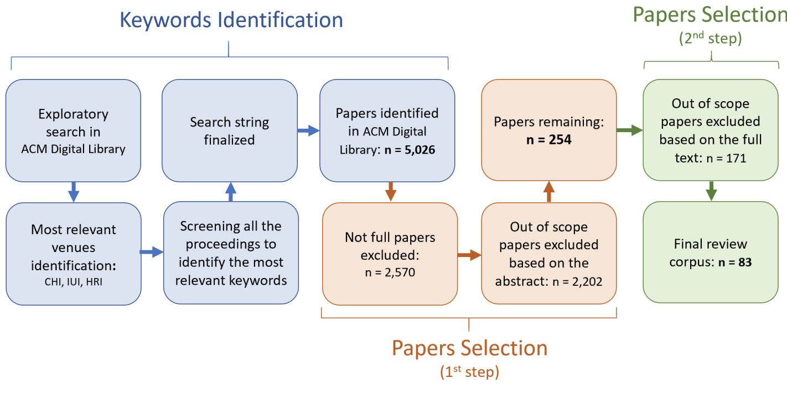
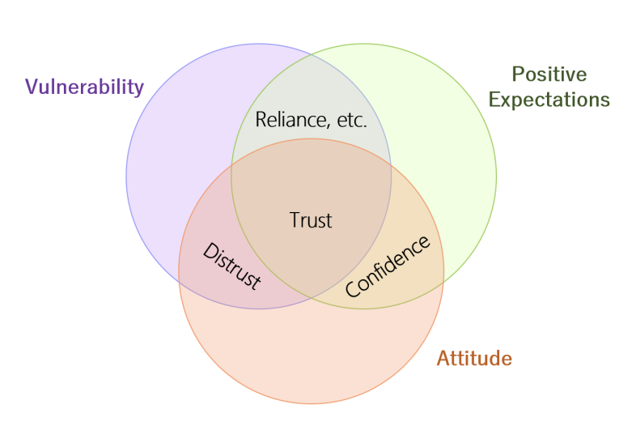
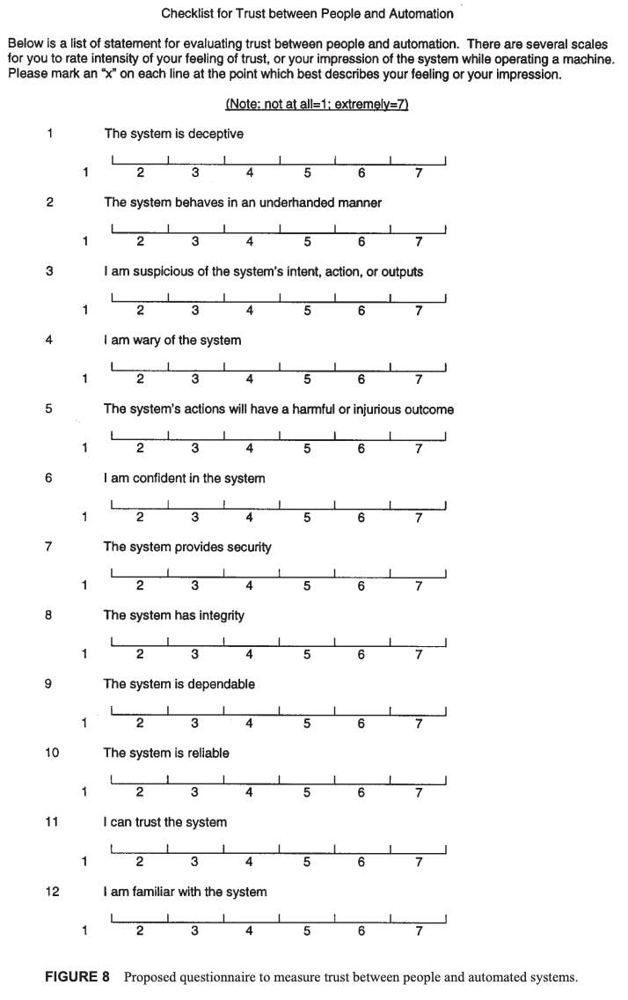
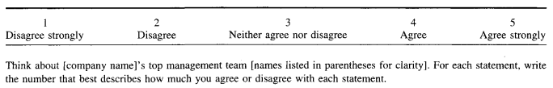
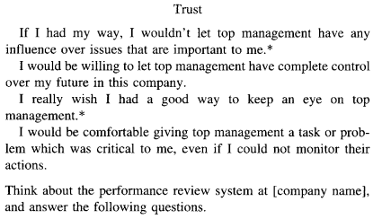

# Vereschak et al. — How to Evaluate Trust in AI-Assisted Decision Making? A Survey of Empirical Methodologies

```
@article{10.1145/3476068,
author = {Vereschak, Oleksandra and Bailly, Gilles and Caramiaux, Baptiste},
title = {How to Evaluate Trust in AI-Assisted Decision Making? A Survey of Empirical Methodologies},
year = {2021},
issue_date = {October 2021},
publisher = {Association for Computing Machinery},
address = {New York, NY, USA},
volume = {5},
number = {CSCW2},
url = {https://doi.org/10.1145/3476068},
doi = {10.1145/3476068},
abstract = {The spread of AI-embedded systems involved in human decision making makes studying human trust in these systems critical. However, empirically investigating trust is challenging. One reason is the lack of standard protocols to design trust experiments. In this paper, we present a survey of existing methods to empirically investigate trust in AI-assisted decision making and analyse the corpus along the constitutive elements of an experimental protocol. We find that the definition of trust is not commonly integrated in experimental protocols, which can lead to findings that are overclaimed or are hard to interpret and compare across studies. Drawing from empirical practices in social and cognitive studies on human-human trust, we provide practical guidelines to improve the methodology of studying Human-AI trust in decision-making contexts. In addition, we bring forward research opportunities of two types: one focusing on further investigation regarding trust methodologies and the other on factors that impact Human-AI trust.},
journal = {Proc. ACM Hum.-Comput. Interact.},
month = {oct},
articleno = {327},
numpages = {39},
keywords = {decision making, artificial intelligence, trust, methodology}
}
```

# One Sentence


This paper reviews literature on trust and the evaluation of trust in computing systems to summarize a series of guidelines for evaluating trust in AI-assisted decision making.

# More Sentences


> ... we present a survey of existing methods to empirically investigate trust in AI-assisted decision making and analyse the corpus along the constitutive elements of an experimental protocol
> 

# Key Points


### The systematic approach of reviewing literature



### Definition of trust

> “*An attitude that an agent will achieve an individual’s goal in a situation characterized by uncertainty and vulnerability*”
> 

> ... trust is linked to a situation of **vulnerability** and **positive expectations**, and is **an attitude**
> 
- “... *vulnerability* ... involves uncertainty of the outcomes of a decision, with potential negative or undesirable consequences ... Without vulnerability, there is no need for trust to emerge.”
- “... *positive expectations ...* Trust has grounds to form only when one thinks that negative outcomes associated with trusting do not exist or are very unlikely.”
- “... trust is rather an attitude ..., i.e., a certain way of feeling about the object ... cannot always be fully observable to the third parties (unless clearly and objectively communicated in a verbal or written form)”



### Trust vs. confidence

> ... without an element of vulnerability in a situation, it would be more appropriate to consider **confidence** instead of trust ...
> 

### Reliance and compliance

> The former is defined as the decision to follow someone’s recommendation, and the latter as the decision to ask for a recommendation in the first place ... trust does not always translate to a behavior, but there is definitely a relation between them.
> 

### Trust vs. perceived trustworthiness

> **trustworthiness** ... having beliefs about the degree of someone’s trustworthiness does not involve any vulnerability, a key element of trust.
> 

### How to incorporate ‘vulnerability’ in a study

> To immerse participants in the state of vulnerability, they must feel that their decisions matter, that is having something at stake.
> 

### “... one of the most recurring trust questionnaire [96]”



### Trust-related behavioral measures

- **Decision Time:** “... how fast a recommendation is accepted”;
- **Compliance**: “... the number of times participants follow the system’s recommendations”;
- **Reliance**: “... the number of times participants asked for a recommendation”;
- **Switch ratio**: “... the number of times a participant who initially disagreed with the system decided to follow its recommendation in the end”;

# Other Notes


### Mayer’s organizational trust questionnaire

> ... equally comprises all the theoretical concepts
> 





### Critical incident technique

> ... is a set of procedures used to collect data from narrated past experiences (or observations) to identify and brainstorm about important events related to a pre-defined problem.
> 

### Trust definitions

> ... are often incomplete or even not provided.
> 

# Take-Away


- Might need to do pre- and post- tests to assess participants’ change of trust (because trust is dynamic).
- This paper seems to assume trust happens at an instance-level (local) rather than at a model-level (global).
