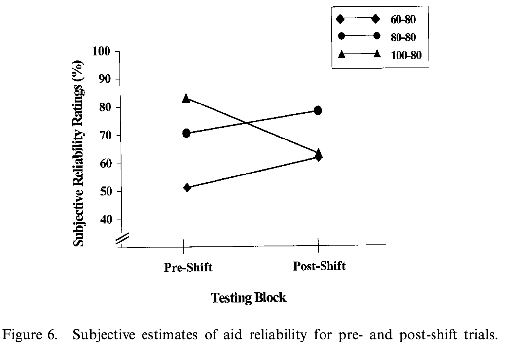
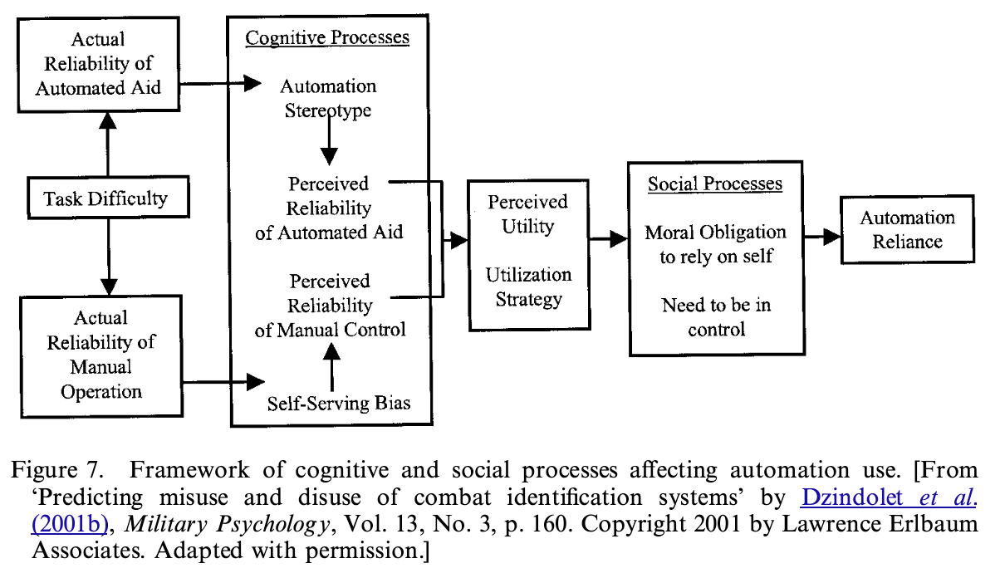

# Wiegmann et al. — Automated diagnostic aids: The effects of aid reliability on users' trust and reliance

```

@article{wiegmann_automated_2001,
	title = {Automated diagnostic aids: {The} effects of aid reliability on users' trust and reliance},
	volume = {2},
	issn = {1463-922X},
	shorttitle = {Automated diagnostic aids},
	url = {https://doi.org/10.1080/14639220110110306},
	doi = {10.1080/14639220110110306},
	abstract = {We examined the effects that different levels of, and changes in, automation reliability have on users' trust of automated diagnostics aids. Participants were presented with a series of testing trials in which they diagnosed the validity of a system failure using only information provided to them by an automated diagnostic aid. The initial reliability of the aid was either 60, 80 or 100\% reliable. However, for participants initially provided with the 60\%-reliable aid, the accuracy of the aid increased to 80\% half way through testing, whereas for those initially provided the 100\%-reliable aid, the aid's reliability was reduced to 80\%. Aid accuracy remained at 80\% throughout testing for participants in the 80\%-reliability group. Both subjective measures (i.e. perceived reliability of the aids and subjective confidence ratings) and objective measures of performance (concurrence with the aid's diagnosis and decision times) were examined. Results indicated that users of automated diagnostic aids were sensitive to different levels of aid reliabilities, as well as to subsequent changes in initial aid reliabilities. However, objective performance measures were related to, but not perfectly calibrated with, subjective measures of confidence and reliability estimates. These findings highlight the need to distinguish between automation trust as a psychological construct that can be assessed only through subjective measures and automation reliance that can only be defined in terms of performance data. A conceptual framework for understanding the relationship between trust and reliance is presented.},
	number = {4},
	urldate = {2024-04-22},
	journal = {Theoretical Issues in Ergonomics Science},
	author = {Wiegmann, Douglas A. and Rich, Aaron and Zhang, Hui},
	month = jan,
	year = {2001},
	note = {Publisher: Taylor \& Francis
\_eprint: https://doi.org/10.1080/14639220110110306},
	keywords = {Automation Reliability, Contrast Effects, Diagnostic Aids, Trust},
	pages = {352--367},
}

```

# One Sentence


This paper studied how people’s trust and reliance on automated diagnostic aids change when the aid’s performance of stays the same, increases, or decreases.

# More Sentences


# Key Points


### The measure of trust

… is the subjective reliability rating of the automated diagnostic aid.

### The change of trust vs. the change of reliability

Across the three conditions where the aid’s reliability shifted from 60% to 80%, from 100% to 80%, or stayed at 80%, we can see that neither the 60-80 nor the 100-80 shift resulted in under-trust—a level of trust that is lower than what the aid’s objective reliability would deserve.



### The discrepancy between trust and reliance

**Human reliance matches the aid’s reliability**: “… higher initial aid reliabilities … were generally associated with (1) higher agreement rates with the aid … (3) higher confidence ratings in decisions on agreement trials”

**Human trust does not match human reliance on aids**: see the graph above

Some discussion:

> … participants’ *reliance* on the automated aid (agreement rates) exceeded their trust levels (subjective reliability estimates) because aided diagnosis was more accurate than unaided diagnosis … always agreeing with the aid was the optimal strategy … disagreements still occurred even when the aid was perfectly reliable …
> 

# Other Notes


# Take-Away


### The framework that describe how reliance is formulated

- For LLM, perhaps another important factor is how reliance saves efforts


